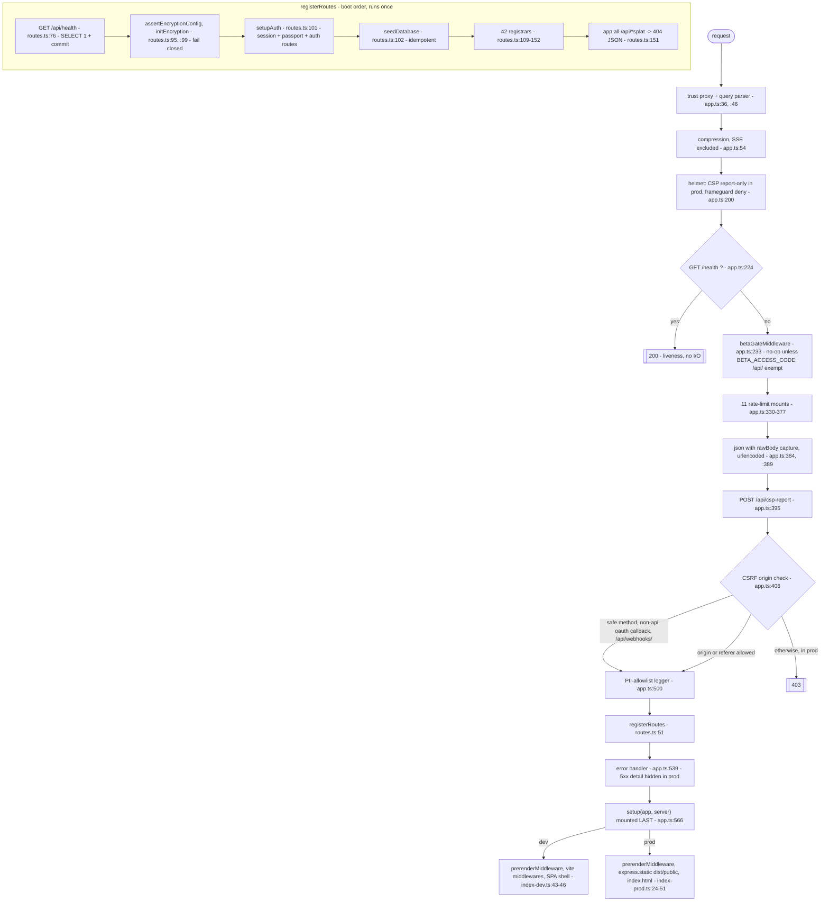

# 01 — Architecture and the request lifecycle

> **Freshness:** last verified 2026-08-23 · review every 30 days
> **Verified against** `origin/main` @ 6377727e · **Authoritative:** [app-guide 02 — Architecture](../handbook/app-guide/02-architecture.md) (it wins on conflict; the code wins over both). The five places the code had moved past it were fixed by #694 (`3d047ce9`, 2026-08-22) — two residues remain, listed under *Where this breaks*.

## The mental model

Every request climbs one fixed middleware ladder in `server/app.ts`, registration order in
`server/routes.ts` decides who answers, and whatever nobody answers falls through to Vite or the
static shell mounted last.

## Explain it to a new hire

There is one Express app (`server/app.ts`) and two entry points that differ only in the final
`setup` callback they hand to `runApp()`: `server/index-dev.ts` passes a Vite dev-server mount,
`server/index-prod.ts` passes a static-file mount, and in production that one process serves the
API and the built client from `dist/index.js`. The middleware order is a correctness invariant,
not a style choice: compression first so every later writer is covered, then security headers,
then a bare `/health` mounted *above* the beta gate (the gate exempts only `/api/`, so a `/health`
below it would return a 401 lock screen the moment the private beta is armed), then eleven
rate-limit mounts, the body parsers, the CSP-report sink, a CSRF check that is an Origin/Referer
comparison with three carve-outs, and a request logger that prints a response body for exactly
three allow-listed paths. `registerRoutes(app)` then boots in a fixed order — a readiness
`/api/health` that really runs `SELECT 1` and reports the deployed commit, an encryption check
that fails the boot closed, session and auth setup, idempotent seeding, forty domain registrars,
and finally a JSON 404 for any `/api/*` path nobody claimed — so an API path can never fall
through to the HTML shell. The error handler comes after that, and the `setup` step is mounted
last on purpose, because it contains the SPA catch-all that matches everything. Around all of it,
`runApp` hardens the process: swallowed stdout errors, a storm breaker that exits after fifty
uncaught events in five seconds, an uncaught exception that crashes on purpose rather than
serving in an undefined state behind a green health check, keep-alive tuned above the load
balancer's idle window, and a ten-second bounded drain on `SIGTERM`.

## Mechanism



## The facts, with receipts

- **39 `app.use(` mounts in the app file.** `grep -c "app.use(" server/app.ts` → `39`.
- **Trust proxy is set first, from a shared function, and it is *not* what identifies the
  client IP.** `server/app.ts:37` `app.set("trust proxy", trustProxyHops())`; `server/trustProxy.ts:10-16`
  explains that Railway's edge sends `X-Real-IP`, and every consent/audit IP and the rate-limit key
  go through `server/clientIp.ts` instead.
- **Express 5's query parser is explicitly reverted to the extended (qs) behaviour.**
  `server/app.ts:47` `app.set("query parser", "extended")` — the regression guard at `:38-46`.
- **Compression is first and excludes SSE.** `server/app.ts:54-58` — buffering would hold
  `text/event-stream` frames past their flush (the assistant streams over SSE).
- **CSP is report-only in production until `CSP_ENFORCE=true`, and off outside production;
  frame blocking is done by `X-Frame-Options: DENY`.** `server/app.ts:181-189`, `:192-197`.
- **Liveness and readiness are two endpoints on purpose.** `GET /health` (`server/app.ts:224`,
  event loop only) vs `GET /api/health` (`server/routes.ts:76-92`: `SELECT 1`, returns
  `commit: process.env.RAILWAY_GIT_COMMIT_SHA ?? null`, 503 on a DB failure). `railway.json:9`
  points `healthcheckPath` at the readiness one, so a container that cannot reach the database
  never replaces one that can.
- **The beta gate is read per request and never touches `/api/*`.**
  `server/middleware/betaGate.ts:114-119` (no-op when `BETA_ACCESS_CODE` is unset), `:124`
  (`/api/` passthrough), `:129-137` (`/robots.txt` answers `Disallow: /` while armed), cookie =
  SHA-256 of the code, 90 days (`:165`).
- **Nine named limiters plus two inline ones.** `grep -cE '^const [a-zA-Z]+Limiter = rateLimit\(' server/app.ts`
  → `9`; inline mounts at `server/app.ts:361` (`/api/webhooks/sms`) and `:368` (`/api/client-errors`);
  `generalLimiter` is last and skips non-`/api` paths (`:377`, `:242`). Two limiters relax under
  `RATE_LIMIT_RELAXED=true`, never in production (`server/services/rateLimitPolicy.ts:8-13`).
- **Body parsing comes *after* every limiter** (a flood is dropped before it is parsed):
  `server/app.ts:384` (`express.json()` capturing `req.rawBody` for webhook signatures), `:389`.
- **CSRF is an Origin/Referer check with three carve-outs and a dev bypass.**
  `server/app.ts:406-469`: safe methods (`:410`), non-`/api` paths (`:414`), OAuth callbacks
  `/^\/api\/auth\/[^/]+\/callback$/` (`:422`, Apple's form_post is a cross-site POST), anything
  under `/api/webhooks/` (`:429`, each webhook verifies its own signature); in development
  everything passes (`:458`); in production a request with neither header is 403'd (`:462-465`).
- **Response-body logging is an allow-list of exactly three paths, and reverting to a denylist
  is banned in writing.** `server/app.ts:481-485` `RESPONSE_BODY_LOG_ALLOWLIST` = `/api/health`,
  `/api/track`, `/api/csp-report`; the comment at `:475-480`: the previous denylist "silently missed
  new PII routes (e.g. /api/urla/* responses contain the borrower's SSN) — do not revert to one."
  Staff-invite codes are redacted from the logged path (`:471`).
- **`createApp` wires everything without a socket; `runApp` listens.** `server/app.ts:536`,
  `:573`.
- **Forty-two registrars, in mount order, exactly one awaited.** `server/routes.ts:109-152`;
  `grep -cE "^\s*(await )?register[A-Za-z]+Routes\(app" server/routes.ts` → `42`; the `await` is
  `registerTaskEngineRoutes` at `:115`.
- **Boot fails closed on encryption before any route is mounted.** `server/routes.ts:95`
  `assertEncryptionConfig()`, `:99` `await initEncryption()` — "a misconfigured KMS setup stops boot
  rather than silently falling back."
- **The API 404 uses a named wildcard; the SPA catch-all uses braces.** `server/routes.ts:151`
  `app.all("/api/*splat", …)` (path-to-regexp v8 requires named wildcards);
  `server/spaCatchAll.ts:14` `SPA_CATCH_ALL_PATTERN = "/{*splat}"` — a bare `/*splat` matches
  `/login` but not `/`, so the homepage would 404 (`:5-8`).
- **Five route directories, four of which are sub-registrars.** `ls -d server/routes/*/` →
  `admin/ agent-broker/ borrower/ lending/ underwriting/`; `ls server/routes/*/index.ts` → four
  files (`admin/` holds one file wired directly from `server/routes.ts:114`). Each `index.ts` pins "the
  ORIGINAL registration order, so Express route matching is unchanged", and
  `server/routes/borrower/index.ts:43-45` records that `registerLeaseRoutes` was *appended, not
  inserted*.
- **Size.** `find server -name '*.ts' | wc -l` → `326`; `find server -name '*.ts' -exec cat {} + | wc -l`
  → `100125`; routes 84 files / 27,769 lines; services 156 / 50,804; storage 26 / 6,642.
  `grep -rhoE "(app|router)\.(get|post|put|patch|delete|all)\(" server | wc -l` → `603`
  registration call sites (an over-count of distinct URLs — see *What we do not know*).
- **Dev loads `.env` explicitly; prod does not.** `server/index-dev.ts:1` `import "./load-env"`
  (must stay first; falls back to the main worktree's `.env` for secrets but never for `PORT`);
  `server/index-prod.ts` has no such import — Railway injects variables.
- **Both entry points mount `prerenderMiddleware` ahead of the static/HMR layer.**
  `server/index-dev.ts:43`, `server/index-prod.ts:24`; the symbol is exported from
  `server/routes/seo.ts:187`, built by `makePrerenderMiddleware` from `server/prerender.ts`
  (`seo.ts:19`) — app-guide 02 now documents this correctly; `runbooks/CICD.md:129-131` and
  `app-guide/10-deploy-ops.md:154-156` still point at `server/prerender.ts` as the mounted
  middleware.
- **Prod static: hashed assets immutable for a year, `index.html` `no-cache`, SPA fallback by
  `root:` because a dotted directory 404'd every document.** `server/index-prod.ts:32-56`.
- **Process hardening.** `server/app.ts:581-582` (stdout/stderr `error` swallowed), `:588-605`
  (`noteStorm`: 50 events in 5 s → `process.exit(1)`, the 2026-08-05 EPIPE loop that pinned the
  CPU), `:607-625` (`uncaughtException` → exit; "a persistent process that survives an uncaught
  throw keeps serving in an undefined state behind a green /api/health"), `:650-651`
  (`keepAliveTimeout 65_000`, `headersTimeout 66_000`), `:657` (`PORT` default 5000 — 5001 comes
  from `.env`), `:669-691` (bounded `SIGTERM` drain, `pool.end()`, `closeIdleConnections()`).
- **Railway runs the same two commands you do.** `railway.json`: `RAILPACK`,
  `pnpm install --frozen-lockfile && pnpm build`, `pnpm start`, `healthcheckPath /api/health`,
  `healthcheckTimeout 300`, `ON_FAILURE` ×10.

## Prove it yourself

```bash
cd /Users/ammrebarakat/Developer/Homiquity-handoff && git rev-parse --short HEAD
# → 12d7cbec @ 12d7cbec
grep -c "app.use(" server/app.ts
# → 39 @ 12d7cbec
grep -cE '^const [a-zA-Z]+Limiter = rateLimit\(' server/app.ts ; grep -c "rateLimit(" server/app.ts
# → 9 named, 11 mounts @ 12d7cbec
grep -cE "^\s*(await )?register[A-Za-z]+Routes\(app" server/routes.ts ; grep -n "await register" server/routes.ts
# → 40 ; 115:  await registerTaskEngineRoutes(app, storage); @ 12d7cbec
ls -d server/routes/*/ ; ls server/routes/*/index.ts | wc -l
# → admin/ agent-broker/ borrower/ lending/ underwriting/ ; 4 @ 12d7cbec
sed -n '481,485p' server/app.ts
# → RESPONSE_BODY_LOG_ALLOWLIST = [ /^\/api\/health$/, /^\/api\/track$/, /^\/api\/csp-report$/ ] @ 12d7cbec
sed -n '150,153p' server/routes.ts
# → app.all("/api/*splat", …) → 404 { error: "Not found" } @ 12d7cbec
tail -1 server/spaCatchAll.ts
# → export const SPA_CATCH_ALL_PATTERN = "/{*splat}"; @ 12d7cbec
grep -rn 'load-env' server/*.ts
# → server/index-dev.ts:1 only @ 12d7cbec
grep -n 'healthcheckPath' railway.json
# → 9:    "healthcheckPath": "/api/health", @ 12d7cbec
find server -name '*.ts' | wc -l ; find server -name '*.ts' -exec cat {} + | wc -l
# → 291 ; 81467 @ 12d7cbec
grep -rhoE "(app|router)\.(get|post|put|patch|delete|all)\(" server | wc -l
# → 579 @ 12d7cbec
```

## Where this breaks

| Trap | Where | Caught by |
|---|---|---|
| *(Resolved 2026-08-22 by #694, `3d047ce9` — kept so the resolution is datable.)* Four rows stood here: app-guide 02 stale on five counts (HO-0822-11), "CSP disabled" when it is report-only in prod, the response logger described as a **denylist** when it is a three-path allow-list — the most dangerous stale line, HO-0822-12 — and the wrong prerender symbol. #694 fixed all four in the doc; the LEDGER rows await closing by the Handoff Corpus Steward. | `knowledge-base/handbook/app-guide/02-architecture.md:21,58-60,71,98-101` (now correct) | The trap this row records is historical. |
| **Residue 1:** the #694 fix itself miscounts — app-guide 02 now says "**39** route domains" while the measured count is **40** (`grep -cE "^\s*(await )?register[A-Za-z]+Routes\(app" server/routes.ts` → 40, same at #694's own commit). | `knowledge-base/handbook/app-guide/02-architecture.md:21,91` | Nothing — `guard:citations` checks paths, not counts. |
| **Residue 2:** two docs still name `server/prerender.ts` as the mounted middleware; the mounted symbol is `prerenderMiddleware` (`server/routes/seo.ts:187`), built by that file's factory. | `knowledge-base/runbooks/CICD.md:129-131`, `app-guide/10-deploy-ops.md:154-156` | Partially — `guard:citations` passes because `server/prerender.ts` exists. |
| Mount-order fragility: move `/health` below the beta gate and the liveness probe 401s the instant `BETA_ACCESS_CODE` is set. | `server/app.ts:224` vs `:233` | No order test. `tests/betaGate.test.ts:115` proves `/api/*` is never gated; nothing pins `/health`'s position. |
| The CSRF webhook carve-out is a bare prefix — a new route under `/api/webhooks/` that forgets its signature check is unauthenticated *and* un-CSRF'd. | `server/app.ts:424-429` | No central test; enforcement is per route. |
| In development the CSRF check is bypassed after the allowlist fails, so a CSRF regression is invisible locally and in the integration lane (which runs against a dev server). | `server/app.ts:436`, `:458-460` | Nothing. |
| The SPA pattern is one brace away from 404ing the homepage. | `server/spaCatchAll.ts:14` | Yes — `tests/spaCatchAll.test.ts:83` ("serves the HTML shell for the bare root") and `:103` ("does not shadow the API"). |
| The beta-gate cookie digest is load-bearing: change the hash and every issued invite cookie dies. | `server/middleware/betaGate.ts:40`, `:165` | Yes — `tests/betaGate.test.ts:195`. |
| `index-prod.ts` never loads `.env`: `pnpm start` locally without an exported env dies at `server/db.ts:12`. | `server/index-prod.ts:1-8` | Indirectly — CI's boot probe sets the env inline, so a developer hits it first. |
| Rate limiting is per-process and in-memory: scaling to N replicas multiplies every ceiling by N. | `server/app.ts:235-328`; documented at `app-guide/10-deploy-ops.md:161-163` | Nothing fails if replicas > 1. |
| `registerLeaseRoutes` must stay appended; inserting a registrar above it can shadow `/api/leases*`. The only awaited registrar (`:115`) would silently half-mount if the `await` were dropped. | `server/routes/borrower/index.ts:43-45`; `server/routes.ts:115` | No test. |

## What we do not know

| Question | What resolves it |
|---|---|
| The number of distinct HTTP endpoints — 579 counts registration call sites across all of `server/` (sub-routers, MCP, tests included). | Scope the same grep to `server/routes` and cross-check against [app-guide 04](../handbook/app-guide/04-api-routes.md). |
| *(Answered 2026-08-23.)* `server/prerender.ts` is not dead code — it is the factory: `server/routes/seo.ts:19` imports `makePrerenderMiddleware` from it and `:187` builds the mounted symbol. app-guide 02 documents this since #694. | — resolved; kept so the question is not re-opened. |
| Is `CSP_ENFORCE` set in the live Railway service (i.e. is CSP enforcing in prod today)? | Railway → service → Variables (founder-only; values are never in the repo). |
| Does any test pin middleware *order* in `server/app.ts`? Searches found only behavioural tests. | `grep -rln "app.use" tests/` and a read of each hit. |

## Analogy

An airport security lane. Compression is the conveyor belt that wraps everything; helmet is the
posted rules; the `/health` desk sits *outside* the checkpoint so staff can confirm the terminal
is open even when it is closed to the public; the beta gate is the boarding-pass scanner; the
rate limiters are the "one bag per person" signs; body parsing is the X-ray; CSRF is the ID
check; and the SPA catch-all is the "if you are lost, this way to the concourse" sign — which must
be the *last* sign, or nobody ever reaches their gate.

## Teach-back checkpoint

1. Someone moves `app.get("/health")` below `app.use(betaGateMiddleware)`. What breaks, and when?
2. Why are there two health endpoints, and which one does Railway use for the traffic switch?
3. You want a new route's response body in the logs for debugging. What do you do?
4. A vendor webhook POST is rejected with `403 CSRF validation failed`. Where do you look first?
5. Why would changing `/{*splat}` to `/*splat` 404 the homepage but not `/login`?
6. Where in the boot does the server refuse to start, and why is that position deliberate?
7. The process throws an uncaught exception in production. What happens, and why not log-and-continue?
8. Why is `setup` the last thing `createApp` does?

## Go deeper

- [app-guide 02](../handbook/app-guide/02-architecture.md) — brought back in step with the code
  by #694 on 2026-08-22; read it with the two residues above in mind. Adjacent:
  [04 — API Surface](../handbook/app-guide/04-api-routes.md), [06 — Auth, Security & Secrets](../handbook/app-guide/06-auth-security-secrets.md)
  (the CSP script inventory referenced at `server/app.ts:68`), [12 — API contract](../handbook/app-guide/12-api-contract.md).
- Runbooks: `knowledge-base/runbooks/LOCAL_DEV.md` (ports; the `serving on port 5001` line),
  `knowledge-base/runbooks/CICD.md` §How the Railway deploy works.
- Feature-map rows: area 40 (observability — lists `server/app.ts`), area 41 (CI and the guard
  fleet), area 33 (auth — owns `server/trustProxy.ts` and `server/clientIp.ts` as hand-back only).
- Owner agents: `.claude/agents/hq-observability-owner.md` is the only owner that lists
  `server/app.ts`; `server/spaCatchAll.ts` belongs to `hq-seo-content-owner`; the beta gate to
  `hq-admin-console-owner`. **`server/routes.ts`, `server/db.ts`, `server/index-prod.ts` and
  `railway.json` appear in no owner's file list** (`grep -ln 'server/routes\.ts' .claude/agents/hq-*-owner.md`
  → no matches) — an ownership gap recorded as LEDGER HO-0822-13.
