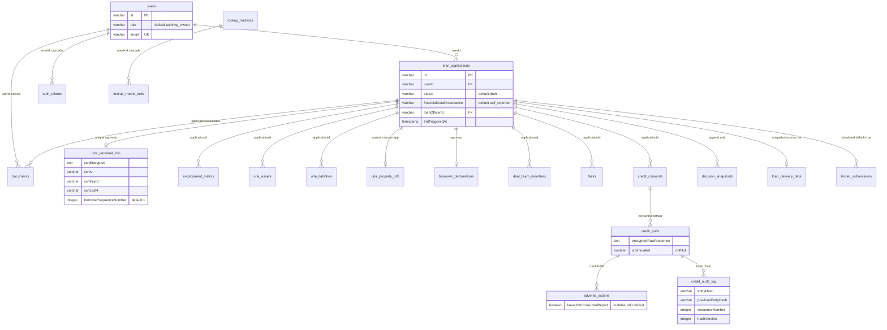

# 03 — Data model and schema

> **Freshness:** last verified 2026-08-22 · review every 30 days
> **Verified against** `origin/main` @ 12d7cbec · **Authoritative:** [app-guide 03 — Database & Schema](../handbook/app-guide/03-database.md) (it wins on conflict; the code wins over both — and its table/file counts are stale, LEDGER HO-0822-01).

## The mental model

196 Drizzle tables in 37 files behind one barrel; `loan_applications` is the root that 95 foreign
keys point at; status is a `varchar` plus an `as const` vocabulary — the database enforces almost
nothing about state, the code does.

## Explain it to a new hire

The whole database lives in TypeScript under `shared/schema/`: 37 files holding 196 `pgTable(…)`
declarations, re-exported through a 27-line barrel at `shared/schema.ts`, so the client gets the
same types and the same `drizzle-zod` validators the server uses (and a renamed column is a compile
error on both sides at once). Everything hangs off two tables — `users` (138 inbound foreign keys)
and `loan_applications` (95) — and almost everything else is a timestamped side-car keyed by
`applicationId`: the URLA (Form 1003) sections, consents and credit records, tasks, decisions,
delivery data. Runtime *values* such as status vocabularies deliberately live in table-free
modules like `shared/loanApplicationStatus.ts`, because `pgTable()` is side-effecting and a single
value import from the barrel once shipped the map of the entire database to every public visitor.
Schema changes never go through `drizzle-kit generate` or `db:push` — both are hard-blocked in
`package.json` — you hand-author `migrations/NNNN_*.sql` plus a `migrations/meta/_journal.json`
entry, and two zero-dependency guard scripts fail CI if the schema outran the migrations or the
ledger is malformed. The habit that will save you most often: read the comment above a column
before touching it — the load-bearing ones (the SSN quartet, `basedOnConsumerReport`,
`financialDataProvenance`, the two-axis task status) each carry a paragraph naming the incident
that produced them.

## Mechanism



## The facts, with receipts

- **Sizes.** `grep -c "pgTable(" shared/schema/*.ts | awk -F: '{s+=$2} END{print s}'` → `196`;
  `ls shared/schema/*.ts | wc -l` → `37`; `wc -l shared/schema/*.ts | tail -1` → `10982`;
  `wc -l shared/schema.ts` → `27` (26 `export *` lines plus one blank separator).
- **Two of the 37 are zero-table re-export shims.** `shared/schema/lending.ts:5-10` re-exports six
  `lending*.ts` files; `shared/schema/underwriting.ts:4-8` five `underwriting*.ts` files (split
  2026-07-17; new tables go in the domain file, never the shim).
- **Exactly one `pgEnum`.** `grep -o "pgEnum(" shared/schema/*.ts | wc -l` → `1`
- **The 196 tables by file.** `grep -c "pgTable(" shared/schema/*.ts | awk -F: '{s+=$2} END {print s}'`
  → `196`, and per file, `grep -c "pgTable(" shared/schema/*.ts | sort -t: -k2 -rn`:

  | file | `pgTable(` |
  |---|---|
  | `shared/schema/admin.ts` | 29 |
  | `shared/schema/compliance.ts` | 17 |
  | `shared/schema/underwritingCore.ts` | 15 |
  | `shared/schema/intelligence.ts` | 13 |
  | `shared/schema/documents.ts` | 13 |
  | `shared/schema/lendingLetters.ts` | 11 |
  | `shared/schema/lendingWholesale.ts` | 9 |
  | `shared/schema/lendingRatesOps.ts` | 8 |
  | `shared/schema/underwritingTasks.ts` | 7 |
  | `shared/schema/underwritingConditions.ts` | 7 |
  | `shared/schema/lendingUrla.ts` | 7 |
  | `shared/schema/property.ts` | 6 |
  | `shared/schema/lendingCore.ts` | 6 |
  | `shared/schema/core.ts` | 5 |
  | `shared/schema/underwritingPolicy.ts` | 4 |
  | `shared/schema/lendingComms.ts` | 4 |
  | `shared/schema/financialReview.ts` | 4 |
  | `shared/schema/underwritingFinancials.ts` | 3 |
  | `shared/schema/rent.ts` | 3 |
  | `shared/schema/marketData.ts` | 3 |
  | `shared/schema/coach.ts` | 3 |
  | `shared/schema/review.ts` | 2 |
  | `shared/schema/partners.ts` | 2 |
  | `shared/schema/lookup.ts` | 2 |
  | `shared/schema/delivery.ts` | 2 |
  | `shared/schema/cpaPartners.ts` | 2 |
  | `shared/schema/taxInsights.ts` | 1 |
  | `shared/schema/scenarioRuns.ts` | 1 |
  | `shared/schema/leads.ts` | 1 |
  | `shared/schema/incomePathEvaluations.ts` | 1 |
  | `shared/schema/fileReview.ts` | 1 |
  | `shared/schema/documentLineage.ts` | 1 |
  | `shared/schema/decisions.ts` | 1 |
  | `shared/schema/autopilot.ts` | 1 |
  | `shared/schema/ai.ts` | 1 |
  | `shared/schema/underwriting.ts` | 0 |
  | `shared/schema/lending.ts` | 0 |

  The two zero-count files, `shared/schema/lending.ts` and `shared/schema/underwriting.ts`, are the
  re-export shims above; a new table never goes in them. The table **names** per file, from
  `for f in shared/schema/*.ts; do printf '%s: ' "${f##*/}"; tr '\n' ' ' < "$f" | grep -oE 'pgTable\( *"[a-z_]+"' | sed -E 's/.*"([a-z_]+)"/\1/' | tr '\n' ' '; echo; done`
  (long lines on purpose — this is the inventory the app-guide's domain table approximates):

  ```
admin.ts: content_categories articles faqs broker_commissions calculator_results calculator_profiles partner_providers partner_orders kba_sessions kyc_screenings onboarding_profiles onboarding_feedback co_brand_profiles deal_desk_threads deal_desk_messages dpa_programs agent_pipeline_access deal_rescue_escalations strategy_sessions accelerator_enrollments accelerator_milestones closing_guarantees notifications staff_invites audit_logs user_activities email_captures partner_waitlist agent_referral_requests 
ai.ts: ai_interactions 
autopilot.ts: autopilot_config 
coach.ts: coaching_sessions coach_conversations coach_messages 
compliance.ts: credit_consents draft_consent_progress credit_pulls adverse_actions credit_audit_log credit_audit_chain_tips homeownership_goals credit_actions savings_transactions journey_milestones consent_templates borrower_consents hmda_demographics verification_reports change_of_circumstances loan_estimate_disclosures loan_cost_entries 
core.ts: sessions users auth_tokens sms_opt_outs user_phones 
cpaPartners.ts: cpa_partners cpa_referrals 
decisions.ts: decision_snapshots 
delivery.ts: loan_delivery_data lender_submissions 
documents.ts: document_packages document_package_items document_uploads document_extraction_jobs document_pages page_classifications logical_documents logical_document_pages extracted_fields completeness_checks tax_extraction_runs borrower_business_entities situation_profiles
incomePathEvaluations.ts: income_path_evaluations 
fileReview.ts: file_review_checkpoints
documentLineage.ts: document_lineage
financialReview.ts: financial_workpaper_versions financial_workpaper_reviews credit_memo_versions credit_memo_reviews
intelligence.ts: borrower_profiles real_estate_owned lender_products borrower_state_history readiness_checklist intent_events lender_match_results anonymized_borrower_facts analytics_events loan_outcomes document_confidence_scores core_provider_canary_runs predictive_snapshots
leads.ts: leads 
lending.ts: 
lendingComms.ts: team_messages loan_milestones plaid_link_tokens verifications 
lendingCore.ts: loan_applications deal_team_members application_properties loan_options documents deal_activities 
lendingLetters.ts: disclaimer_versions pre_approval_letters pre_approval_conditions pre_qualification_letters letter_generation_logs expiration_policies credit_refresh_decisions lender_pre_approval_formats agent_confidence_views document_expirations lender_data_packages 
lendingRatesOps.ts: mortgage_rate_programs mortgage_rates application_invites rate_locks application_milestones sla_configurations analytics_snapshots platform_fee_schedules 
lendingUrla.ts: urla_personal_info employment_history other_income_sources urla_assets urla_liabilities urla_property_info borrower_declarations 
lendingWholesale.ts: wholesale_lenders rate_sheets rate_sheet_products lender_pricing_adjustments lender_offers lock_requests broker_offer_controls offer_selection_events offer_comparison_sessions 
lookup.ts: lookup_matrices lookup_matrix_cells 
marketData.ts: hmda_competitor_loans competitor_rate_benchmarks loan_performance_profiles 
partners.ts: partner_profiles partner_progress_consents 
property.ts: agent_profiles properties saved_properties homeowner_profiles refi_alerts equity_snapshots 
rent.ts: leases rent_payments rent_furnishing_queue 
review.ts: review_items bank_statement_analyses 
scenarioRuns.ts: scenario_runs 
taxInsights.ts: tax_insights 
underwriting.ts: 
underwritingConditions.ts: rule_execution_log loan_conditions document_requirement_rules materiality_rule_sets materiality_rules change_events materiality_evaluations 
underwritingCore.ts: underwriting_event_rules underwriting_event_log underwriting_snapshots underwriting_results anomalies audit_events seasoning_rules cash_flow_adjustments portfolio_stress_tests product_rules underwriting_explanations confidence_breakdowns what_if_scenarios underwriting_decisions underwriting_rules_dsl 
underwritingFinancials.ts: income_streams canonical_assets canonical_liabilities 
underwritingPolicy.ts: policy_profiles policy_thresholds policy_approval_workflow policy_lender_overlays 
underwritingTasks.ts: tasks task_documents task_events task_audit_log sla_class_configs task_type_sla_mapping escalation_actions 
  ```
  (`shared/schema/lookup.ts:24` `lifecycleStatusEnum`, `policy_lifecycle_status`). Every other
  status is `varchar` + an `as const` array + a `z.enum` re-pin.
- **The spine.** `grep -rn "references(() => loanApplications.id)" shared/schema/*.ts | wc -l` → `95`;
  `grep -rn "references(() => users.id)" shared/schema/*.ts | wc -l` → `138`. Naming split:
  `applicationId` is the column name in 18 schema files, `loanId:` in 14 declarations (the UAL
  document pipeline and `underwritingCore.ts`) — a real navigation hazard when joining.
- **`users`.** `shared/schema/core.ts:47`; `:55` `role: varchar("role",{length:50}).default("aspiring_owner").notNull()`;
  `sessions` `:37-45` (the connect-pg-simple store); `auth_tokens` `:86-94` stores only a SHA-256
  `tokenHash`.
- **`loan_applications`.** `shared/schema/lendingCore.ts:26`; `:29` `status … default("draft")`;
  `:34-46` provenance: `financialDataProvenance` default `self_reported` plus `incomeVerified` /
  `assetsVerified` / `creditVerified` — "must NOT drive a credit decision or required disclosure";
  `:48-55` the AUS block (`ausCasefileId`, `ausRecommendation`, three D1C relief flags — written by
  `server/routes/aus.ts`); `:152-158` TRID stamps, `tridTriggeredAt` "written only by
  server/services/trid.ts"; six indexes `:163-168`.
- **`documents` keeps server lineage and borrower text apart.** `lendingCore.ts:386-404` — `notes`
  is server-written AI lineage; `borrowerDescription` is "UNTRUSTED INPUT — never parse as extraction
  output" (finding F-027, migration 0046). `applicationId` is nullable (`:379`), `userId` is not.
- **URLA: one row per (application, borrower sequence) where it matters.**
  `shared/schema/lendingUrla.ts:97` `uniqueIndex("urla_personal_info_app_seq_idx")`; the SSN
  quartet `:34-44` (`ssn` varchar is **DEPRECATED plaintext**, writes go to `ssnEncrypted` /
  `ssnIv` / `ssnKeyId` / `ssnLast4`); the insert schema `.omit`s the four server-managed columns
  (`:104-114`). Employment, other income, assets and liabilities are multi-row
  (`server/storage/urla.ts:188-381` create/update/delete); property, declarations, HMDA are
  upserts (`:395`, `:515`, `:657`).
- **Tasks carry two axes on purpose.** `shared/schema/underwritingTasks.ts:137-145` `TASK_STATUSES`
  (`OPEN IN_PROGRESS BLOCKED COMPLETED EXPIRED`) and `:170-181` `TASK_VERIFICATION_STATUSES`
  (`pending verified rejected needs_review`); the comment at `:128-136` records the one-column
  collision that made SLA sweeps skip pipeline tasks (migration 0033 remapped them).
  `insertTaskSchema` re-pins all three vocabularies with `.extend` + `z.enum` (`:293-303`) because
  `createInsertSchema` derives a bare string for `varchar`.
- **Decisions are reproducible after a matrix edit.** `shared/schema/decisions.ts:42-46`
  `resolvedPolicy` + `policyFingerprint` — "lookup matrices are mutable, so these let a past decision
  be reconstructed" (both nullable).
- **A compliance column with no default, on purpose.** `shared/schema/compliance.ts:232-244`
  `adverse_actions.basedOnConsumerReport` — "a backfilled guess on a compliance record would be a
  falsified record"; `fcraCompliant` is computed per notice, never defaulted.
- **The hash chain.** `shared/schema/compliance.ts:270` `credit_audit_log` (`entryHash`, `previousEntryHash`,
  `sequenceNumber`, `hashVersion`) and `:329` `credit_audit_chain_tips` — the schema header says
  plainly it is tamper-*evident*, not a cryptographic guarantee (same database as the log).
- **Delivery is one row per application.** `shared/schema/delivery.ts:100`
  `uniqueIndex("loan_delivery_data_application_idx")`; `lender_submissions.simulated` is
  `notNull().default(true)` (`:132`) and the MISMO package is snapshotted with a SHA-256 (`:142-145`).
- **Rent furnishing performs no I/O by design.** `shared/schema/rent.ts:22-29` — "Nothing here
  transmits anything to a credit bureau … The queue accumulates state and performs no I/O."
- **Encrypted-at-rest columns: 8 sites, 3-column pattern each.** `grep -rn "_encrypted" shared/schema/*.ts | wc -l`
  → `8`: `shared/schema/documents.ts:339` (`raw_response_encrypted`), `:462` (`classification_raw_encrypted`),
  `lendingCore.ts:429` (`extraction_raw_encrypted`), `lendingUrla.ts:40` (`ssn_encrypted`), `:354`
  and `:383` (`account_number_encrypted` on assets and liabilities), `rent.ts:107`
  (`landlord_email_encrypted`), `:110` (`property_address_encrypted`). Plus `credit_pulls`'
  `encryptedRawResponse` (`shared/schema/compliance.ts:158-160`) which the grep's naming misses. Chapter 08 has
  the vaults.
- **Validation pattern.** `grep -rn "createInsertSchema(" shared server | wc -l` → `177`;
  `grep -rn "z.enum(" shared/schema | wc -l` → `22`. Shape: `createInsertSchema(table).omit({id,
  createdAt, updatedAt}).extend({ col: z.enum(VOCAB) })`.
- **The access layer.** `server/storage/index.ts` (23 lines): 24 domain classes — `UsersStorage` plus 23 that
  each extend the previous one — in a linear chain ending in `DatabaseStorage`, with two helper
  modules (`server/storage/batchGroup.ts`, `server/storage/urlaBatch.ts`) beside them: 26 files; `export type IStorage = DatabaseStorage` — derived,
  not hand-maintained (the old 733-line interface had to move in lockstep with every method).
  `grep -rln "\.transaction(" server --include='*.ts'` → 19 files; `.transaction(` has 39 call sites; `grep -rn "inArray(" server --include='*.ts' | wc -l` → `84`.
- **The driver.** `server/db.ts:23-24` picks node-postgres for a localhost URL (or
  `USE_LOCAL_PG=true`), Neon serverless otherwise; `drizzle.config.ts:9-10` points at the barrel and
  `./migrations`.
- **Migrations.** `ls migrations/*.sql | wc -l` → `74` (`0000`…`0073`); `grep -c '"tag"' migrations/meta/_journal.json`
  → `74`; journal entry shape `{idx, version:"7", when, tag, breakpoints:true}`. `package.json:30,34`
  block `db:generate` and `db:push` with an explaining `echo … && exit 1`.
  `scripts/schema-migration-guard.cjs:5-18` exists because of the 2026-07-13 outage and runs schema
  → migrations only; `scripts/migration-ledger-guard.cjs:18-24` runs six hard checks.
- **Stale counts in the wild.** `knowledge-base/handbook/app-guide/03-database.md:7` said "21 schema
  files, 178 tables" until `3d047ce9` corrected it to 34 / 188 — but the code has since reached 37 / 196, and its per-file table (`:40-56`)
  still lists only 17 of the 37 files (`grep -cE '^\| .[a-zA-Z]+\.ts. \| [0-9]' knowledge-base/handbook/app-guide/03-database.md` → `17`) and four counts the inventory above contradicts (`admin.ts` 28 →
  29, `compliance.ts` 13 → 17, `documents.ts` 9 → 13, `core.ts` 4 → 5); "174 Drizzle tables" in `shared/loanApplicationStatus.ts:9`,
  `shared/statusVocabularies.ts:8`, `client/src/pages/lending/preApproval/useServerDraftAutosave.ts:24`,
  `tests/clientSchemaImports.test.ts:15` — all history inside rationale comments (LEDGER HO-0822-01/02).
- **The status machine.** `shared/loanApplicationStatus.ts:29-48` — 16 states, 4 terminal
  (`funded denied withdrawn expired`, `:52`), a full transition table (`:59`); the single writer is
  `updatePipelineStage` in `server/pipelineEngine.ts:849` (chapter 04).

## Prove it yourself

```bash
cd /Users/ammrebarakat/Developer/Homiquity-handoff && git rev-parse --short HEAD
# → 12d7cbec @ 12d7cbec
grep -c "pgTable(" shared/schema/*.ts | awk -F: '{s+=$2} END{print s}' ; ls shared/schema/*.ts | wc -l ; wc -l shared/schema/*.ts | tail -1
# → 188 / 34 / 10669 total @ 12d7cbec
grep -o "pgEnum(" shared/schema/*.ts | wc -l ; grep -rn "pgEnum(" shared/schema/*.ts
# → 1 / shared/schema/lookup.ts:24:export const lifecycleStatusEnum = pgEnum("policy_lifecycle_status", [ @ 12d7cbec
wc -l shared/schema.ts ; grep -c "pgTable(" shared/schema/lending.ts shared/schema/underwriting.ts
# → 23 / lending.ts:0 underwriting.ts:0 @ 12d7cbec
grep -rn "references(() => loanApplications.id)" shared/schema/*.ts | wc -l ; grep -rn "references(() => users.id)" shared/schema/*.ts | wc -l
# → 91 / 130 @ 12d7cbec
grep -n "urla_personal_info_app_seq_idx" shared/schema/lendingUrla.ts ; grep -n "loan_delivery_data_application_idx" shared/schema/delivery.ts
# → 97 / 100 @ 12d7cbec
grep -rn "_encrypted" shared/schema/*.ts | wc -l
# → 8 @ 12d7cbec
grep -rn "createInsertSchema(" shared server | wc -l ; grep -rn "z.enum(" shared/schema | wc -l
# → 177 / 22 @ 12d7cbec
grep -rln "\.transaction(" server | wc -l ; grep -rn "inArray(" server --include='*.ts' | wc -l
# → 6 / 56 @ 12d7cbec
cat server/storage/index.ts | grep -n "extends\|IStorage"
# → 16:export class DatabaseStorage extends LeasesStorage {} / 21:export type IStorage = DatabaseStorage; @ 12d7cbec
ls migrations/*.sql | wc -l ; grep -c '"tag"' migrations/meta/_journal.json
# → 58 / 58 @ 12d7cbec
grep -n "db:push\|db:generate" package.json
# → 25 (BLOCKED: drizzle-kit generate has snapshot drift…) / 29 (BLOCKED: db:push drops columns owned by other branches…) @ 12d7cbec
grep -rn "174" shared/loanApplicationStatus.ts shared/statusVocabularies.ts
# → loanApplicationStatus.ts:9 and statusVocabularies.ts:8 — the stale "174 Drizzle table" comments @ 12d7cbec
```

## Where this breaks

| Trap | Where | Caught by |
|---|---|---|
| One value import from `@shared/schema` in client code ships all 196 table names to the browser — `pgTable()` is side-effecting and tree-shaking cannot drop it. | `shared/loanApplicationStatus.ts:8-15` | Yes — `tests/clientSchemaImports.test.ts` scans `client/src` for value imports of the barrel; TypeScript, the bundler and ESLint all stay silent. |
| The deprecated plaintext `ssn` column still exists and is still accepted as insert input; storage encrypts on write and masks on read, but nothing stops a *new* code path from writing plaintext via `db.insert(urlaPersonalInfo)`. | `shared/schema/lendingUrla.ts:34-37`, `:104-114`; `server/storage/urla.ts:69`, `:116` | No DB constraint. |
| `guard:schema` is a name-presence check, not table-scoped: a drifted column whose name coincides with any quoted identifier in any migration passes — its own documented blind spot. | `scripts/schema-migration-guard.cjs:20-25` | Catches genuinely new names only. |
| `guard:schema`'s baseline allow-list can be regenerated to silence a failure; the comment forbids it, no code enforces it. | `scripts/schema-migration-guard.cjs:34-41` | Nothing. |
| Prod's `DATABASE_URL` and CI's minted URL are independent settings; `/api/health` answers green from the wrong Neon branch. | `app-guide/03-database.md:29-35` (the 2026-08-06 incident) | Nothing reconciles the two URLs (chapter 10). |
| The storage chain is 23 links deep and order-sensitive for `this.x()` cross-domain calls; a method-name collision between two links is a silent override. | `server/storage/index.ts:3-9` | TypeScript catches a call to a later link; nothing catches a shadowed name. |
| `decision_snapshots` reproducibility depends on `resolvedPolicy`/`policyFingerprint` being populated — both nullable. | `shared/schema/decisions.ts:42-50` | Nothing. |
| `documents.applicationId` is nullable — any query that joins documents → applications silently drops orphans. | `shared/schema/lendingCore.ts:379-380` | Nothing schema-level. |
| The app-guide lists `lending.ts` (44 tables) and `underwriting.ts` (36) as real domains; both are zero-table shims. | `app-guide/03-database.md:40-41` vs `shared/schema/lending.ts:1` | Nothing automated. LEDGER HO-0822-01. |

## What we do not know

| Question | What resolves it |
|---|---|
| How many tables exist in the production database vs 196 declared — the guard is one-directional, so prod may carry extra legacy tables. | A prod read-only probe through CI (`knowledge-base/runbooks/DB_MIGRATIONS.md` §contract migrations); no prod credential lives locally. |
| Has the plaintext `ssn` backfill run in every environment? The schema says "drop the column once the backfill has run in every environment". | `server/scripts/backfillSsnEncryption.ts` and the PII vault owner. |
| What are the five snapshot files in `migrations/meta/` (0000 to 0004) for (0000–0004 only, for 58 migrations), given `db:generate` is blocked? | `git log --follow migrations/meta/0004_snapshot.json`; `hq-ci-guards-owner`. |
| Do all 12 `uniqueIndex(` declarations exist in prod (the guard checks columns, not indexes)? | A prod `\di` through CI. |

## Analogy

A filing cabinet with one master index card. `loan_applications` is the card; 95 other drawers
hold folders stamped with that card's number, so pull the card and everything about the borrower
is one hop away — but nothing in the cabinet stops you filing a folder with no card number on it
(`documents.applicationId` is nullable), and that folder is then invisible forever. The contract
both parties signed (`shared/schema/`) is bilingual — client and server read the same clauses —
while the pronunciation guide (the runtime vocabularies) is printed on separate loose pages,
because binding the full contract into the borrower's pocket edition would hand every passer-by
the table of contents.

## Teach-back checkpoint

1. 27 lines in the barrel but 37 files in `shared/schema/`. Where do the extra domain files come from?
2. Why does `shared/loanApplicationStatus.ts` import nothing at all?
3. What are the two axes of a task's status, and what incident produced the split?
4. Why is `adverse_actions.basedOnConsumerReport` nullable with no default?
5. You need to add a column. What is the exact sequence, and what is forbidden?
6. `IStorage` is 733 lines shorter than it used to be. Why?
7. `urla_personal_info` gets an `upsert` method but `employment_history` gets create/update/delete. Why the asymmetry?
8. Name one transaction boundary in the server and say why its writes must be atomic.

## Go deeper

- [app-guide 03](../handbook/app-guide/03-database.md) for the narrative of what each domain is
  for — its per-file table (`:40-56`) is still partly stale (LEDGER HO-0822-01), so take the
  counts and names from *The 188 tables by file* above; `knowledge-base/runbooks/DB_MIGRATIONS.md` (the authoritative *how*; CLAUDE.md §Database
  is the binding rule), `knowledge-base/runbooks/ROLLBACK.md` §3, `knowledge-base/runbooks/NEON_PREVIEW_DB.md`.
- Feature-map rows for the schema files: URLA (`:95`), intake + `lendingCore` (`:110`), rates /
  wholesale / lookup (`:125`), underwriting + decisions (`:156`), income / review (`:172`),
  compliance (`:187`), delivery (`:202`), documents (`:248`), rent (`:286`), tasks (`:317`),
  letters (`:347`), admin (`:392`), coach / AI (`:408`), property (`:436`), partners (`:496`),
  intelligence (`:624`), market data (`:639`).
- Owner agents (`grep -ln "shared/schema" .claude/agents/hq-*-owner.md` → 21 hits):
  `hq-urla-owner`, `hq-credit-fcra-owner`, `hq-underwriting-owner` (engine and decision engine are
  hand-back only), `hq-gse-delivery-owner`, `hq-task-engine-owner`, `hq-documents-owner`,
  `hq-rent-reporting-owner`, `hq-auth-owner` (core), `hq-pipeline-owner` (the status vocabularies),
  `hq-pii-vault-owner`, `hq-ci-guards-owner` (the two guard scripts).
