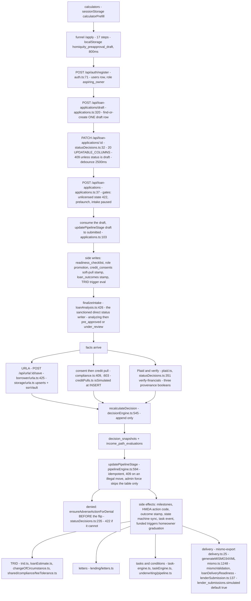

# 04 — Data flow: a loan's journey

> **Freshness:** last verified 2026-08-23 · review every 30 days
> **Verified against** `origin/main` @ 6377727e · **Authoritative:** [app-guide 05 — Data Flow: A Loan's Journey](../handbook/app-guide/05-data-flow.md) (it wins on conflict; the code wins over both — and this chapter's hop table is where the code has moved furthest from it, LEDGER HO-0822-16).

## The mental model

A loan is one `loan_applications` row that starts in the browser's own storage, is adopted into
one server draft container, and is then advanced stage by stage through a single chokepoint — and
every regulated moment (consent, credit, denial, disclosure) must leave its own immutable record
before the status is allowed to move.

## Explain it to a new hire

A borrower's figures start life client-side — a calculator stashes them in `sessionStorage` under
`calculatorPrefill`, and the 17-step funnel autosaves answers to `localStorage` under
`homiquity_preapproval_draft` — none of which the server has seen. Once they sign up,
`POST /api/loan-applications/draft` mints exactly one draft container row and a 2,500 ms-debounced
`PATCH` keeps it current so progress survives a device switch; on submit,
`POST /api/loan-applications` consumes that same draft rather than minting a sibling, stamps the
FCRA soft-pull consent with the exact text that was shown, seeds the readiness checklist, promotes
`aspiring_owner` → `active_buyer`, and hands off to `finalizeIntake` after the 201 has already gone
out. From there the file gains facts — URLA sections through one `POST /api/urla/:id/save`, a credit
pull through a consent-gated route, Plaid or staff verification that flips three provenance
booleans — and each fact fires `recalculateDecision`, which *appends* an immutable
`decision_snapshots` row rather than overwriting anything. Every stage move after intake goes
through `updatePipelineStage` in `server/pipelineEngine.ts`, which is idempotent, validates against
the transition table (throwing `PipelineTransitionError` → HTTP 409), and fans out milestones, HMDA
action codes, outcome stamps, state-machine sync and task events; a denial cannot reach it until
its ECOA adverse-action notice exists. The far end is delivery: a MISMO 3.4 package is assembled,
hashed and snapshotted onto a `lender_submissions` row — born `simulated: true`, because the lender
leg is a deterministic simulation until broker agreements exist.

## Mechanism



## The hops, with receipts

| # | Hop | Route | Service / engine | Table(s) written |
|---|---|---|---|---|
| 1 | Calculators | read-only endpoints in `server/routes/calculators.ts` | — | none; figures ride in `sessionStorage` key `calculatorPrefill` (`client/src/lib/calculatorPrefill.ts:23`) — "a URL is logged, shared and referred" (`:9-12`) |
| 2 | Anonymous funnel | — | `client/src/funnel/preApprovalMachine.ts` (17 steps, no SSN by design `:33-35`), `client/src/funnel/useFunnelAutosave.ts` (800 ms; consent acknowledgements deliberately not persisted `:11-12`) | `localStorage` only — keys in `client/src/lib/pendingAttribution.ts:14-16` ("must never change") |
| 3 | Signup | `POST /api/auth/register` `server/auth.ts:71` | `issueEmailVerification` fire-and-forget `:119` | `users`, `sessions`, `auth_tokens` |
| 4 | Server draft | `POST /api/loan-applications/draft` `server/routes/lending/applications.ts:320` (find-or-create); `PATCH /api/loan-applications/:id` `server/routes/lending/statusDecisions.ts:32` | `client/src/pages/lending/preApproval/useServerDraftAutosave.ts` (`DEBOUNCE_MS = 2500`, `:28`; empty answers omitted, clears are a transition `:60-68`); restore via `useDraftRestore.ts` (`draftToFormValues` `:50`, `form.reset` IS the restore `:133-137`) | `loan_applications` (status `draft`); the PATCH 409s `not_editable` unless `draft` (`statusDecisions.ts:52-55`) and only writes `UPDATABLE_COLUMNS` — 20 names at `:78-91`, the last three added by #667 |
| 5 | Submit | `POST /api/loan-applications` `server/routes/lending/applications.ts:37` | gates: `unlicensedStateRejection` → 422 (`:52`), `prelaunchGate`, `intakePausedGate`; consumes the draft via `updatePipelineStage(existingDraft.id, "submitted")` (`:103`) | `loan_applications`; `readiness_checklist` (`:117`); `users.role` promotion (`:130-142`); `credit_consents` soft-pull stamp with `FUNNEL_SOFT_PULL_CONSENT_TEXT` (`:179-197`); `loan_outcomes` (`:150-158`, create path only); `deal_activities`, `notifications`, `application_invites` — every one wrapped as non-fatal |
| 6 | Intake automation | runs after `res.status(201)` (`:279` → `:293`) | `server/services/loanAnalysis.ts:515` `finalizeIntake` — writes `status: "analyzing"` (`:436`) then the outcome (`:455`) **directly**; resets to `submitted` on failure (`:588`) for the recovery sweep (`:596-614`); automation never denies — the non-approval outcome is `under_review` (`:400`) | `loan_applications.status`, `preApprovalAmount`, `dtiRatio`, `ltvRatio`, `aiAnalysis` |
| 7 | URLA sections | `POST /api/urla/:applicationId/save` `server/routes/borrower/urla.ts:425` → `writeBorrowerSections` `:455` | `server/storage/urla.ts` (whitelisted to table columns before any write; `upsertUrlaPersonalInfo` `:116` → `ssnVault.resolveSsnInput`); the `/personal-info` route is dead (`server/routes/borrower/urla.ts:481-484`) | the 8 URLA tables; `urla_personal_info` keyed by `borrowerSequenceNumber` |
| 8 | Consents | `server/routes/compliance.ts:375,409,539,560,581` | `creditConsents.ts`, `creditConsentDrafts.ts`, `server/consentGate.ts` | `credit_consents`, `draft_consent_progress`, `borrower_consents`, `credit_audit_log` |
| 9 | Credit pull | `POST /api/loan-applications/:id/credit/pull` `server/routes/compliance.ts:603` — active consent required (`:622` → 400), `pullType` is a required `z.enum(["soft","hard","tri_merge"])` (`:632-635`; it used to default to the most invasive option), scope mismatch → 403 `CONSENT_SCOPE_MISMATCH` (`:661`) | `server/services/creditPulls.ts` — `isSimulated: creditVendorIsSimulated()` stamped **at INSERT** (`:107`, derived from `!process.env.CREDIT_VENDOR_API_KEY` `:27-29`); marks the credit dimension verified (`server/routes/compliance.ts:688`) | `credit_pulls`, `credit_audit_log` + `credit_audit_chain_tips`, `loan_cost_entries` |
| 10 | Verification | `server/routes/lending/statusDecisions.ts:464` `/verify-financials` (all dimensions) and `:402` `/verify/:dimension`; Plaid routes `compliance.ts:23,75` | `server/plaid.ts` (link token, exchange, identity, remove, get — 178 lines); `server/services/verification.ts:23` `markDimensionVerified` promotes `financialDataProvenance` to `verified` when all three are true (`:37-40`) | `verification_reports`, `verifications`, `plaid_link_tokens`, the three `*Verified` booleans |
| 11 | Underwriting | — | `server/underwritingEngine.ts:300` `evaluate(input)`; singleton `:728`; thresholds via `server/services/lookupResolver.ts:91` (cached, cross-process invalidation stamp) | `underwriting_snapshots`, `underwriting_results`, `rule_execution_log` |
| 12 | Decision | triggered from 8 files — `grep -rn "recalculateDecision(" server --include='*.ts' | wc -l` → `8` | `server/services/decisionEngine.ts:616` `recalculateDecision` — best-effort, never throws into the caller (`:596-599`) | `decision_snapshots` (`:575`), `income_path_evaluations` (`:559`) — append only |
| 13 | Pipeline | `PATCH /api/loan-applications/:id/status` `statusDecisions.ts:147` (staff; `STAFF_SETTABLE_STATUSES`); `POST …/advance-stage` `server/routes/underwriting/pipeline.ts:265` | `server/pipelineEngine.ts:849` `updatePipelineStage` — no-op when unchanged (`:615`), `PipelineTransitionError` (`:574`) → 409 with `allowedStatuses` (`statusDecisions.ts:265-273`), `force` is admin-only and skips **only** the table (`:600`, `statusDecisions.ts:262`) | `loan_applications.status`; milestones (`:623-655`), HMDA action codes 1/3/4 (`:670-678`), outcome stamp (`:687-692`), state-machine sync (`:701-706`), task event (`:709-736`), homeowner graduation on `funded` (`:648-654`) |
| 14 | Adverse action | inside hop 13: `statusDecisions.ts:230-251` — `ensureAdverseActionForDenial` runs **before** the flip, 422 if it cannot; HMDA needs ≥ 2 reasons (`:165-168`); only underwriter/admin set outcomes (`:174-175`) | `server/services/creditAdverseActions.ts:521`; delivery sweep `adverseActionDelivery.ts` via the cron | `adverse_actions`, `credit_audit_log`, `hmdaActionTaken` / `hmdaDenialReasons` |
| 15 | TRID | the TRID hard stop blocks forward movement, never exit dispositions (`statusDecisions.ts:221-228`) | `server/services/trid.ts` (`assessSixPieces` `:58`, `evaluateTridTrigger` `:160`), `server/services/loanEstimate.ts:568` `generateLoanEstimate`, `server/services/changeOfCircumstance.ts:63`, `shared/compliance/feeTolerance.ts` | `loan_estimate_disclosures`, `change_of_circumstances`, `loan_cost_entries`; `tridTriggeredAt` written only by `trid.ts` |
| 16 | Letters, tasks, conditions | `server/routes/lending/letters.ts` (7 endpoints; revoke gated to `CREDIT_DECISION_ROLES` = `["admin","underwriter"]`); `server/routes/task-engine.ts`; `server/routes/underwriting/pipeline.ts:121` conditions | `pdfLetterGenerator.ts`, `letterExpiry.ts`, `server/services/taskEngine.ts:102` | `pre_approval_letters`, `tasks`, `task_events`, `loan_conditions`, `notifications` |
| 17 | Delivery | `GET /api/loan-applications/:id/mismo-export` `server/routes/lending/delivery.ts:25` (role gate **and** `getLoanApplicationWithAccess` `:30`); `GET …/mismo-validation` `server/routes/underwriting/submissions.ts` | `server/mismo.ts:1303` `generateMISMO34XML`; `server/services/mismoValidation.ts`; `server/services/loanDeliveryReadiness.ts`; `server/services/lenderSubmission.ts:178` `submitToWholesaleLender` — four gates (counterparty eligibility `:151`, one live per lender `:162`, broker readiness `:174`, package validation `:189`) | `loan_delivery_data`; `lender_submissions` with the immutable package + SHA-256 (`shared/schema/delivery.ts:142-145`), `simulated` default `true` (`:132`) |

**Who may write `status`.** `grep -rn "updatePipelineStage(" server --include='*.ts' | wc -l` → `5`
(the definition + four callers: `borrower/dealTeam.ts:143` withdraw, `lending/applications.ts:103`
submit, `lending/statusDecisions.ts:260` staff PATCH, `underwriting/pipeline.ts:382` advance).
`tests/statusVocabulary.test.ts:243-259` scans every server file for a direct `status:` write and
allows exactly four files: `server/pipelineEngine.ts`, `server/services/loanAnalysis.ts`
("the one other sanctioned writer"), `scripts/migrate-status-vocabulary.ts`, `server/seed.ts`.

## Prove it yourself

```bash
cd /Users/ammrebarakat/Developer/Homiquity-handoff && git rev-parse --short HEAD
# → 12d7cbec @ 12d7cbec
grep -rn "updatePipelineStage(" server --include='*.ts'
# → pipelineEngine.ts:594 (def) · borrower/dealTeam.ts:143 · lending/applications.ts:103 · lending/statusDecisions.ts:260 · underwriting/pipeline.ts:382 @ 6377727e
grep -rn 'status: "' server/services/loanAnalysis.ts
# → :436 "analyzing" · :514 "unread" · :531 "unread" (notifications) · :588 "submitted" (failure reset) @ 12d7cbec
sed -n '254,259p' tests/statusVocabulary.test.ts
# → const ALLOWED = new Set(["server/pipelineEngine.ts", "server/services/loanAnalysis.ts", "scripts/migrate-status-vocabulary.ts", "server/seed.ts"]) @ 12d7cbec
grep -n "STORAGE_KEY =" client/src/lib/calculatorPrefill.ts ; grep -rn "PREAPPROVAL_AUTOSAVE_KEY =" client/src
# → 23:const STORAGE_KEY = "calculatorPrefill"; / pendingAttribution.ts:14 "homiquity_preapproval_draft" @ 12d7cbec
awk '/export const CANONICAL_ORDER/,/^\];/' client/src/funnel/preApprovalMachine.ts | grep -c '^  "'
# → 17 @ 12d7cbec
sed -n '78,84p' server/routes/lending/statusDecisions.ts
# → UPDATABLE_COLUMNS = [annualIncome, monthlyDebts, creditScore, employmentType, employmentYears, propertyType, purchasePrice, downPayment, loanPurpose, isVeteran, isFirstTimeBuyer, propertyState, employerName, propertyAddress, propertyCity, propertyZip, incomeSources, householdFamilySize, homeSquareFootage, avoidsInterestFinancing] @ 12d7cbec
grep -n "DEBOUNCE_MS =" client/src/pages/lending/preApproval/useServerDraftAutosave.ts
# → 28:const DEBOUNCE_MS = 2500; @ 12d7cbec
sed -n '26,29p' server/services/creditPulls.ts
# → function creditVendorIsSimulated() { return !process.env.CREDIT_VENDOR_API_KEY; } @ 12d7cbec
grep -rn "recalculateDecision(" server --include='*.ts' | wc -l
# → 11 @ 12d7cbec
grep -n "simulated: boolean" shared/schema/delivery.ts
# → 132:    simulated: boolean("simulated").notNull().default(true), @ 12d7cbec
grep -n "finalizeIntake\|pipelineEngine\|updatePipelineStage\|decision_snapshots\|lender_submissions\|adverse" knowledge-base/handbook/app-guide/05-data-flow.md | wc -l
# → 0   (the app-guide chapter names none of the current chokepoints) @ 12d7cbec
```

## Where this breaks

| Seam | Where | Caught by |
|---|---|---|
| **The draft round-trip drop — FIXED 2026-08-22 by `12d7cbec` (#667); kept here because the *class* is not fixed.** The funnel collects `householdFamilySize`, `homeSquareFootage`, `avoidsInterestFinancing` (`shared/preApprovalForm.ts:164-183`; two are required for VA borrowers `:217-233`), every autosave validated them and returned 200 — and `UPDATABLE_COLUMNS` never wrote them, so a veteran who resumed on another device was re-asked the VA residual questions and the UAL routing opt-in came back a silent "no". The three names are now in the list (`:90`) with the two integer columns parsed rather than copied as strings (`:97-104`), and `tests/funnelDraftRoundTrip.test.ts` (`:109` pins the numeric round-trip) pins it. | `server/routes/lending/statusDecisions.ts:78-91`; the fix's own comment at `:84-89` | **Still nothing generic.** The PATCH silently drops any unlisted key and the hook swallows failures by design (`useServerDraftAutosave.ts:10-13`) — so the next field added to the funnel repeats this exactly. That is silent-success: a 200 for a write that did not happen. |
| **Two document pipelines.** The UAL tax pipeline (`document_uploads → pages → logical_documents`) and the borrower upload flow (plain `documents`) — extracted *values* were discarded between them until migration 0056 added `extracted_fields.document_id` (its header's first line says "0054", a typo). Nothing backfilled. | `migrations/0056_extracted_fields_source_document.sql:1-24` | The ledger guard would catch a filename/idx mismatch, not an in-comment typo; nothing stops a new writer picking the wrong pipeline. |
| **Credit-audit chain cross-process race.** Appends serialize through an in-process promise queue only; no unique `(application_id, sequence_number)` constraint exists in `shared/schema/compliance.ts:270-311`. | `server/services/creditAuditChain.ts:40-45` | Documented, not guarded. |
| **Rent furnishing is a deliberate dead end** — `pending_authority` is the entry state and the terminus; `hasMetro2Authority()` and `BUREAU_MINIMUM_ACTIVE_LINES = null` hold it there. | `server/services/rentFurnishing.ts:128-142`, `:192`, `:214` | `assertTransition` / `assertFurnishable` refuse to advance. |
| **The lender leg is simulated by a column default, not a runtime assertion.** | `shared/schema/delivery.ts:120-132`; `server/services/lenderSubmission.ts:151-159` | Eligibility refuses seeded demo rows and requires a signed agreement in production; a row inserted by any other path inherits `simulated: true` silently. |
| **The credit-pull simulation flag is env-derived at write time.** Set `CREDIT_VENDOR_API_KEY` without wiring a vendor and every new pull records `isSimulated: false`. | `server/services/creditPulls.ts:27-29`, `:107` | `tests/creditSimulationGuards.test.ts`, `tests/creditVendorInterlock.test.ts`, `tests/liveCreditPullImport.test.ts` cover the throws; the env var itself is unguarded. |
| **`finalizeIntake` compensates by hand for the side effects it bypasses** — its own state-machine sync (`loanAnalysis.ts:437-451`) and outcome stamp (`:465-471`); milestones, HMDA codes and task events are *not* emitted for the intake hop. Add a side effect to the pipeline engine and `finalizeIntake` diverges silently. | `server/services/loanAnalysis.ts:436,455,588` vs `server/pipelineEngine.ts:623-736` | `tests/statusVocabulary.test.ts:243` permits the bypass by name; nothing checks the two stay in sync. |
| **`updatePipelineStage`'s side effects are all best-effort `try/catch` + `console.warn`** — a dropped task event means no task for that stage, and nothing says so. | `server/pipelineEngine.ts:648-654`, `:687-692`, `:701-706`, `:730-735` | Nothing — no dead-letter, no retry, no alert. |
| **Submit sends the 201 first, then runs eight non-fatal side effects.** A crash between `res.json()` and the consent write leaves an application with no consent row and a 201 already returned; only `finalizeIntake` has a recovery sweep. | `server/routes/lending/applications.ts:117-293` | Partially (the sweep at `loanAnalysis.ts:596-614`). |
| **The app-guide data-flow chapter is materially stale** — it never names `finalizeIntake`, `updatePipelineStage`, `decision_snapshots`, `lender_submissions`, adverse actions, TRID or the draft container. | `knowledge-base/handbook/app-guide/05-data-flow.md` (zero hits for the six terms in the prove-it block) | Nothing automated. LEDGER HO-0822-16. |

## What we do not know

| Question | What resolves it |
|---|---|
| Answered by #667: it was a defect, and the fix's comment says why it survived — the list "never learned about" the three answers the funnel added after the #202 registrar split. What is still open is whether anything stops the *next* one: nothing diffs the funnel schema against `UPDATABLE_COLUMNS`. | `hq-intake-funnel-owner` + `hq-pipeline-owner`; proposed as a guard in chapter 12 §6. |
| How Plaid results land as income/asset verification — `server/plaid.ts` exposes identity data only and `verification.ts` is 47 lines of boolean flips; the asset ingestion path is elsewhere. | `grep -rn "assetReport\|plaidClient" server --include='*.ts'`; `hq-verifications-owner`. |
| Has the credit-audit race ever occurred in production? | A prod query for duplicate `(application_id, sequence_number)` through CI. |
| Does `lookupResolver` sit on the underwriting `evaluate()` path or only on pricing? (The resolver exists; the call graph into `underwritingEngine.ts:300-460` was not traced here.) | `grep -rn "lookupResolver" server --include='*.ts'`. |

## Analogy

A hospital admission. Triage happens in the waiting room on the patient's own phone — nobody has
a chart yet. Registration opens exactly one chart, not a new one per visit. From then on every
test result is stapled in with a timestamp, and the chart's *ward* changes only at the nurses'
station, through one person who logs the move, updates the whiteboard and pages the right team —
and who refuses to move a patient from "discharged" back to "surgery" because the board says that
transition does not exist. The one exception is the automated intake screen, which may move the
patient itself but is forbidden, in writing, from ever writing "denied".

## Teach-back checkpoint

1. A borrower fills the funnel on a laptop, closes it, and opens it on a phone. What survives, and by what mechanism?
2. Who is allowed to write `loan_applications.status`, and how is that enforced?
3. Why is `finalizeIntake` allowed to bypass the single writer?
4. A staff member tries to move a file from `funded` to `underwriting`. Trace what happens.
5. Why is the adverse-action notice generated *before* the status flips, not after?
6. Where does a borrower's SSN actually get encrypted, and why not at the route?
7. Name three tables a single successful `POST /api/loan-applications` writes besides `loan_applications`.
8. What does `lender_submissions.simulated` mean, and what would change it?

## Go deeper

- [app-guide 05](../handbook/app-guide/05-data-flow.md) — good for the *shape* (its ASCII diagram
  and "where state lives" table); treat everything after its step 6 as drift. Cross-read
  [app-guide 03](../handbook/app-guide/03-database.md) §59-75 for the tables touched.
- Runbooks: `knowledge-base/runbooks/PROD_ACCEPTANCE_TEST.md`, `knowledge-base/runbooks/TEST_ACCOUNTS.md`
  (the seeded seats for walking the journey), `knowledge-base/runbooks/BETA_GO_LIVE_READINESS.md`.
- Feature-map rows: URLA (`:85-95`), intake funnel + leads (`:110`), underwriting (`:156-157` —
  **hand-back only**: `server/underwritingEngine.ts`, `server/services/decisionEngine.ts`,
  `server/services/ruleEngine.ts`), credit/FCRA (`:187`), GSE delivery (`:202`), documents (`:248`),
  task engine (`:317`), pipeline & cockpit (`:330` — `statusDecisions.ts` and `dealTeam.ts` are
  marked provisional, assigned 2026-08-22), letters (`:347`).
- Owner agents: `hq-intake-funnel-owner`, `hq-pipeline-owner` (`.claude/agents/hq-pipeline-owner.md:16-28`
  for its file list and hand-backs), `hq-urla-owner`, `hq-credit-fcra-owner`, `hq-underwriting-owner`,
  `hq-task-engine-owner`, `hq-trid-disclosures-owner`, `hq-letters-owner`, `hq-gse-delivery-owner`,
  `hq-verifications-owner`, `hq-rent-reporting-owner`.
- Tests to read before touching the flow: `tests/statusVocabulary.test.ts` (the allow-list),
  `tests/pipelineEngineStageTransitions.test.ts`, `tests/pipelineEngineDocumentRequirements.test.ts`,
  `tests/taskEngineSlaSeed.test.ts`, `tests/trid.test.ts`, `tests/mismoValidation.test.ts`,
  `tests/creditSimulationGuards.test.ts`, `tests/intakeSchema.test.ts`.
