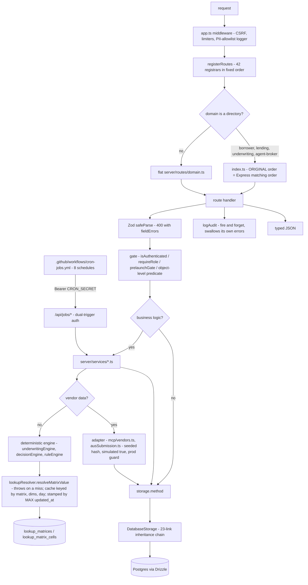

# 05 — Backend patterns, engines and adapters

> **Freshness:** last verified 2026-08-23 · review every 30 days
> **Verified against** `origin/main` @ 6377727e · **Authoritative:** [app-guide 04 — API Surface](../handbook/app-guide/04-api-routes.md), [08 — Service Catalog](../handbook/app-guide/08-services.md), [09 — External Integrations](../handbook/app-guide/09-integrations.md), [12 — API contract](../handbook/app-guide/12-api-contract.md) and the `api-routes` skill (they win on conflict; the code wins over both — the skill's endpoint count and its `pgEnum` rule are stale, LEDGER HO-0822-04/05).

## The mental model

Route → Zod → service → adapter → Drizzle → typed JSON; the engines in the middle are
deliberately dumb — no clocks, no vendors, no AI, every number fetched from a Postgres matrix at
run time — and "integrations" are deterministic simulations that fake a vendor precisely enough
that swapping in the real one changes one function.

## Explain it to a new hire

Every backend request follows one shape — `Zod safeParse` → gates (`isAuthenticated` /
`requireRole` / `prelaunchGate`) → a service or the flat `storage` object → Drizzle → typed JSON —
and `server/routes/lending/applications.ts` is the canonical example, down to `logAudit` on every
mutation and side effects that can never fail the request. The 558 handlers under `server/routes/`
are mostly one file per domain, but the four biggest (`borrower/`, `lending/`, `underwriting/`,
`agent-broker/`) are directories whose `index.ts` calls its registrars *in the original order*
because Express matches in registration order — that sequence is a correctness invariant, spelled
out in all four files. Data access goes through `server/storage/`: 24 domain classes — `UsersStorage` plus 23 that
each extend the previous — collapsed into one `DatabaseStorage`, with `IStorage` *derived* from the class rather
than hand-maintained. The engines — `server/underwritingEngine.ts`, `server/services/decisionEngine.ts`,
`server/services/ruleEngine.ts` — are deterministic by contract: no hard-coded fallbacks, every
threshold resolved at run time from the Postgres lookup matrices through `lookupResolver`, and zero
AI imports, a rule a test enforces by grepping their source. Anything a vendor would own — credit,
AVM, DU, LPA — sits behind an adapter that returns a hash-seeded, `simulated: true` payload until
credentials land, with a production kill-switch so nobody ever ships fabricated bureau data to a
live borrower.

## Mechanism



## The facts, with receipts

- **The shape is written down in the skill.** `.claude/skills/api-routes/SKILL.md:3` names
  "the route→Zod→service→adapter→Drizzle→typed-JSON pattern". Two of its facts are stale: `:24`
  "~523 endpoints" vs `grep -rnE 'app\.(get|post|put|patch|delete)\(' server/routes | wc -l` → `582`
  (603 across all of `server/`), and `:20` "New status pools use `pgEnum`" vs one `pgEnum` in the
  whole schema.
- **The canonical route.** `server/routes/lending/applications.ts:38` `POST /api/loan-applications`:
  `safeParse` `:42` → `unlicensedStateRejection` `:52` → draft consumption through
  `updatePipelineStage` `:103` → `logAudit` `:105,110` → role promotion `:134-145` → `res.status(201)`
  `:279` → `finalizeIntake` after the response `:294`. `grep -c "non-fatal" server/routes/lending/applications.ts`
  → `7`: readiness, promotion, outcome stamp, TRID, consent, invite, LO assignment are all
  wrapped so they can never fail intake.
- **Sub-registrar order is the matching order.** All four `server/routes/*/index.ts` files carry
  the "ORIGINAL registration order" comment; `server/routes/borrower/index.ts:43-45` shows the
  append-not-insert rule in action (`registerLeaseRoutes`). The pre-split monoliths are gone
  (`ls server/routes/borrower.ts` → no such file). Endpoints by domain: borrower 130, agent-broker
  48, underwriting 41, lending 33, admin 5, flat files 301.
- **The storage chain.** `server/storage/index.ts` (23 lines): `grep -c "export class .*Storage extends" server/storage/*.ts | grep -v ":0" | wc -l`
  → `23` links from `UsersStorage` to `LeasesStorage`, then `DatabaseStorage extends LeasesStorage`
  (`:16`) and `export type IStorage = DatabaseStorage` (`:21`) — "the old 733-line interface had
  to be edited in lockstep with every method change" (`:11-13`). 26 files, 6,311 lines; the
  monolith it replaced was 5,700.
- **No repository wall.** Of 123 service files, 43 import `db` directly, 34 import `storage`, 14
  do both, 52 neither. `storage` is a convenience DAL.
- **The two-wave `inArray` pattern.** `server/routes/lending/dashboard.ts:45` (wave 1: five
  storage reads in a `Promise.all`) and `:88-139` (wave 2: six Drizzle selects scoped with
  `inArray(table.applicationId, ids)`); the comment at `:53-56` says it replaced "8 + ~13×N serial
  queries". `grep -rn "inArray(" server --include='*.ts' | wc -l` → `84`.
- **Six transactions in the whole backend.** `grep -rn "\.transaction(" server --include='*.ts'`
  → `storage/leases.ts:209`, `storage/pricingPolicy.ts:147`, `routes/admin/pricingPolicy.ts:141`,
  `services/creditAuditChain.ts:120`, `services/taxDocumentIntelligence.ts:194`,
  `services/borrowerEntityResolution.ts:257`. Intake and stage changes are best-effort sequences.
- **`logAudit` is 26 lines, 155 call sites, and swallows its own errors.**
  `server/auditLog.ts:23-25`; `grep -rn "logAudit(" server | wc -l` → `155`.
- **The underwriting engine.** `server/underwritingEngine.ts:295` `ConsolidatedUnderwritingEngine`,
  singleton `:728`; the contract at `:289-293`: "intentionally isolated from any external/AI
  decisioning path (Fair Lending / Reg B) … resolved at runtime from the dynamic lookup matrices
  … there are no hardcoded fallbacks." `UnderwritingErrorKind` `:32-35` = `INPUT_INCOMPLETE |
  INPUT_INVALID | POLICY_OUT_OF_BAND` so a policy gap routes to a human instead of looping the
  borrower for documents. Two production callers: `server/services/decisionEngine.ts:390`,
  `server/services/scenarioSimulator.ts:344`.
- **The decision engine.** `server/services/decisionEngine.ts` (610 lines): `runInstantDecision`
  `:333`, `recalculateDecision` `:545` (append-only, never throws into the caller),
  `getDecisionHistory` `:603`; most callers reach it by dynamic `await import` (`routes/borrower/urla.ts:212,664`,
  `routes/lending/statusDecisions.ts:386`, `routes/underwriting/decisions.ts:23,45`).
- **The rule DSL.** `server/services/ruleEngine.ts:137` `executeRules` — one export, one
  production caller (`server/routes/underwriting-rules.ts:7`).
- **Policy-as-data.** `server/services/lookupResolver.ts:120` `resolveMatrixValue` **throws** on a
  miss ("FULL REPLACEMENT — there are no silent fallbacks", `:74-76`); `:225` `tryResolveMatrixValue`
  is the non-throwing twin "for NON-DECISION display surfaces only … The deterministic decision
  engine never uses this path" (`:219-223`). Cache keyed by matrix + dims + **day** (`:126-127`),
  coherence via a DB `MAX(updated_at)` stamp read on every resolve by default (`:104-107`, `:242`).
- **The decision-path contract, in one sentence.** A decision-path module — the eight files in
  `DECISION_PATH_MODULES`, `tests/complianceInvariants.test.ts:34-43` — **is a pure function of its
  inputs and the policy snapshot: no AI import (enforced, `:55-64` greps each for the six
  `AI_IMPORT_PATTERNS` at `:46-53`), no vendor call outside its adapter, no `Math.random`, no
  `tryResolveMatrixValue`, and every threshold through `resolveMatrixValue`, which throws on a
  missing matrix or an out-of-interval cell (`server/services/lookupResolver.ts:120`, `:273-276`,
  `:323-326`) rather than defaulting; the resolved policy is stored beside the decision so it can be
  reconstructed after a matrix edit (`shared/schema/decisions.ts:42-46` `resolvedPolicy`,
  `policyFingerprint`).** Clocks are the stated exception: four of the eight read `Date.now()` or
  `new Date()` (below) — for employment tenure at `server/underwriting.ts:148`, stamps and
  expiries elsewhere — and only the AI-import half of this sentence is enforced by a test (LEDGER
  HO-0822-U8: nothing forbids `tryResolveMatrixValue` in these files; today nothing outside
  `lookupResolver.ts` calls it either, `grep -rln tryResolveMatrixValue tests/ server/`).
- **The seeded matrices.** `server/scripts/seedLendingGrids.ts:43-51` — 8 scalars each labelled
  with its ledger id (`CONVENTIONAL_DTI_CAP` 43.0 *platform-conv-dti-cap-43*, `CONVENTIONAL_STRETCH_DTI`
  50.0 *fnma-b3-6-02-du-max-dti*, `CONVENTIONAL_LTV_CAP` 95.0, `CONVENTIONAL_FICO_FLOOR` 620
  *fnma-b3-5-1-01-min-credit-score*, `CONFORMING_LOAN_LIMIT`, `VA_RESIDUAL_EXTRA_MEMBER` 80.0,
  `HAIRCUT_STOCK_INVESTMENT` 60, `HAIRCUT_RETIREMENT` 70) and 4 grids (`CONVENTIONAL_PMI` `:65`,
  `CONVENTIONAL_MAX_LTV` `:163`, `FANNIE_LLPA` `:195`, `VA_RESIDUAL` `:239`). **The seed deletes
  both matrix tables first** (`:17-18`). Unseeded cells route to manual review on purpose (`:168-169`).
- **The adapter template.** `server/mcp/vendors.ts:31` `seeded(seed)` = SHA-256 → uint32 /
  0xffffffff; env key absent → seeded simulation flagged `simulated: true` (`:140`, `:184`); key
  present → throw "live adapter not implemented yet" (`:70-76`, `:171-175`); production refuses to
  simulate unless `CREDIT_VENDOR_MODE=simulation` (`:88-95`). The same guard sits in
  `server/services/creditPulls.ts:192`, plus a contradiction guard at `:179-183` (a live key with
  simulation mode is fatal). `seeded()` is duplicated in `server/services/ausSubmission.ts:35`;
  there Plaid is real when credentialed (`:57-66`), DU and LPA always simulate (`:155-189`, `:225`).
- **Pricing is not a simulation.** `server/services/pricingAdapter.ts` prices against real
  rate-sheet rows; `lenderApproved` (`:60`, `:225`) is the compliance flag that separates a live
  counterparty from a seeded demo lender — "every quote comes from a seeded demo company"
  (`:52-58`), and the anti-steering option set reads that flag rather than counting rows.
- **`server/integrations/` holds exactly two adapters** — `auth/` and `object_storage/` (8 files,
  932 lines). Uploads: V4 presigned PUT, 900 s TTL (`objectStorage.ts:148-154`, `:337-344`); a
  dev-only local shim (`localObjectStorage.ts:7-20`); multer is memory-only for exactly one
  consumer, the public lease extractor, followed by magic-byte verification of 7 signatures because
  the declared MIME type is spoofable (`server/routes/utils.ts:9-15`, `:35`, `:56`).
- **The single status writer.** `server/pipelineEngine.ts:849` `updatePipelineStage` — "Direct
  storage.updateLoanApplication calls with a status field are forbidden (see
  tests/statusVocabulary.test.ts)" (`:587-593`). Chapter 04 has the callers and the one
  sanctioned bypass.
- **Typed errors at the service boundary.** `server/services/taskEngine.ts:29` `InvalidTaskStatusError`,
  `:43` `TaskNotCancellableError` — routes map them to 400/409 rather than writing phantom states
  ("Completed work is part of the permanent loan record; rewriting it to EXPIRED would falsify that
  record", `:38-42`).
- **The borrower graph is advisory.** `server/services/borrowerGraph.ts:31` trust tiers 1–3;
  `:421-425` — "it feeds coaching, prediction, lender matching and scenarios, never the binding
  decision path."
- **Jobs.** `server/routes/jobs.ts:61` `isCronRequest` — `Bearer $CRON_SECRET` or an admin
  session; unset secret degrades to admin-only, never open (`:30`). `.github/workflows/cron-jobs.yml:29-35`
  is THE scheduler (8 schedules; an unmapped expression fails the run, `:78-81`; it curls the
  Railway origin, `:104`). Pinned by `tests/cronSchedules.test.ts:30-40`.
- **The MCP server.** `server/mcp/index.ts` registers 3 tools (`:134` `run_soft_credit_pull`,
  `:365` `get_best_execution_rates`, `:497` `retrieve_property_valuation`); agent identity is
  enforced at startup (`:63-70`, `process.exit(1)`); `server/mcp/softPullGate.ts:11-15` fixed F-042
  *structurally* — `readCachedSoftPull` takes the authorized consent as a parameter, so cached
  bureau data is unreachable without the gate; `server/mcp/identity.ts:17-18` — a presented-but-invalid
  credential is always fatal.
- **Homi.** `server/services/coachingClient.ts:48` `COACH_MODEL = "claude-sonnet-5"`, `:54`
  `COACH_PROMPT_VERSION = "homi-2.5.0"`, `:83` `MAX_MODEL_CALLS_PER_TURN = 4` (raised from 2 on
  measurement: "zero text in 12/12 trials" at 2, `:68-72`; `tool_choice: {type:"none"}` on the
  final call was tried first and rejected — it returns an empty message rather than forcing prose,
  `:74-77`), `:89-91` budgets 90 s / 2,048 tokens /
  24 messages. One Anthropic call site: `server/services/coachingTurn.ts:189` inside the call loop
  (`:182`). `STATIC_COACH_PROMPT` must stay byte-stable — it carries `cache_control`
  (`coachingPrompt.ts:27-29`, attached at `coachingTurn.ts:358`). 8 tools in a fixed order because
  tools render before system in the cache prefix (`coachTools.ts:29-31`; `grep -c 'name: "' server/services/coachTools.ts`
  → `8`). `server/services/coachFileTruth.ts:19-31`: never trust a model-supplied id; staff signals
  never cross to a borrower surface — but its `:17` cites an oracle test at a path that does not
  exist (LEDGER HO-0822-17). Daily cap 30 messages (`server/routes/coach.ts:337`). Seven files
  mention Anthropic; none is in the decision path.
- **Inventory.** `find server -name '*.ts' | wc -l` → `291`; services 123 files / 36,529 lines,
  routes 82 / 25,892, storage 26 / 6,311, mcp 5 / 1,015, integrations 8 / 932 (@ d9e8f79d).

## Prove it yourself

```bash
cd /Users/ammrebarakat/Developer/Homiquity-handoff && git rev-parse --short HEAD
# → 12d7cbec @ 12d7cbec
grep -rnE 'app\.(get|post|put|patch|delete)\(' server/routes | wc -l ; grep -rhoE "app\.(get|post|put|patch|delete|all)\(" server | wc -l
# → 558 / 579   (the api-routes skill says "~523") @ 12d7cbec
grep -rn "pgEnum(" shared --include='*.ts' | wc -l
# → 1 @ 12d7cbec
grep -n "ORIGINAL" server/routes/*/index.ts | wc -l
# → 4 @ 12d7cbec
grep -c "export class .*Storage extends" server/storage/*.ts | grep -v ":0" | wc -l ; wc -l server/storage/index.ts server/auditLog.ts
# → 23 / 23 + 26 @ 12d7cbec
grep -rl 'from "../db"' server/services | wc -l ; grep -rl 'from "../storage"' server/services | wc -l
# → 43 / 34 @ 12d7cbec
grep -rn "inArray(" server --include='*.ts' | wc -l ; grep -rn "\.transaction(" server --include='*.ts' | wc -l ; grep -rn "logAudit(" server | wc -l
# → 56 / 6 / 138 @ 12d7cbec
sed -n '235,239p' server/underwritingEngine.ts
# → "Deterministic, rules-based decision engine. It is intentionally isolated from any external/AI decisioning path … there are no hardcoded fallbacks." @ 12d7cbec
sed -n '219,224p' server/services/lookupResolver.ts
# → tryResolveMatrixValue: "Non-throwing variant for NON-DECISION display surfaces only … The deterministic decision engine never uses this path" @ 12d7cbec
grep -rn 'CREDIT_VENDOR_MODE !== "simulation"' server --include='*.ts'
# → server/mcp/vendors.ts:90 · server/services/creditPulls.ts:192 @ 12d7cbec
grep -rn "function seeded(" server --include='*.ts'
# → server/mcp/vendors.ts:31 · server/services/ausSubmission.ts:35   (duplicated, not shared) @ 12d7cbec
sed -n '17,18p' server/scripts/seedLendingGrids.ts
# → await db.delete(lookupMatrixCells); await db.delete(lookupMatrices);   ← destructive @ 12d7cbec
grep -n "COACH_MODEL\|COACH_PROMPT_VERSION\|MAX_MODEL_CALLS_PER_TURN" server/services/coachingClient.ts ; grep -c 'name: "' server/services/coachTools.ts
# → 48 claude-sonnet-5 / 54 homi-2.5.0 / 83 = 4 ; 8 tools @ 12d7cbec
grep -rln "anthropic" server --include='*.ts' | wc -l
# → 7 @ 12d7cbec
grep -c "cron:" .github/workflows/cron-jobs.yml ; grep -n -A1 'server.registerTool(' server/mcp/index.ts | grep -c 'name\|"'
# → 7 cron rows ; 3 MCP tools @ 12d7cbec
for f in $(sed -n '35,42p' tests/complianceInvariants.test.ts | tr -d ' ",'); do printf '%s random=%s try=%s clock=%s\n' $f $(grep -c 'Math.random' $f) $(grep -c tryResolveMatrixValue $f) $(grep -cE 'Date.now\(\)|new Date\(' $f); done
# → server/services/underwritingNuance.ts random=0 try=0 clock=0
#   server/services/preUnderwriting.ts random=0 try=0 clock=1
#   server/services/decisionEngine.ts random=0 try=0 clock=0
#   server/services/loanAnalysis.ts random=0 try=0 clock=2
#   server/services/ausSubmission.ts random=0 try=0 clock=3
#   server/pricing.ts random=0 try=0 clock=0
#   server/underwriting.ts random=0 try=0 clock=1
#   server/underwritingEngine.ts random=0 try=0 clock=0   @ d9e8f79d
```

## Where this breaks

| Trap | Where | Caught by |
|---|---|---|
| Registration order is silent: insert a registrar above an existing one and a broader route shadows a narrower one with zero errors. | `server/routes/*/index.ts` comments only | No automated check. |
| The skill's endpoint count is 56 stale and its `pgEnum` rule is contradicted by the code; a new hire following it produces a pattern nothing else uses. | `.claude/skills/api-routes/SKILL.md:20,24` | Nothing reads prose numbers. LEDGER HO-0822-04/05. |
| `logAudit` swallows every error — an audit write can fail permanently with only a `console.error`. | `server/auditLog.ts:23-25` | `complianceInvariants` checks that paths *call* `logAudit`, never that the write landed. |
| Seven side effects in the intake route are swallowed after the 201. | `server/routes/lending/applications.ts:124-258` | `tests/intakeNeverDenies.test.ts`, `tests/activeBuyerPromotion.test.ts` prove the shape (they mock the decision engine), not persistence. |
| `tryResolveMatrixValue` swallows a real config error as `null`; its display-only status is a comment, not a type or lint. | `server/services/lookupResolver.ts:225-233` | No test greps for it inside the decision path. |
| The lookup cache is per-process; correctness rests on the DB stamp. Raise `stampWindowMs` via env and two instances can quote different policy for that window. | `server/services/lookupResolver.ts:41-56`, `:104-111` | `tests/lookupResolver.test.ts` cannot see an env override. |
| `seedLendingGrids.seed()` deletes all matrix data first, with no confirmation, and is directly executable. | `server/scripts/seedLendingGrids.ts:17-18` | No guard. |
| The credit production guard keys on `NODE_ENV === "production"`: a staging deploy without it fabricates bureau data with `simulated: true` set — flag right, data invented. | `server/mcp/vendors.ts:88-95`; `server/services/creditPulls.ts:190-197` | `tests/creditSimulationGuards.test.ts`, `tests/creditVendorInterlock.test.ts` (cannot see the deployed env). |
| A vendor key set without an implementation is a hard throw, not a fallback — `CRS_API_KEY`, `HOUSECANARY_API_KEY`, `FANNIE_DU_API_KEY`, `FREDDIE_LPA_API_KEY` break the feature rather than upgrading it. Loud on purpose. | `server/mcp/vendors.ts:70-76,171-175`; `ausSubmission.ts:157-160,226-230` | The throw is the guard. |
| `pricingAdapter` selects on `status: "ACTIVE"` (row liveness, not an agreement); every quote today comes from a seeded demo lender. | `server/services/pricingAdapter.ts:50-60` | `tests/lenderApprovalControl.test.ts`, `tests/counterpartyAndCompensation.test.ts`. |
| `coachFileTruth.ts:17` cites a test at tests/integration/homiTruth.test.ts — no such directory (hence no backticks); the nearest live file is `tests/homiFileTruth.test.ts`. | `server/services/coachFileTruth.ts:17` | `citation-guard` reads markdown, not `.ts` comment prose. LEDGER HO-0822-17. |
| `STATIC_COACH_PROMPT` byte-stability and `COACH_TOOLS` order are enforced by comments; a reorder invalidates the ~19.6k-token cache prefix for everyone. | `coachingPrompt.ts:27-39`; `coachTools.ts:29-31` | Nothing asserts either. |
| `CRON_SECRET` unset degrades every sweep to admin-only — loud in Actions (`cron-jobs.yml:106-109` fails the step), invisible in the app. | `server/routes/jobs.ts:28-32` | CI only. |
| The `/api/webhooks/*` CSRF carve-out is a path prefix; a new webhook is unprotected until someone writes its signature check and test. | `server/app.ts:427` | `tests/twilioWebhookSignature.test.ts` pins the two SMS receivers only. |
| *(Resolved 2026-08-22 by #694, `3d047ce9` — kept so the resolution is datable.)* app-guide 08 routed readers to `server/storage.ts`, deleted at the split; `:107` now points at `server/storage/`. LEDGER HO-0822-18 awaits closing by the Handoff Corpus Steward. | `knowledge-base/handbook/app-guide/08-services.md:107` (now correct) | The trap this row records is historical. |

## What we do not know

| Question | What resolves it |
|---|---|
| Do any two registrars currently register overlapping patterns (i.e. does registration order *currently* matter, or only potentially)? | A test that builds the app and probes for shadowing; none exists. |
| The measured cost of the two-wave dashboard pattern — the comment says "past a second on hosted Postgres"; no benchmark artifact exists. | A timing probe against the worktree server. |
| Are the 52 service files that import neither `db` nor `storage` pure, or do they reach the DB through a sibling? | `grep -rn "from \"../../db\"" server/services` plus a read. |
| Is `MCP_AGENT_REGISTRY` populated in any deployed environment? | Railway Variables (founder-only). |
| How many of the 558 registrations are the same path+verb registered twice? | A dedupe over `(method, path)` pairs. |
| Can a clock read change a decision? Four decision-path modules read the clock (prove-it above); `server/underwriting.ts:148` turns `Date.now()` into employment months, so the same file run on two days could cross a tenure threshold with no input change. Is that intended, and is the evaluation date stored with the decision? | Read the four sites against `shared/schema/decisions.ts:42-46`; a characterisation test that runs the engine twice with a mocked clock. `hq-underwriting-owner`. |

## Analogy

A restaurant kitchen with a paper ticket rail. The route is the ticket: it takes the order,
checks it is legible (Zod), checks the customer may order it (the gate), and hands it down the
rail. The services are the stations. The `storage` object is the pass — one flat surface where
everything lands, even though behind it 23 cooks each own one dish. The engines are the recipe
cards: no chef improvises, every measurement is read off the card, and the cards live in a binder
anyone can update (the Postgres matrices) — which is exactly why the card's edition is stamped on
the plate (`policyFingerprint`). And the suppliers — the credit bureau, the valuation vendor —
have not signed contracts yet, so the kitchen plates an extremely convincing prop that says PROP
on the bottom (`simulated: true`), with a rule that the prop never leaves the building (the
production guard).

## Teach-back checkpoint

1. A new endpoint belongs to the `borrower` domain. Where does it go, and what must you not do?
2. Why is `IStorage` a type alias rather than an interface, and what does that buy?
3. What exactly is the two-wave pattern, and what does it replace?
4. Why does `resolveMatrixValue` throw instead of returning a default?
5. A `CRS_API_KEY` appears in your env and credit pulls start failing. What happened?
6. How does the platform stop a status write from bypassing the pipeline engine?
7. Why is `MAX_MODEL_CALLS_PER_TURN` 4 and not 2, and why not `tool_choice: none` for the last call?
8. Where does audit-log durability actually sit in the risk model?

## Go deeper

- [app-guide 04](../handbook/app-guide/04-api-routes.md) (endpoint tables, authorization pattern),
  [08](../handbook/app-guide/08-services.md) (the pre-flight checklist for regulated math at
  `:89-102` — read before touching an engine — its stale `storage.ts` pointer was fixed by #694),
  [09](../handbook/app-guide/09-integrations.md) (the vendor table and pre-flight at `:81-98`),
  [12](../handbook/app-guide/12-api-contract.md) (the three wire states at `:29-50`, machine-checked
  by `tests/zodSchemaSemantics.test.ts`).
- Feature-map rows: 3 pricing (`:113-124` — restates the resolve/tryResolve rule at `:120`), 5
  underwriting, 15 task engine, 16 pipeline, 21 AI coach, 34 PII/audit, 38 MCP, 39 jobs.
- Owner agents: `.claude/agents/hq-underwriting-owner.md` (hand-back only at `:24-26`:
  `server/underwritingEngine.ts`, `decisionEngine.ts`, `ruleEngine.ts`; trap at `:105` — "A
  `complianceInvariants` failure is a compliance incident … it is largely a source grep (F-014), so
  it passes on wrong logic and breaks on renames"), `hq-pii-vault-owner`, `hq-mcp-owner`,
  `hq-jobs-cron-owner`, `hq-ai-coach-owner`, `hq-pricing-owner`; the shared always-off-limits list
  is `.claude/agents/_OWNER_RAILS.md` §2.
