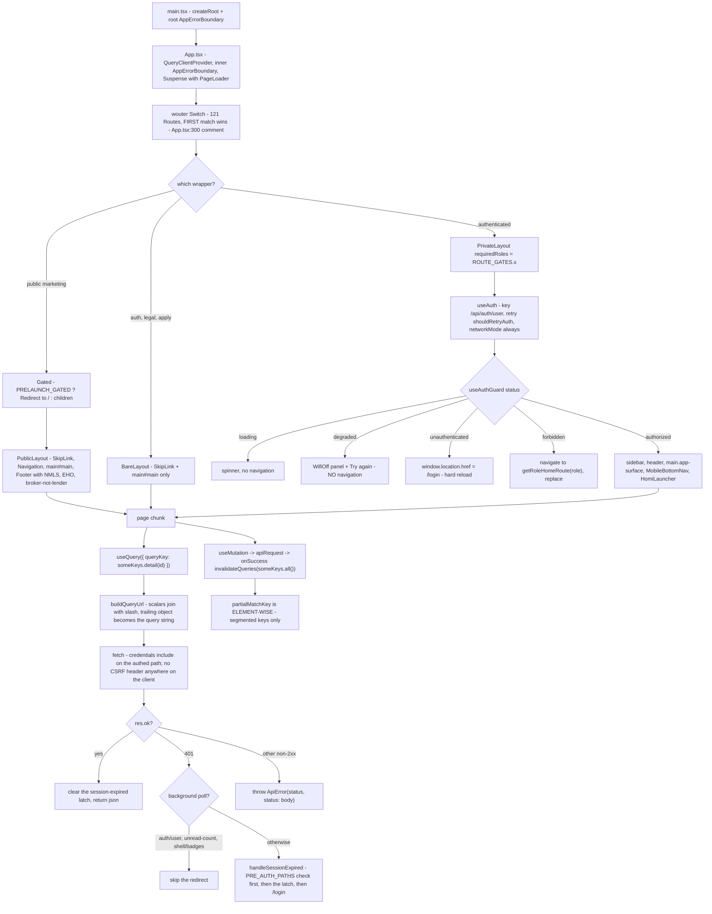

# 06 — Frontend patterns

> **Freshness:** last verified 2026-08-22 · review every 30 days
> **Verified against** `origin/main` @ 12d7cbec · **Authoritative:** [app-guide 07 — Frontend](../handbook/app-guide/07-frontend.md), [app-guide 12 — API contract](../handbook/app-guide/12-api-contract.md) and `../handbook/design/DESIGN_SYSTEM.md` (they win on conflict; the code wins over both — app-guide 07's version, size and page-count claims are stale, LEDGER HO-0822-06/19).

## The mental model

A wouter `Switch` whose order matters, three layouts plus `PageShell`, every server fact fetched
through one key→URL convention in `queryClient.ts`, and client-side gating that is an affordance,
never a boundary — with correctness held by ratchets, not taste.

## Explain it to a new hire

`client/src/App.tsx` is a single 635-line wouter `<Switch>` holding 121 `<Route>`s, 113 of them
`lazy()` page chunks behind one `<Suspense>`, and each route composes exactly three wrappers: a
layout shell (`PublicLayout`, `PrivateLayout` or `BareLayout`), a role gate drawn from
`ROUTE_GATES` in `client/src/lib/routeGates.ts`, and — on public commercial surfaces — the
pre-license `<Gated>` redirect driven by `PRELAUNCH_GATED`. Authorization on the client is a UX
affordance only: `useAuth` probes `GET /api/auth/user` with a retry policy that treats a 401 as a
definitive "signed out" and anything else as "the question went unanswered", and `useAuthGuard`
collapses that into five statuses with three deliberately different navigation models (degraded
goes nowhere, unauthenticated hard-reloads to `/login`, forbidden soft-hops to the role's home).
All server data flows through `client/src/lib/queryClient.ts` (539 lines), whose central
invention is that **the query key *is* the URL** — `buildQueryUrl` joins scalar segments with `/`
and turns a trailing object into a query string, so 17 exported key factories are the only
sanctioned way to address an endpoint, and three CI guards fail the build on a template-string
key, a dead invalidation, or a hand-written `queryFn`. Styling routes through semantic CSS
variables in `client/src/index.css` (Tailwind v4 loading `tailwind.config.ts` via `@config`),
and two zero-dependency ratchet guards hold raw palette colours at zero and eleven other metrics
at committed baselines that may only shrink. The two hardest things to learn are traps:
`partialMatchKey` is element-wise, not a string prefix (so `["/api/task-engine"]` never matched
`["/api/task-engine/metrics"]`), and `client/src/pages/borrower/URLAForm.tsx` is under a
documented refactor prohibition because the obvious extractions can write a co-applicant's PII
into the primary borrower's rows with a green test suite.

## Mechanism



## The facts, with receipts

- **Layout.** `find client/src -type d -maxdepth 1` → `components`, `funnel`, `hooks`, `lib`,
  `pages`, `types` (no `contexts/`); pages 390 files (281 non-test under subdirectories + `not-found.tsx`),
  components 173, lib 48, hooks 19, funnel 5. Pages per persona directory: borrower 56, staff 48,
  public 27, lending 27, agent-broker 26, calculators 24, admin 23, education 17, property 14,
  homeowner 8, rates 6, realtor-engine 4, profile 1.
- **The borrower's home page**, for orientation: `client/src/pages/borrower/Dashboard.tsx`, lazy-loaded
  at `client/src/App.tsx:73` and mounted at `/dashboard` (`App.tsx:398`); its data comes from
  `GET /api/dashboard` (`server/routes/lending/dashboard.ts`) through the `dashboardKeys` factory
  (`client/src/lib/queryClient.ts:259`). The staff equivalent is `client/src/pages/staff/StaffDashboard.tsx`
  (`App.tsx:90`).
- **The router.** `client/src/App.tsx:2` `import { Switch, Route, useLocation } from "wouter"`;
  `grep -c "<Route" client/src/App.tsx` → `121`; `grep -c "lazy(" client/src/App.tsx` → `113`;
  one `<Suspense fallback={<PageLoader />}>` wraps the whole Switch (`:245`); `:300` "Must precede
  /learn/:slug — Switch takes the first match". `EmailCaptureModal` is both lazy *and* path-gated
  (`:15-42`) — eagerly mounting it had shipped framer-motion in the main chunk on every page.
- **Three shells plus the in-page primitive.** `client/src/components/layouts/BareLayout.tsx` (22
  lines: SkipLink + `<main id="main" tabIndex={-1}>`), `PublicLayout.tsx` (33: adds Navigation and
  the Footer — mounted *here*, not per page, because it carries the NMLS id, the Equal Housing
  notice and the broker-not-lender disclosure, `:13-19`), `PrivateLayout.tsx` (137:
  `requiredRoles?: readonly UserRole[]`). `client/src/components/PageShell.tsx:124` owns the only
  legitimate `min-h-screen` (its `fullHeight` prop) and four semantic widths (`:36-41`).
- **`<Gated>` is the pre-license redirect.** `client/src/App.tsx:238-239`; used on 24 route
  sites; `client/src/lib/prelaunch.ts:21-23` `PRELAUNCH_GATED = VITE_PRELAUNCH_GATED === "true" || (PROD && VITE_PRELAUNCH_GATED !== "false")`
  — gated by default in a production build.
- **Ten gates, one source.** `client/src/lib/routeGates.ts:33-109`: `borrower`, `staff`,
  `internalStaff`, `underwriterOps`, `disclosure`, `marketData`, `loTeam`, `cpaPortal`,
  `partnerHub` (a deliberate literal — `cpa` removed on RESPA §8(a) grounds, `:90-105`),
  `adminOnly`. Header `:29-31`: "Client gates are a UX affordance, never the security boundary."
  Pinned by `tests/routeGates.test.ts:98` ("App.tsx passes ROUTE_GATES, never an inline role
  literal") and `tests/routeGateDrift.test.ts`.
- **Auth hooks.** `client/src/hooks/useAuth.ts:52` `queryKey: ["/api/auth/user"]`, `:33-36`
  `shouldRetryAuth` (401 → never retry; else twice), `:60` `networkMode: "always"` ("never PAUSE
  this query"), `:72` `isLoading = status === "pending"` (react-query's `isLoading` goes false
  between retries — "a 502 bounced a signed-in user to the login page mid-retry", `:63-72`), `:80`
  `isError` excludes 401. `client/src/hooks/useAuthGuard.ts:6-11` five statuses; `:48-50` `isError`
  is tested *before* `!isAuthenticated`; `:59-66` the three navigation models; `:65` "degraded
  deliberately navigates nowhere". `client/src/lib/roleRoutes.ts:14-21` `getRoleHomeRoute` is total
  over roles; `client/src/lib/postAuthRoute.ts` was split out purely so `roleRoutes.ts` stays
  eager-light (`:7-11`) and lets two pre-auth intents outrank the role home (`:24-26`);
  `client/src/lib/logout.ts` is the single sign-out path and "THE LAST module-singleton
  `queryClient` consumer" (`:2-12`), raw `fetch` on purpose (`:32-35`).
- **The data layer.** `client/src/lib/queryClient.ts` (539 lines); defaults `:529-536`:
  `queryFn: getQueryFn({ on401: "throw" })`, `refetchInterval: false`, `refetchOnWindowFocus: true`,
  `staleTime: 5 min`, `retry: false` (queries and mutations). `:111` `buildQueryUrl` — scalars join
  with `/`, a trailing plain object becomes the query string, empty/null/undefined dropped
  (`:112-127`). `:150` `getPublicQueryFn` (no cookie, `sessionRedirect: false`; 33 non-test uses)
  vs `:161` `getQueryFn` (`credentials: "include"`). `:33` `ApiError` keeps the historical
  `"<status>: <body>"` message and adds a numeric `status`. The session-expiry latch `:5-19`:
  `PRE_AUTH_PATHS = ["/", "/login", "/signup"]` is checked **before** the latch is consumed (a wrong
  password on `/login` once burned it for the whole tab); three background polls are exempt from
  the redirect (`:63-68`: `/api/auth/user`, `/api/notifications/unread-count`, `/api/shell/badges`).
  **No client CSRF code** — `grep -rin csrf client/src | wc -l` → `0`; the server's Origin check is
  the control (chapter 01).
- **Seventeen key factories, every one a tombstone.** `grep -nE '^export const [a-zA-Z]+Keys' client/src/lib/queryClient.ts | wc -l`
  → `17` (`loanApplicationKeys` `:198` … `applicationResourceKeys` `:515`). Their comments name the
  bug each fixed: `consentKeys` (`:339-347` — ConsentGateCard invalidated a flat key and every other
  consent surface kept rendering "not consented"), `taskEngineKeys` (`:367-376`), `autopilotKeys`
  (`:417` — "a confident, frozen 'we're reviewing your file' to a borrower forever"),
  `borrowerGraphKeys` (`:439` — a path that does not exist), `calculatorResultKeys` (`:270-279` —
  has no reader; kept as the canonical shape).
- **Three guards, three questions.** `package.json:44` `guard:querykeys` runs
  `scripts/query-key-guard.cjs` (no interpolated template-string key under `client/src`, `:15`),
  `scripts/query-key-reachability.cjs` (every invalidate/remove/refetch/reset key must element-wise
  prefix-match a fetched key, `:35-37`; cross-file misses are warnings, `:71-72`; sibling omission
  is out of scope, `:60-68`) and `scripts/query-key-transport-guard.cjs` (no hand-written `queryFn`,
  `:46-48`). The invariant, quoted from query-core inside the guard (`scripts/query-key-reachability.cjs:18-28`): it
  "reads like a prefix and behaves like a string equality test on segment 0". Companion:
  `tests/queryKeyConvergence.test.ts` (432 lines).
- **Fetch census.** 176 files call `useQuery` (491 call sites), 102 `useMutation`, 182
  `invalidateQueries`, 141 import `apiRequest`; 7 raw non-test `fetch(` sites remain, allow-listed
  in `tests/apiRequestConvergence.test.ts:25`.
- **Design tokens.** `client/src/index.css:1,7` `@import "tailwindcss"` + `@config "../../tailwind.config.ts"`
  (compatibility mode on purpose, `:4-6`); contrast ratios live beside the tokens (`:98-105` the
  ALLOWED/FORBIDDEN `--flare` pairs; `--primary` 5.49:1 `:38`; `--destructive` 4.80:1 `:135`).
  `tailwind.config.ts:56` maps semantic names to `hsl(var(--x) / <alpha-value>)`; the `precision`
  ramp at `:159-177` carries measured white-on contrast.
- **The two UI ratchets.** `scripts/design-token-guard.cjs` → `scripts/design-token-baseline.json`
  `{rawColorOccurrences: 0, whiteBlackLiterals: 97}`; `scripts/ui-standard-guard.cjs` → nine
  metrics in `scripts/ui-standard-baseline.json` (`arbitraryColorValues 3 · arbitraryTypeScale 151
  · blindSpotPaletteClasses 0 · directLucideImports 323 · nestedInteractive 0 · pageShellDrift 0 ·
  rawHexLiterals 11 · subMinTouchTarget 0 · unprefixedMultiColGrid 62`). It strips comments first
  ("a guard a writer has to tiptoe around teaches people to stop explaining themselves",
  `:49-62`); two named exceptions: `client/src/lib/icons.ts` (the one file allowed to import
  `lucide-react` — the audit found 178 ad-hoc import sites, `:4-11`) and `PageShell.tsx`. Both
  guards auto-tighten the baseline on a shrink.
- **Shadcn.** `client/src/components/ui/` — 34 primitives (35 files; one is a test); `components.json`
  style `new-york`, `baseColor: neutral`, `cssVariables: true`, no prefix.
- **Forms.** `grep -rl "zodResolver" client/src | wc -l` → `7`; 11 non-test `useForm<` calls.
  `tests/formResolverContract.test.ts:18-34` exists because a zod 4 + resolvers 3 mismatch turned
  every failed validation into an unhandled rejection — "The button was simply inert."
- **The funnel.** `client/src/funnel/preApprovalMachine.ts` (562 lines, 17 steps in both
  `FunnelStepId` and `CANONICAL_ORDER`); `FunnelContext.tsx:17-22` (the machine owns sequencing
  and gates, react-hook-form owns fields); three persistence layers — localStorage 800 ms
  (`useFunnelAutosave.ts:26`, keyed on the serialized snapshot because `form.watch()` returns a
  fresh object every render, `:41-47`), the server draft 2,500 ms
  (`pages/lending/preApproval/useServerDraftAutosave.ts:28`), and a post-auth replay 500 ms
  (`useDeferredSubmit.ts:25`, consumed synchronously so two tabs cannot double-submit, `:9-13`).
  Keys "must never change" (`client/src/lib/pendingAttribution.ts:10-16`). `useDraftRestore.ts:133-137`
  — "form.reset IS the restore".
- **URLA.** `client/src/pages/borrower/URLAForm.tsx` (857 lines) + 12 files in
  `client/src/pages/borrower/urla/`; `knowledge-base/handbook/URLA_FORM_REFACTOR_TRAP.md:26-28` —
  "Do NOT extract `buildPayload`/`buildSectionsPayload`, the `STEPS` table, or the hydration effect";
  `:24-25` — "invisible to `tsc`, to the full 2,576-test suite, and to every CI guard".
- **SEO.** `shared/seo/routeMeta.ts:35` `STATIC_ROUTE_META` — 31 entries that hand-mirror the
  `<SEOHead>` props of 43 page files (`grep -rl "SEOHead" client/src/pages | wc -l` → `43`); the
  drift hazard is stated three times in the file (`:7-10`, `:36-39`, `:65-66`); 19 sitemap paths +
  6 gated. `tests/seoPrerender.test.ts` pins the bot-prerender regex and the middleware's four
  guards — not the mirror.
- **Client tests.** `git ls-files 'client/src/**/*.test.ts' 'client/src/**/*.test.tsx' | wc -l`
  → `124` (92 `.tsx`, 32 `.ts`); `vitest.client.config.ts:37` is a **glob** (`:11-13`) — which
  protects against a colocated file being *forgotten*, not against the crawl being *truncated*: a
  `readdir` that fails under load reads as an empty directory and the lane exits 0 short (chapter
  07; `knowledge-base/runbooks/CICD.md` said "can never be stranded" and was corrected in 2026-08-23's
  collection-guard change, which is now what `pnpm test` runs). `happy-dom` (`:18`); the `@assets`
  alias exists because without it a component test reports "0 tests" rather than a failure
  (`:44-47`). Every vitest lane is `--config`-explicit (`package.json:20-24`; `:15` `pnpm test` is
  the collection guard that runs both unit lanes, and `:16-19` are the `harness:t0..t3` tier
  aliases, chapter 07) — a bare `vitest run <file>` resolves no client config.
- **Bundle.** `tests/clientSchemaImports.test.ts:7-17` — types only from `@shared/schema`, never
  values ("the browser bundle shipped 174 table definitions with their column names … No data was
  exposed; the map of the database was"); `scripts/bundle-size-guard.cjs` gates the eager entry
  graph in raw bytes against `scripts/bundle-size-baseline.json` `{eagerRawBytes: 526640}`; lazy
  chunks are reported, never gated.
- **Accessibility substrate.** `DESIGN_SYSTEM.md:424` §11 (SkipLink first focusable, `<main
  id="main" tabIndex={-1}>`, `FormMessage role="alert"`, visible labels, ≥ 44 px targets — drifted to
  233 before `subMinTouchTarget` ratcheted it, `:432-441`); the four-question gate `:532`
  (provenance · explanation · agreement · honesty). `grep -rho 'data-testid="[^"]*"' client/src | wc -l`
  → `2224` (1,985 distinct, `| sort -u | wc -l`) — the substrate the happy-dom lane drives.
- **Two error boundaries at two altitudes.** `client/src/main.tsx:10` (root, backstops the
  providers) and `client/src/App.tsx:626` (inner — a failed lazy chunk is contained so the Toaster
  and providers stay mounted).

## Prove it yourself

```bash
cd /Users/ammrebarakat/Developer/Homiquity-handoff && git rev-parse --short HEAD
# → 12d7cbec @ 12d7cbec
grep -c "<Route" client/src/App.tsx ; grep -c "lazy(" client/src/App.tsx ; wc -l client/src/App.tsx
# → 121 / 113 / 635 @ 12d7cbec
sed -n '300p' client/src/App.tsx
# → {/* Must precede /learn/:slug — Switch takes the first match */} @ 12d7cbec
grep -oE "^  [a-zA-Z]+:" client/src/lib/routeGates.ts | wc -l
# → 10 @ 12d7cbec
sed -n '17,19p' client/src/lib/prelaunch.ts
# → PRELAUNCH_GATED = VITE_PRELAUNCH_GATED === "true" || (PROD && VITE_PRELAUNCH_GATED !== "false") @ 12d7cbec
grep -nE '^export const [a-zA-Z]+Keys' client/src/lib/queryClient.ts | wc -l ; wc -l client/src/lib/queryClient.ts
# → 17 / 539 @ 12d7cbec
grep -n "staleTime\|refetchOnWindowFocus\|refetchInterval\|retry:" client/src/lib/queryClient.ts | tail -5
# → 530 refetchInterval false / 531 refetchOnWindowFocus true / 532 staleTime 5 min / 533 retry false / 536 retry false @ 12d7cbec
grep -rin csrf client/src | wc -l
# → 0 @ 12d7cbec
grep -n '"guard:querykeys"' package.json
# → 42: three scripts chained @ d9e8f79d
cat scripts/design-token-baseline.json ; cat scripts/ui-standard-baseline.json ; cat scripts/bundle-size-baseline.json
# → rawColorOccurrences 0 / whiteBlackLiterals 97 ; nine metrics ; eagerRawBytes 526640 @ 6377727e
git ls-files 'client/src/**/*.test.ts' 'client/src/**/*.test.tsx' | wc -l ; grep -n 'include:' vitest.client.config.ts
# → 124 / 37:  include: ["client/src/**/*.test.{ts,tsx}"], @ d9e8f79d
grep -rl "zodResolver" client/src | wc -l ; grep -rl "SEOHead" client/src/pages | wc -l
# → 7 / 43 @ 12d7cbec
awk '/^export const STATIC_ROUTE_META/,/^};/' shared/seo/routeMeta.ts | grep -cE '^  "/'
# → 31 @ 12d7cbec
wc -l client/src/pages/borrower/URLAForm.tsx ; ls client/src/pages/borrower/urla/ | wc -l
# → 857 / 12 @ 12d7cbec
grep -rho 'data-testid="[^"]*"' client/src | wc -l
# → 2224 @ d9e8f79d
```

## Where this breaks

| Trap | Where | Caught by |
|---|---|---|
| `partialMatchKey` is element-wise: `["/api/task-engine"]` never matched `["/api/task-engine/metrics"]`; four dead invalidations shipped for months. | `queryClient.ts:367-376`; `scripts/query-key-reachability.cjs:35-37` | Same-file misses fail; **cross-file misses are warnings** (`:71-72`); sibling omission is out of scope (`:60-68`). |
| A template-string key hoisted into a `const` slips the primary guard (how `RateLockDialog` got through). | `scripts/query-key-reachability.cjs:48-52` | The reachability guard resolves one variable hop; two hops are invisible to both. |
| A hand-typed *segmented* key is invisible to the template guard — three spellings of `['/api/urla', id]` once coexisted. | `queryClient.ts:485-492` | Only the transport guard's no-`queryFn` rule and review. |
| A new background poll not added to the three-entry allow-list bounces a signed-in user to `/login` when the session expires. | `queryClient.ts:63-68`; the obligation at `app-guide/12-api-contract.md:62-64` | `client/src/lib/queryClient.test.ts` covers the existing paths; nothing fails when a new poll is forgotten. |
| The 401 latch's ordering: reorder the `PRE_AUTH_PATHS` check and the latch and a wrong password on `/login` burns the latch again. | `queryClient.ts:11-19` | `client/src/lib/queryClient.test.ts:48,61` only. |
| `useAuth` must not use react-query's own `isLoading`/`isError` — both exist, both are `boolean`, both are wrong here. A type-safe wrong answer. | `client/src/hooks/useAuth.ts:63-80` | `client/src/hooks/useAuth.test.ts`, `useAuthGuard.test.ts`. |
| `useAuthGuard` order matters: `isError` before `!isAuthenticated`, or `degraded` is swallowed by `unauthenticated`. | `useAuthGuard.ts:46-57` | Nothing structural — a legal reorder. |
| URLAForm extraction writes a co-applicant's PII into the primary borrower's rows; `slice`, `borrowerData[1]`, `borrowerData[2]` are all `BorrowerSlice`, so the wrong one compiles. | `knowledge-base/handbook/URLA_FORM_REFACTOR_TRAP.md:31-38`; `server/routes/borrower/urla.ts:485` | **Nothing** — by the doc's own statement. |
| `fullHeight` under a real layout is a second 100 vh (footer below the fold under `PublicLayout`; a second scrollbar under `PrivateLayout`); the guard catches only the file-level `min-h-screen` + `PageShell` pattern, not the prop. | `PageShell.tsx:47-65`; `DESIGN_SYSTEM.md:620-626` | Partially. |
| The `.app-surface` shadow rule's comment still reasons from Tailwind v3 `@layer` semantics while the same file declares v4 native cascade layers. Behaviour may be right; the stated reason cannot be. | `client/src/index.css:437-446` vs `:9` | Nothing reads `.css`. |
| `ui-standard-guard` sees only literal double-quoted `className` strings — classes built by `cn()`, template literals or cva variants are invisible; every count is a floor. | `scripts/ui-standard-guard.cjs:27-29` | By its own statement. |
| `VITE_*` is build-time: flipping `VITE_PRELAUNCH_GATED` needs a redeploy, not a restart. | `app-guide/07-frontend.md:89-93`; `client/src/lib/prelaunch.ts:17` | `tests/prelaunchGate.test.ts` covers the **server** gate (per-request env), not the client constant. |
| `vitest run <file>` with no `--config` resolves no client config: no happy-dom, no `@`/`@shared`/`@assets` aliases, and a "0 tests" that reads like the file was never picked up. | `vitest.client.config.ts:18,37,40-48`; `package.json:20-24` | Only `pnpm test` / `pnpm test:client`. |
| `tests/formResolverContract.test.ts` covers only the six schemas it imports; a new `zodResolver` form is not auto-covered. | `tests/formResolverContract.test.ts:4-14` | The listed schemas only. |
| `STATIC_ROUTE_META` (31) hand-mirrors `<SEOHead>` in 43 files — drift means crawlers read different copy than humans. | `shared/seo/routeMeta.ts:7-10,36-39` | No test compares a registry entry to a page's props. Proposed ticket in chapter 12. |
| Public gates are UX only and `tests/routeGateDrift.test.ts` enumerates specific client↔server pairs; a *new* route whose client gate is wider than its server gate is not derived. | `client/src/lib/routeGates.ts:29-30` | Partially. |

## What we do not know

| Question | What resolves it |
|---|---|
| Do the guards currently pass on 12d7cbec? Only committed baselines are quoted here — the token/bundle guards write files on a shrink, so they were not run. | `pnpm guard:tokens && pnpm guard:ui` then `git status` (stage any tightened baseline); `pnpm build && pnpm guard:bundle`. |
| Is dark mode reachable at all? `tailwind.config.ts:4` is `darkMode: ["class"]` and `index.css:265` defines `.dark {}`, but `next-themes` is not in `package.json` and nothing under `client/src` toggles the class. | `grep -rn "classList.*dark\|ThemeProvider\|useTheme" client/src`; the design owner. |
| Are there undocumented route-order dependencies beyond `:300` (e.g. `/redeem-invite` vs `/redeem-invite/:code` at `:260-261`)? | A read of adjacent `<Route>` pairs. |
| Do the 7 remaining raw `fetch(` sites equal the `ALLOWED_RAW_FETCH` map exactly? | `tests/apiRequestConvergence.test.ts:25` vs the grep. |

## Analogy

An airport with one address system. `buildQueryUrl` is the rule that a flight's gate number is
*derived from* its flight number. The moment anyone writes the gate down separately — a
hand-written `queryFn`, a template-string key — you have two spellings of one fact, and on the
day they diverge nobody notices because the plane still boards; only the baggage (the
invalidation) goes to the wrong carousel. The three query-key guards are three inspectors: one
checks you wrote the flight number in a matchable format, one checks that "all flights to gate
12" actually reaches some flight, one checks nobody hand-wrote a gate. And the design guards are
ratchet straps over the cargo: they only tighten.

## Teach-back checkpoint

1. A borrower is on `/urla-form` filling a long form and the server 502s on the auth probe. What does the UI do, and why not send them to `/login`?
2. Why does `useAuth` derive `isLoading` from `status === "pending"` instead of react-query's `isLoading`?
3. You add a page that polls `/api/foo/badge-count` every 30 s. A session expires overnight. What happens, and what should you have done?
4. A mutation succeeds and you fire `invalidateQueries({ queryKey: ["/api/consents"] })`, but the page stays stale. Why?
5. Where is "who may see this page" decided, and how many places is it written?
6. What is the single legitimate `min-h-screen` in the client, and what breaks if you hand-roll another?
7. Why is `EmailCaptureModal` both lazy-loaded *and* mounted behind a path check?
8. A PR extracts `buildPayload()` out of `URLAForm.tsx` with a `slice` parameter. CI is green. Ship it?

## Go deeper

- [app-guide 07](../handbook/app-guide/07-frontend.md) — with measured drift at 12d7cbec: `:3`
  "React 18" (19.2.8); `:12-13` "~420 lines … 160+ routes" (635 / 121); `:9` lists `next-themes`
  (absent); the page-map table at `:16-37` is stale across the board; `:56-58` and `:75` quote
  adoption figures the generated table in `DESIGN_SYSTEM.md:42` has since replaced. Still accurate:
  the alias table, the `dist/public` static story, the `VITE_*` build-time warning.
  [app-guide 12](../handbook/app-guide/12-api-contract.md) — `:27` client ownership, `:52-64` the
  error shape and the 401 latch, `:77-79` "Query keys are the client's half of the contract."
- `knowledge-base/handbook/design/DESIGN_SYSTEM.md` in this order: §0 the generated adoption table
  (`:25`), §2 colour layers (`:108`), §11 accessibility (`:424`; its "what is not verifiable here"
  paragraph `:449-452`), §12 the capture-flow standard (`:455`), §13 the four-question gate (`:532`),
  §16 the PageShell checklist (`:616`), §17 enforcement — "a green guard is not a clean bill of
  health" (`:640`).
- `knowledge-base/handbook/URLA_FORM_REFACTOR_TRAP.md` — read before touching `URLAForm.tsx`.
- Feature-map rows: 1 URLA (`hq-urla-owner`), 2 intake funnel, 19 borrower journey, 24
  multi-property, 25 calculators, 33 auth, 35 SEO content, 41 CI guards. Owner agents:
  `.claude/agents/hq-auth-owner.md:17` (owns `useAuth.ts`, `useAuthGuard.ts`, `roleRoutes.ts`,
  `routeGates.ts`, `logout.ts`, the sidebar), `hq-urla-owner.md:18`, `hq-intake-funnel-owner.md:18`,
  `hq-borrower-journey-owner.md:16`, `hq-ci-guards-owner.md` (`:32-33` — "A ratchet only ever moves
  down … A guard only answers its own question"), `hq-seo-content-owner.md`.
