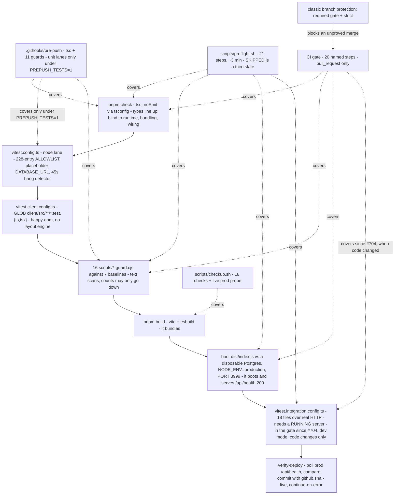

# 07 — Test harness and the CI proof hierarchy

> **Freshness:** last verified 2026-08-23 · review every 30 days
> **Verified against** `origin/main` @ d9e8f79d · **Authoritative:** `../runbooks/CICD.md` §Checks, `../governance/TEAM_PRACTICES.md` §5 and `vitest.config.ts`'s own header (they win on conflict; the code wins over both).

> **Dated status box (re-verified 2026-09-11):** `main` is protected by classic branch protection (rulesets `0`). The session token cannot read the protection detail, but merge behaviour proves that the named `gate (typecheck · tests · schema guard)` check is required and strict; `migrate-prod` and
> `verify-deploy` were **re-armed on 2026-08-22** by `76c96751` (#669) after a two-day pause, but
> `verify-deploy` carries `continue-on-error: true` on purpose, so it reddens without failing the
> workflow (chapter 10); the test-collection guard **merged 2026-08-23** (`fd4a22c5`, #670) and
> `pnpm test` is now `scripts/test-collection-guard.cjs`, which fails when vitest collects fewer
> files than exist and when any test file matches no lane's `include`; the pre-push hook stopped
> running the unit lanes by default on 2026-08-22 (`e49aab6d`, #660 — `PREPUSH_TESTS=1` opts back
> in), so **CI is where that floor binds**; and the previously stranded `tests/maintenanceMode.test.ts`
> is listed — the strand count is now zero *and enforced*, not merely observed.

## The mental model

Four proof lanes — `tsc`, the node glob, the client glob, the integration lane — all four
of which now run in CI (the fourth only since #704, and only when code changed); above them the
browser probe is run by nothing and the deploy verifier can redden but never fail the workflow.
The PR gate is the merge proof, `preflight` is the ship proof, and `complianceInvariants` reads
the source as text, so a failure there is an incident, not a flake.

## Explain it to a new hire

`pnpm test` is `scripts/test-collection-guard.cjs` (`package.json:15`): it runs two vitest configs
back to back and then refuses to pass unless every test file on disk was actually collected (the
bare pair survives as `pnpm test:raw`, `:20`). The **node** lane's `include` was a hand-maintained
allowlist of ~230 entries in `vitest.config.ts` **until 2026-08-24**, when `387a3518`/#725 deleted
it for `include: ["tests/**/*.test.{ts,tsx}"]` (`vitest.config.ts:71`) plus a 30-entry `exclude`
that drops the integration files (`:77-95`). Read the reason, not just the diff: the list *carried
no information* — 307 files in `tests/` minus the 30 integration files is exactly the number that
was typed out — and it cost merges, because every concurrent PR inserted its entry at the same
place (`:44-62`). What replaced its one virtue, failing closed on a typo'd path, is the collection
guard: the orphan floor fails when a test file matches no lane, and a second check fails when one
is claimed by **two** lanes — the one new way a glob can be wrong
(`scripts/test-collection-guard.cjs:419-437`). The lesson survived the mechanism: the floor is what
makes either design safe, and it is mechanism-agnostic. And the **client** lane, whose `include` is a
glob on purpose so a colocated `*.test.tsx` cannot be *forgotten* — but the glob does not make it
safe: `CICD.md` used to say such a file "can never be silently stranded", and that is false. Vitest
crawls via `tinyglobby` → `fdir`, which defaults `suppressErrors: true`, so a directory whose
`readdir` FAILED is indistinguishable from an empty one; under load `pnpm test` collected 111 of 118
client files and exited 0. A glob protects against a file being *forgotten*, not against the crawl
being *truncated* (`fd4a22c5` corrected the `CICD.md` sentence and added the floor). A third config,
`vitest.integration.config.ts`, lists 30 files that hit a *running* HTTP server over the network;
for the life of the repo nothing but `scripts/preflight.sh` ran it, and since `d9e8f79d` (#704,
2026-08-23) the gate runs it too — against the bundle it has just booted, in development mode,
and only when code changed (`.github/workflows/ci.yml:583-646`). `knowledge-base/runbooks/CICD.md:357`
still says it "never runs in CI" (LEDGER HO-0823-05). CI's one gate job is `gate (typecheck · tests
· schema guard)` — those separators are U+00B7 middle dots, matched byte-for-byte by branch
protection — with 20 named steps, fronted by a fail-closed "change scope" step that skips the
expensive half when every changed file is inert prose, and closed by a production build, a boot of
`dist/index.js` against a disposable Postgres that must answer 200 from `/api/health`, and now
that integration lane. Below CI sits `.githooks/pre-push` (typecheck + eleven guards — the gate's
full guard set since #703 brought it to parity; the unit lanes only under `PREPUSH_TESTS=1`; an
uninstalled checkout is *warned*, not blocked — it skips with `exit 0`), and above it
`scripts/preflight.sh` (21 steps including the build, the boot and the integration lane) and
`scripts/checkup.sh` (18 read-only checks plus a live prod probe). The caveat that outranks all of
it: classic branch protection requires the named PR gate and a branch current with `main`; the post-merge deploy verifier remains advisory because it runs after the merge and carries `continue-on-error: true`.

## Mechanism



## The facts, with receipts

- **The node lane.** `vitest.config.ts:71` `include: ["tests/**/*.test.{ts,tsx}"]`, with the 18
  integration files dropped by `exclude` (`:77-95`); `:38-39` `testTimeout: 45000`,
  `hookTimeout: 60000` ("TIMEOUTS ARE A HANG DETECTOR HERE, NOT A PERFORMANCE ASSERTION", `:6`; the
  suite runs 172 s idle and 305–419 s under load, `:9-10`); `:99-105` a placeholder `DATABASE_URL`
  keeps it hermetic. The file was **the most-churned in the repository** — 222 commits, more than
  `package.json` (92) and more than any source file, 172 of its last 195 adding nothing but a path
  (`:44-51`); its globbed sibling has 3 commits in its whole life doing the same job (`:49-51`).
  The old "append at the END" rule was treating a symptom and is gone with the list it protected.
- **The client lane.** `vitest.client.config.ts:41` `include: ["client/src/**/*.test.{ts,tsx}"]`
  ("a GLOB on purpose", `:11-13`); `:18` `environment: "happy-dom"`; the `@assets` alias (`:47`)
  exists because without it a component test "reports '0 tests' rather than a failure" (`:44-46`).
  `git ls-files 'client/src/**/*.test.ts' 'client/src/**/*.test.tsx' | wc -l` → `148`.
- **The integration lane.** `vitest.integration.config.ts` — 30 files
  (`grep -cE '^\s*"tests/'` → `30`); `tests/setup.ts:1` `BASE_URL = TEST_BASE_URL || "http://localhost:5000"`;
  tighter timeouts than the unit lane (15 s / 30 s, `:13-14`). Every request sends
  `X-Forwarded-Proto: https` + `Origin` (`tests/roleSeparation.test.ts:31`), logs in through
  `POST /api/test-login` with a **per-file session cache of promises** because hammering the login
  route trips the auth limiter even under `RATE_LIMIT_RELAXED` (`:33-36`). Nine files define their
  own `loginAs`; 14 send the proto header. `knowledge-base/runbooks/CICD.md:357-361` still reads "The
  integration suite … never runs in CI: a green gate proves the change typechecks, breaks no unit or
  component test, and produces a bundle that boots and answers `/api/health` — nothing more." — true
  until #704 (`d9e8f79d`) put the lane in the gate (`.github/workflows/ci.yml:583-646`): development
  mode because `/api/test-login` hard-404s in production, grids seeded first because
  `resolveMatrixValue` throws rather than guesses, `RATE_LIMIT_RELAXED` for the auth limiter only.
  The runbook sentence is LEDGER HO-0823-05.
- **Counts that must agree — and now a guard makes them.** `git ls-files 'tests/*.test.ts' | wc -l`
  → `307`; the node lane takes all of them and excludes 30, which is exactly the integration lane's
  list, so the two `"tests/…"` blocks must be **identical**:
  `{ grep -ohE '"tests/[^"]+\.test\.ts"' vitest.config.ts | tr -d '"' | sort -u; grep -ohE '"tests/[^"]+\.test\.ts"' vitest.integration.config.ts | tr -d '"' | sort -u; } | sort | uniq -u | wc -l`
  → `0` (FACTS F-39; a file on one side only is either an orphan or double-claimed, and both are
  build failures). Until `fd4a22c5` this identity was a thing you checked by hand and nobody did;
  `scripts/test-collection-guard.cjs` now fails on an orphan (`:515-534`) and on a double claim
  (`:419-437`). Note that the glob change **broke the old form of this check**: the previous
  command diffed the on-disk list against the paths *quoted in the configs*, and with the allowlist
  gone it reported 231 files as stranded when the true answer is none — the corpus's own F-39 command
  was rewritten on 2026-08-24 for exactly this reason.
- **Source-text tests.** `grep -lE 'readFileSync\(' tests/*.test.ts | wc -l` → `70` (27% of the
  node suite asserts on source text, not behaviour). `tests/complianceInvariants.test.ts` (716
  lines, 16 describes, 55 its): `:16` "If one of these fails, treat it as a compliance incident,
  not a flaky test"; the Reg B check is a grep of 8 decision-path modules for 6 AI import patterns
  (`:34-53`).
- **The harness helpers are thin by design.** `tests/setup.ts` exports `BASE_URL`, `apiGet`,
  `apiPost`, `apiPatch`, `apiDelete`, `fetchPage` — no app factory, no DB fixture, no shared login.
- **The gate job.** `.github/workflows/ci.yml:118` `name: gate (typecheck · tests · schema guard)`
  (`hexdump` shows `c2 b7` = U+00B7; rename procedure at `:108-117`); triggers `:54-101` —
  `pull_request` with **no `branches:` filter** (a filter once gave stacked PRs zero check-runs while
  reporting `CLEAN`, `:58-69`), `types: [opened, synchronize, reopened, edited, ready_for_review]`
  (`edited` because `guard:security` reads the PR body from the event payload, `:85-89`),
  `push: [main]`, `workflow_dispatch`. `if:` skips drafts and title-only edits (`:142-147`);
  concurrency cancels in-progress per PR and is safe only because of that `if:` (`:155-170`). The
  `postgres:16` service is for the boot probe only (`:173-176`).
- **The 20 gate steps, in order** (`grep -n '^      - name:' .github/workflows/ci.yml`): change
  scope (`:203`) → typecheck (`:261`) → unit tests (`:264` — `pnpm test`, i.e. the collection floor;
  the step's comment at `:265-273` says so) → `pnpm audit --prod --audit-level=high`
  (`:276`) → `guard:schema` (`:284`) → `guard:migrations` (`:287`) → `guard:channel` (`:298`) →
  `guard:tokens` (`:308`) → `guard:ui` (`:319`) → `guard:kb` (`:332`) → `guard:staleness` (`:342`) →
  `guard:citations` (`:355`) → `guard:security` (`:367`, PR body via env, diff from the merge-base —
  two dots was F-0818-16, `:73-78`) → Selling Guide authority guard (`:424`, TEAM_PRACTICES §10,
  added by #654) → `guard:querykeys` (`:457`) → guard scripts parse (`:481` —
  added after a backtick inside `browser-probe.cjs` made every probe crash and a sweep read the
  stack trace as CLEAN, `:484-490`) → production build (`:499`) → `guard:bundle` (`:518`) →
  self-host boot (`:544`, `PORT=3999`, poll `/api/health` 45 × 1 s) → integration lane (`:583`,
  added by #704: the same bundle re-booted in development mode on port 4000, grids seeded,
  `pnpm test:integration`). Six doc-side steps run even on a docs-only PR (`:211-215`); the
  change-scope step fails closed (`:217-220`).
- **Pre-push.** `.githooks/pre-push` — `grep -c '^step ' .githooks/pre-push` → `12`: typecheck
  (`:104`) then eleven guards (`:110-125` — the eight it always ran, plus the other two query-key
  scripts and the citation ratchet that #703 added on 2026-08-23 so the hook runs the gate's whole
  guard set, `:118-125`). **The unit lanes are not among them.** As of
  `e49aab6d` (#660, 2026-08-22) `pnpm test` runs from the hook only under `PREPUSH_TESTS=1`
  (`:138-142`); the default branch prints `skipped — CI runs them`. The stated reason is capacity,
  not confidence: "both lanes cost ~1-2 GB and every core for minutes, which on a shared 8 GB laptop
  is what makes the machine swap, and CI runs them on every PR regardless" (`:127-129`). **What this
  changes for you:** a push now costs ~25 s instead of ~2 min, and a broken test reaches CI before it
  reaches you — so T1 is a step you run deliberately, not one the hook runs for you. The tooling
  probe is back to **warn-only** (`:61-83`: an uninstalled checkout prints `pre-push gate SKIPPED`
  and exits 0; it *blocked* between 2026-08-19 and 2026-08-22 while CI was dead, `:69-72`) and it
  looks for `tsc`, not `vitest` (`:73`) — so a fresh worktree pushes with nothing checked, and the
  PR's gate is the first thing that runs. It names its own blind spots (`:154-157`): no unit suite
  by default, no build, no boot, no integration lane.
- **Preflight.** `scripts/preflight.sh` — `grep -c 'step "' scripts/preflight.sh` → `21` (its
  header, `:8`, now recounts the day it said "sixteen" while running eighteen); stages `:82-194`:
  pre-push armed → tsc → the eight guards → guard-scripts parse → the three query-key scripts and
  the citation ratchet (`:96-99`, #703) → §9 security review (only when `origin/main` is fetched,
  else SKIPPED) → unit tests + collection floor (`:126`) → `pnpm audit` → build → bundle ratchet →
  self-host boot (`BOOT_PORT 3999`) → integration lane (`INT_PORT 4000`, **dev mode on the
  production bundle** because `/api/test-login` 404s in production, `:184-185`). `--fast` skips
  build/bundle/boot/integration (`:130-133`); `--no-db` skips the two DB stages; **SKIPPED is a third
  state that neither passes nor fails** (`:24`, `:64-68`, `:218-221`); every run prints what it
  cannot see (`:203-211`).
- **Checkup.** `scripts/checkup.sh` — `grep -c '^check "' scripts/checkup.sh` → `18`, including
  citations, regulatory-ledger freshness, living-doc freshness, and a live probe of
  `https://www.homiquity.com` (`:16`, the only lane that uses the `www` host); audits at
  `moderate` vs the gate's `high` (`:58` vs `ci.yml:283`); integration tests deliberately excluded
  (`:8-9`).
- **The guard fleet.** `ls scripts/*-guard.cjs | wc -l` → `16`; `ls scripts/*baseline*.json | wc -l`
  → `7`. Ratchets (down only; **auto-tighten on a shrink**): `bundle-size` (`:217-218`), `design-token`
  (`:116-119`), `citation`, `doc-staleness`, `schema-migration` (baseline allow-list), `ui-standard`,
  `delivery-stack-freeze` (= `pnpm guard:channel`: the four GSE-delivery files may shrink, never
  grow, until the channel decision flips — `scripts/delivery-stack-freeze-guard.cjs`). Hard pass/fail with no baseline: `kb-index`,
  `migration-ledger`, `query-key`, `query-key-transport`, `security-review`, `hooks-installed`,
  `test-collection` (the collected-count floor; its orphan floor is zero, `scripts/test-collection-guard.cjs:464-468`),
  `selling-guide-authority` (TEAM_PRACTICES §10, `scripts/selling-guide-authority-guard.cjs`, #654).
  Calendar-based: `doc-freshness` (weekly workflow, deliberately outside the gate).
- **Gaps between the lanes — the guard gap closed by #703.** Until `7f6cea19` (2026-08-23) neither
  pre-push nor preflight ran `guard:citations`, and both ran **one** of the three query-key scripts,
  so a citation regression or a dead invalidation passed locally and reddened in CI. Both now run all
  three and the citation ratchet (`.githooks/pre-push:123-125`, `scripts/preflight.sh:96-99`;
  `package.json:42` chains the three for CI) — `grep -n citation scripts/preflight.sh .githooks/pre-push`
  → 3 hits. What still differs: the hook skips the unit lanes by default and never builds, boots or
  runs the integration lane; preflight does all of those but reports a stage it cannot run as SKIPPED.
- **What the meta-test pins.** `tests/ciTriggers.test.ts` (294 lines): `:110` migrate-prod wired
  for push+dispatch **or explicitly paused to dispatch only**; `:115` verify-deploy wired for push
  **or explicitly paused off**; `:120` no `pull_request` can reach a deploy job; `:135` drafts are
  skipped; `:153` verify-deploy probes the Railway origin, never `www`; `:191` migrate-prod is never
  cancellable; `:237` the scope step fails closed. Note what `:110`/`:115` *do not* pin: both
  accept LIVE **or** PAUSED, so the two-day pause and the re-arm that ended it were each green.
  The property under test is only that no `pull_request` reaches a deploy job.
- **Other workflows.** `cron-jobs.yml` (8 sweeps, pinned by `tests/cronSchedules.test.ts:30-40` —
  whose title at `:63` still says "six"), `doc-freshness.yml` (weekly, `0 9 * * 1`, deliberately not
  in the gate — "it would go red on the day ASSUMPTIONS.md hits day 31 and block EVERY merge",
  `:10-13`), `preview-seed.yml` (dispatch only).
- **The definition of done.** `knowledge-base/governance/TEAM_PRACTICES.md:93-138` — nine rules:
  `pnpm check` clean; `pnpm test` green in both lanes; UI
  behaviour gets a component test first. ⚠️ Rule 2 there (`:96-97`) still reads "New server/logic
  test files **must be added to `vitest.config.ts`'s include list**", which #725 made false on
  2026-08-24 — the include is a glob, and the only hand-maintained list left is the `exclude`,
  where adding a path *strands* the test instead of enrolling it. The definition of done binds
  every PR, so this is the highest-traffic stale instruction the corpus knows of: LEDGER
  **HO-0824-01**. Not fixed from here — this chapter reads siblings, it never edits them. the integration suite green against a live worktree
  server on 5002 with `RATE_LIMIT_RELAXED=true`; live verification on the worktree port with
  evidence in the PR body; regulated math carries a ledger citation in the same commit; schema
  changes are hand-authored SQL; new env vars land in `.env.example` **and** CICD.md; the PR-body
  contract (verification evidence, dependency justification, prod-impact note, an explicit doc-sync
  line — "Silence is not a doc-sync statement"); state assumptions and the success criterion first.
  §8 (`:288-294`): "Grep before claiming 'missing'."
- **Ports.** Dev 5001 (from `.env.example`; code default 5000; AirPlay squats on 5000), worktree
  servers 5002+, preflight boot 3999 / integration 4000, CI boot 3999
  (`knowledge-base/runbooks/LOCAL_DEV.md:183-187`, `scripts/preflight.sh:40-41`, `ci.yml:560`).
- **The collection shortfall — closed on `main`.** vitest 4 discovers files through tinyglobby →
  fdir with `suppressErrors: true`, so a `readdir` that fails under load is indistinguishable from
  an empty directory: one injected failure dropped 36 of 118 files with "signal to the caller:
  NONE"; observed three times on 2026-08-20/21 (`Test Files 111 passed (111)` when 118 existed —
  `scripts/test-collection-guard.cjs:6-18`). Since `fd4a22c5` `pnpm test` **is** the floor: it
  runs each lane with `--reporter=json`, compares what vitest collected against its own loud
  `fs.readdirSync` walk, and exits 1 on a shortfall, naming the files (`:407-421`); a full run ends
  with `all lanes ran every file on disk` (`:483`) and a partial one with `test collection floor
  FAILED — N problem(s):` (`:478`). So read that last line, not the two `Test Files` counts — a bare
  `Test Files 214 passed (215)` can now reach you only from `pnpm test:raw`.

## Prove it yourself

```bash
cd /Users/ammrebarakat/Developer/Homiquity-handoff && git rev-parse --short HEAD
# → 12d7cbec @ 12d7cbec
grep -cE '^\s*"tests/' vitest.config.ts ; grep -cE '^\s*"tests/' vitest.integration.config.ts ; git ls-files 'tests/*.test.ts' | wc -l
# → 228 / 18 / 246 @ d9e8f79d
comm -23 <(git ls-files 'tests/*.test.ts'|sort) <(grep -ohE '"tests/[^"]+\.test\.ts"' vitest.config.ts vitest.integration.config.ts|tr -d '"'|sort -u)
# → (empty — zero stranded, and `pnpm test` now fails if that changes) @ d9e8f79d
git ls-files 'client/src/**/*.test.ts' 'client/src/**/*.test.tsx' | wc -l ; grep -n 'include:' vitest.client.config.ts
# → 124 / 37:  include: ["client/src/**/*.test.{ts,tsx}"], @ d9e8f79d
grep -c '^step ' .githooks/pre-push ; grep -c PREPUSH_TESTS .githooks/pre-push
# → 12 / 4   (the hook stopped running the unit lanes by default — #660; #703 added three guards) @ d9e8f79d
grep -lE 'readFileSync\(' tests/*.test.ts | wc -l ; grep -c '^describe(' tests/complianceInvariants.test.ts
# → 66 / 16 @ d9e8f79d
sed -n '118p' .github/workflows/ci.yml | hexdump -C | sed -n '2p'
# → 00000010  74 79 70 65 63 68 65 63  6b 20 c2 b7 20 74 65 73  |typecheck .. tes|   (c2 b7 = U+00B7 in the required-check name) @ 6377727e
sed -n '107,646p' .github/workflows/ci.yml | grep -c '^      - name:'
# → 20 @ d9e8f79d
grep -c 'step "' scripts/preflight.sh ; grep -c '^check "' scripts/checkup.sh
# → 21 / 18 @ d9e8f79d
grep -n "citation" scripts/preflight.sh .githooks/pre-push | wc -l ; grep -n "query-key" .githooks/pre-push scripts/preflight.sh | grep -c "query-key-guard.cjs"
# → 3 / 2   (the citation guard now runs locally — #703; `query-key-guard.cjs` is still named once per file, the other two scripts on their own lines) @ d9e8f79d
ls scripts/*-guard.cjs | wc -l ; ls scripts/*baseline*.json | wc -l
# → 16 / 7 @ d9e8f79d
gh api repos/barakatammre84/Homiquity/branches/main/protection --jq '{contexts: .required_status_checks.contexts, strict: .required_status_checks.strict}' ; gh api repos/barakatammre84/Homiquity/rules/branches/main --jq 'length'
# → {"contexts":[],"strict":false} / 0 @ 2026-08-22
sed -n '681p;754p;770p' .github/workflows/ci.yml
# → if: github.event_name == 'push' || github.event_name == 'workflow_dispatch'
#   if: github.event_name == 'push'
#   continue-on-error: true                                    @ d9e8f79d
sed -n '63p' tests/cronSchedules.test.ts ; sed -n '/const SCHEDULES/,/^\];/p' tests/cronSchedules.test.ts | grep -c '^\s*\['
# → "schedules exactly these six sweeps…" / 7 @ 12d7cbec
```

## Where this breaks

| Trap | Where | Caught by |
|---|---|---|
| A new server test in neither config never runs — the allowlist is deliberate, and for the life of the repo nothing detected an omission. | `vitest.config.ts:44-70` (the deleted list's own epitaph); `knowledge-base/runbooks/CICD.md:366-376` | **Closed `fd4a22c5` (#670).** `scripts/test-collection-guard.cjs` diffs the disk against every lane's `include` and fails on a non-empty result; the floor is zero, with no baseline to bump. Its first run found the live example, `tests/maintenanceMode.test.ts` — the `INTAKE_PAUSED` kill switch, five assertions that had never executed. |
| `pnpm test` can run fewer files than exist and exit 0 — vitest globs via `tinyglobby` → `fdir`, whose default `suppressErrors: true` makes a directory that failed `readdir` read as an *empty* one. Seen three times under load: 111/118, 214/215, 113/119. | `package.json:15`; `scripts/test-collection-guard.cjs` | **Closed `fd4a22c5` (#670).** `pnpm test` is the guard: it runs each lane with `--reporter=json` and fails on any shortfall, naming the missing files. Its own enumeration is `fs.readdirSync` with no error suppression — counting with the same glob would shrink both sides together and pass. |
| `main` requires zero checks; `enforce_admins: true` binds admins to an empty list. | `ci.yml:30-48` | No mechanism — the comment warns the previous version of itself said "✅ CONFIGURED" while false. LEDGER HO-0822-15. |
| A pause on `migrate-prod` makes the journal run ahead of prod; this caused a 35-minute auth outage (migration 0057, `users.last_failed_login_at`). Re-armed 2026-08-22 — but a *future* pause is equally invisible. | `ci.yml:681`; `76c96751` | `tests/ciTriggers.test.ts:110` accepts LIVE **or** PAUSED, so it cannot tell you which you have. |
| `verify-deploy` reddens but cannot fail the workflow — `continue-on-error: true`, deliberately, because it and Railway's "Wait for CI" would otherwise deadlock into a permanent silent deploy freeze (`ci.yml:755-769`). With zero required checks, nothing turns its red into a block. | `ci.yml:754,770` | `tests/ciTriggers.test.ts:115`; the real alarm is Railway's own deployment notifications. |
| `strict: false`: two individually green PRs can combine into a red `main`; the ratchets surface it on the *next* PR. | `ci.yml:313-315`; `knowledge-base/runbooks/CICD.md:343-347` | Detected late, by design. |
| The integration lane reached CI only on 2026-08-23 (`d9e8f79d`, #704): the gate boots the same `dist/index.js` in **development** mode (so `/api/test-login` answers), seeds the lookup grids, and runs `pnpm test:integration` — but only when the change-scope step says code changed, so a docs-only PR still proves nothing about routing, auth or CSRF. `knowledge-base/runbooks/CICD.md:357-361` still says the lane "never runs in CI". | `.github/workflows/ci.yml:583-646` | `tests/ciTriggers.test.ts` pins nothing about this step; the runbook drift is LEDGER HO-0823-05. |
| Two guards auto-write their baselines on a shrink; a preflight run can dirty the tree with a file you did not edit. | `design-token-guard.cjs:116-119`; `bundle-size-guard.cjs:217-218` | `checkup.sh:48` "working tree clean" — after the fact. |
| `guard:bundle` gates only the eager entry graph, raw bytes; a lazy route can never fail CI. | `bundle-size-guard.cjs:35-36,58-59` | By design. |
| `guard:ui` / `guard:tokens` are text scans — no layout engine; `unprefixedMultiColGrid` is a proxy for "breaks at 320 px". | `ci.yml:328-329`; `scripts/browser-probe.cjs:9-11` | Only `browser-probe.cjs`, which nothing runs automatically. |
| 66 of 246 node tests are source greps — "passes on wrong logic and breaks on renames" (F-014). | `hq-underwriting-owner.md:105` | Acknowledged, not caught. |
| Pre-push and preflight run the gate's guard set in full since #703 (`7f6cea19`, 2026-08-23) — but the hook still skips the unit lanes by default and never builds, boots or runs the integration lane, so a locally green push can fail in CI on any of those. | `.githooks/pre-push:154-158`; `scripts/preflight.sh:130-133` (`--fast` skips exactly that set) | CI — now that it runs again. |
| The pre-push tooling probe is warn-only and looks for `tsc`, not `vitest`: an uninstalled worktree prints `pre-push gate SKIPPED` and pushes with nothing checked at all — the shape that put PR #608 up with zero checks in August, now sanctioned because CI is back. | `.githooks/pre-push:61-83` | No test; `scripts/hooks-installed-guard.cjs` (preflight's first step) checks only that the hook is *armed*. |
| Stale counts inside the harness: `cronSchedules.test.ts:63` "six" (7); `.githooks/pre-push:26,103` "twelve guards" and `:109` "9 guards" (eleven and eight — #703 added three and re-counted wrong); `checkup.sh:2-9` lists 8 categories for 18 checks. `scripts/preflight.sh:8` now *describes* its old "sixteen" drift instead of repeating it. | as cited | `doc-staleness-guard` scans `.md` vocabulary, not counts in scripts. LEDGER HO-0822-20. |

## What we do not know

| Question | What resolves it |
|---|---|
| Was the gate green on 12d7cbec? This chapter is about configuration and structure. | Measured on 2026-08-22 in chapter 12 §1, at the then-current `12d7cbec`: T0–T3 green plus the corpus, 218/218 and 120/120 files collected, the two database stages SKIPPED. The four commits since add one node test and two client tests; the run has not been repeated. |
| ~~Would `tests/maintenanceMode.test.ts` pass if it were listed?~~ | **Answered 2026-08-23:** yes — 5 tests, listed in `fd4a22c5` (#670) and green in that PR's gate. |
| ~~Does #670 still apply cleanly now that #660 has rewritten the hook's test step?~~ | **Answered 2026-08-23:** no, it needed a rebase, and it got one — #670 took #660's `PREPUSH_TESTS` conditional verbatim rather than restoring the unconditional step, and rewrote its own "while CI is down this hook is the only gate" rationale, which #660 had falsified. Merged `fd4a22c5`. |
| Does `enforce_admins: true` with an empty context list have any effect at all? | The `ci.yml` comment asserts it does not; untested. |

## Analogy

An aircraft's pre-flight checklist with three gauges disconnected. `tsc` is "do the controls
move" — cheap, proves nothing about flight. The unit lanes are the ground run: the engine spins,
the instruments read, the aircraft never leaves the tarmac. The guards are the walk-around:
counting rivets against yesterday's count catches corrosion and cannot see a cracked spar. The
build-and-boot step is the taxi test — the thing moves under its own power. The integration lane
and `verify-deploy` are the take-off and the tower confirming you are airborne — which is why it
matters that one never runs in CI and the other, though it calls, is wired so its warning cannot
ground the aircraft. The repo knows: `preflight` reads out the disconnected gauges on every run.

## Teach-back checkpoint

1. You add a new `tests/<name>.test.ts`, it passes locally, you push. Will it ever run again?
2. What exactly does a green `gate` prove, and what does it not?
3. Why is the change-scope step first, and what happens when it cannot classify the diff?
4. `pnpm test` prints `Test Files 214 passed (215)`. Green or not, and what would tell you?
5. Two guards rewrite their own baseline files. Which, when, and why does it matter to you?
6. `main` has `enforce_admins: true`. Is it protected?
7. Why does `tests/roleSeparation.test.ts` cache sessions in a `Map` of promises keyed by email?
8. Name the proof hierarchy from cheapest to strongest, and say which rungs do not run automatically.

## Go deeper

- `knowledge-base/runbooks/CICD.md` — `## Checks — what the gate enforces, and what stays manual`
  (`:315-363`) first; `:83-85` the `--auto` merge warning. `knowledge-base/runbooks/LOCAL_DEV.md`
  (ports `:183-187`, the browser-probe invocation `:57`, the integration recipe `:247-249`),
  `knowledge-base/runbooks/BROWSER_PROBE.md`, `knowledge-base/runbooks/CHANGE_LEDGER.md`.
- `knowledge-base/governance/TEAM_PRACTICES.md` §5 (`:93-135`), the known-traps index (`:137-202`),
  §6 push/merge (`:203`), §8 (`:285-291`), §9 (`:292-400`).
- Feature-map row 41 (CI, the guard fleet and repository tooling) — the only row with no routine
  assigned. Owner: `.claude/agents/hq-ci-guards-owner.md` (`:29-30` — "A ratchet only ever moves
  down… A guard only answers its own question"; `package.json` and the lockfile are off limits to
  every owner).
- Read before touching anything here: the commit messages of the three changes that were open PRs
  when this chapter was written — the hook's opt-in unit lanes (`e49aab6d`), the collection guard
  (`fd4a22c5`) and the deploy-job re-arm (`76c96751`). All three have merged.
