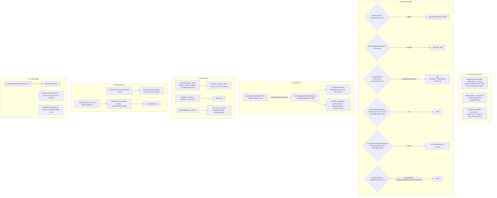

# 08 — Compliance rails (how compliance is enforced by code shape)

> **Freshness:** last verified 2026-08-23 · review every 30 days
> **Verified against** `origin/main` @ 6377727e · **Authoritative:** `../L2_COMPLIANCE_AND_LOGIC.md` (the L2 overlay that overrides any feature), `CLAUDE.md` §Compliance first / §NMLS / §Reg Z, `../governance/TEAM_PRACTICES.md` §9, `../compliance/UNDERWRITING_SCENARIOS.md` (they win on conflict; the code wins over both; **nothing in this chapter is a compliance reading — readings come only from captured sources in `docs/`**).

## The mental model

Compliance here is not a review at the end; it is the shape of the code — gates that 404 or 403
rather than degrade, engines with no hard-coded fallbacks, a citation ledger a script can fail,
and tests that read source text as a string — so the question "who decided this?" always has one
answer, and it is never a model.

## Explain it to a new hire

Compliance in this repo is a property of the code's shape, not a review step at the end: the
question "who decided this?" must always have an answer at a file and line, and that answer is
never a model. Four shapes carry it, and the first is gates that refuse rather than degrade — the
server will not boot without its encryption keys (`assertEncryptionConfig`, called at
`server/routes.ts:95`), a borrower's Loan Estimate (the early cost disclosure required by TRID, the
TILA-RESPA Integrated Disclosure rule) is answered 403 until an electronic-consent record under
ESIGN (the Electronic Signatures in Global and National Commerce Act) exists (`requireConsent`,
`server/consentGate.ts:177`, mounted at `server/routes/underwriting/delivery.ts:81`), any
soliciting surface answers 404 while the company's NMLS (Nationwide Multistate Licensing System)
license is pending (`server/services/prelaunchGate.ts:37`), and a denial cannot be recorded before
the adverse-action notice that ECOA (the Equal Credit Opportunity Act, implemented by Regulation B)
and FCRA (the Fair Credit Reporting Act) require has been generated (`ensureAdverseActionForDenial`,
`server/routes/lending/statusDecisions.ts:235-244`). The second is engines that never guess: every
underwriting threshold is read at run time from a database matrix through `resolveMatrixValue`
(`server/services/lookupResolver.ts:120`), which throws when no cell matches, because a hard-coded
fallback would be a decision nobody cited — a Fair Lending (equal-treatment) liability the engine's
own header names (`server/underwritingEngine.ts:289-293`). The third is a citation ledger a script
can fail: `data/regulatory/regulatory-ledger.json` holds 59 entries, each naming its rule, value,
citation, source, the code it governs (`codeRef`) and the date a human last verified it, and
`scripts/regulatory-freshness.cjs` fails when any is overdue — the rule behind all four shapes is
*no citation, no code*. The fourth is tests that read the source as text — 66 of the 246 unit test
files open a file with `readFileSync` and grep it — and the header of
`tests/complianceInvariants.test.ts:16` says what a red run means: treat it as a compliance
incident, not a flaky test.

## Mechanism



## The facts, with receipts

- **The L2 overlay.** `knowledge-base/L2_COMPLIANCE_AND_LOGIC.md` — six sections; ten invariants
  I1–I10 (`grep -c "^| \*\*I" …` → `10`). I1 (`:35`): "AI never decides. No AI output sits in the
  credit-decision path." I2 (`:36`): "No citation, no regulated-math change … No source → the value
  is not implemented." I8 (`:42`): no prohibited-basis variable or proxy is a model input;
  four-fifths disparate impact tested quarterly. And L2 names its own weakness: "F-014:
  `complianceInvariants` is grep-only — a green run there ≠ proven determinism" (`:35`).
- **The source rule.** `CLAUDE.md:139-143` — a reading is verified only when checked against a
  captured source *this run*; everything else stays flagged in the ledger. Reg Z is captured and
  pinned (the whole of 12 CFR 1026 plus Supplement I at eCFR `latest_amended_on` 2026-08-06,
  `docs/reg-z/README.md:16`; cite by section **and line**): "A reading fetched live is unrepeatable
  and drifts silently … Re-capture, do not re-fetch ad hoc" (`CLAUDE.md:95-97`). NMLS answers come
  only from `docs/nmls/` (`CLAUDE.md:76-79`). The one source CLAUDE.md tells you to fetch — the
  Fannie Loan Delivery job aid — returns 403 (`CLAUDE.md:127-137`); since 2026-08-20 the founder-supplied
  08-05-2026 Selling Guide is the other Fannie authority — gitignored because the repo is public,
  regenerated locally by `scripts/extract-selling-guide.py`, located by the tracked
  `docs/fannie-mae/selling-guide/section-index.tsv` (#654); `docs/fannie-mae/README.md:13-15` puts the Selling/Servicing Guides above
  any job aid and says escalate, never pick. `docs/` and `data/regulatory/` are off limits to every
  owner agent except to *add* a ledger entry (`.claude/agents/_OWNER_RAILS.md:37`).
- **The invariant test.** `tests/complianceInvariants.test.ts:16`; `grep -c "^describe("` → `16`;
  `grep -c "  it("` → `55`. `DECISION_PATH_MODULES` (`:34-43`) = `underwritingNuance.ts`,
  `preUnderwriting.ts`, `decisionEngine.ts`, `loanAnalysis.ts`, `ausSubmission.ts`, `server/pricing.ts`,
  `server/underwriting.ts`, `server/underwritingEngine.ts`; `AI_IMPORT_PATTERNS` (`:46-53`) = six
  regexes including `@anthropic-ai/sdk`, `openai`, `@google/genai`, `/coaching*`, `/gemini`,
  `riskBrief`. The 16 describes name the regimes: Reg B firewall (`:55`), FCRA consent gating
  (`:66`), ESIGN/Reg Z disclosure gates (`:93`), guideline traceability (`:110`), Reg B intake
  determinism (`:196`), TRID §1026.19 (`:217`), Reg Z §1026.22 APR (`:277`), ECOA §1002.9 adverse
  action (`:298`), Reg N/UDAAP coach lint (`:337`), advisory risk brief (`:360`), SAFE Act/Reg H
  footprint (`:389`), protocol safety (`:416`), AI governance AG-1 (`:436`) and AG-2 (`:474`), C2
  binding (`:518`), the compliance-critical field registry (`:639`).
  `grep -lE 'readFileSync\(' tests/*.test.ts | wc -l` → `70` — source-text tests are a repo-wide style.
- **Encryption.** `server/services/encryptionService.ts:3` `ALGORITHM = "aes-256-gcm"` (32-byte
  key, 12-byte IV, 16-byte tag); ciphertext is `keyId`-tagged into a registry so versions coexist;
  precedence `ENCRYPTION_ACTIVE_KEY_ID` > newest KMS DEK > highest app version (`:32-34`); KMS
  envelope — DEKs unwrapped once at boot, KEK never leaves KMS, boot fails closed if KMS is
  configured but unusable (`:91-93`, `:148`); `assertEncryptionConfig()` (`:197-215`) refuses
  production without `CREDIT_ENCRYPTION_KEY` and `PII_HASH_SALT`, called at `server/routes.ts:97`.
- **The audit hash chain is versioned, and v1 is kept on purpose.** `encryptionService.ts:298-300`
  `AUDIT_HASH_V1`, `AUDIT_HASH_V2_SEQUENCED` (folds `sequenceNumber` in, so renumbering after a
  deletion no longer verifies); `:294-296` — "Re-hashing history to retire it would rewrite the
  audit log to make it verify — the exact move an audit log exists to make impossible";
  `:320-334` keys are canonicalised recursively because jsonb does not preserve key order.
  `server/services/creditAuditChain.ts:40-45` states the cross-process caveat in code; `:20` the
  null-application sentinel scope. `grep -rn "logCreditAction(" server | wc -l` → `16`.
- **The vaults.** `server/services/ssnVault.ts:46-55` `encryptSsnToColumns` produces `ssn: null`
  + ciphertext + IV + keyId + `ssnLast4`; `:31` `isMaskedSsn` skips a masked round-trip.
  `server/services/piiVault.ts:9-11` — "only `*Last4` ever leaves the server. Decryption is
  reserved for server-side consumers with a regulatory need … never for API responses";
  `stripEncryptedFields` `:69`; Plaid tokens as `encv1:keyId:iv:ciphertext` (`:49`). Eight
  `_encrypted` column sites in the schema (chapter 03). The only audited full-SSN reveal:
  `server/routes/borrower/urla.ts:89` `logAudit(req, "urla.ssn_reveal", …)`, allow-list
  `["admin","underwriter","processor"]` (`:79`). `grep -rn "logAudit(" server | wc -l` → `155`;
  `server/auditLog.ts:23-25` swallows its own errors.
- **FCRA consent is deny-by-default and exact-match.** `server/services/creditConsents.ts:37`
  `consentCoversPullType` — "Unknown types authorize nothing"; before the map existed "a `soft_pull`
  consent silently unblocked a hard tri-merge" (F-035, `:13-15`). `server/services/creditPulls.ts:67`
  throws without a covering consent; `:97-107` stamps `isSimulated` at INSERT (F-036); `:179-183`
  a live key with simulation mode is a fatal contradiction; `:189-196` production refuses to
  fabricate unless `CREDIT_VENDOR_MODE=simulation` is explicit.
- **Determinism.** `server/underwritingEngine.ts:289-293` (the isolation contract); `:32-35`
  `UnderwritingErrorKind` so `POLICY_OUT_OF_BAND` routes to a human. `server/services/lookupResolver.ts:74-76`
  "FULL REPLACEMENT — there are no silent fallbacks … loud and auditable (Fair Lending / Reg B
  determinism)"; `:219-224` `tryResolveMatrixValue` "for NON-DECISION display surfaces only".
  `shared/schema/decisions.ts:42-46` `resolvedPolicy` + `policyFingerprint` reconstruct a decision
  after a matrix edit.
- **The ECOA chokepoint is visible in the route.** `server/routes/lending/statusDecisions.ts:230-251`
  — "a denial must carry an adverse-action notice. The shared chokepoint generates it BEFORE the
  status flips — if it can't, the denial does not proceed"; ≥ 2 HMDA reasons (`:165-168`); only
  underwriter/admin set outcomes (`:174-175`). Pinned by `tests/complianceInvariants.test.ts:324` ("EVERY
  denial route runs through the shared adverse-action chokepoint") and `:333`.
- **TRID and ESIGN.** The six-piece §1026.2(a)(3) trigger is evaluated on every completing write
  path; only `server/services/trid.ts` writes `tridTriggeredAt`; LE timing is business-day based,
  never `setDate` arithmetic; stage advancement enforces the hard stop (`complianceInvariants:218-270`).
  `server/consentGate.ts:177` `requireConsent` — fail-closed, binds only the borrower (staff
  preview is work product, `:191-193`), an explicit decline does not satisfy it (`:196-198`), a
  block writes a friction-log entry (`:199-205`) → 403 `CONSENT_REQUIRED`; mounted on exactly one
  route (`server/routes/underwriting/delivery.ts:81`). The anti-steering template is v1.1 and
  claims only the two options `computeOffers` actually labels — a third would be an unearned
  §1026.36(e)(3) safe-harbour claim (`consentGate.ts:58-68`).
- **Licensing gates.** `server/services/prelaunchGate.ts:25-31` fails safe to the NMLS licensing
  state when the env var is unset; 15 references across `server/`. The SAFE Act footprint is
  Illinois-only; `unlicensedStateRejection` is called on every property write path
  (`server/routes/borrower/applicationProperties.ts:61,132,211`, `lending/applications.ts:52`,
  `lending/letters.ts:68`); the MCP pricing tool refuses out-of-footprint ZIPs (`server/mcp/index.ts:395`).
- **The ledger.** `data/regulatory/regulatory-ledger.json` — 59 entries with the same 9 keys
  (`citation, codeRef, id, lastVerified, notes, reviewIntervalDays, rule, sourceUrl, value`); its
  `$comment` says every statutory constant in the codebase has an entry and
  `scripts/regulatory-freshness.cjs` fails when any is overdue; 9 entries still carry a
  blocked-network note from 2026-08-04/05 (re-probing is the first step in clearing each —
  `CLAUDE.md:156-161`). The contract in `knowledge-base/compliance/UNDERWRITING_SCENARIOS.md:5-10`:
  "No citation → not implemented"; even the generation prompt says "write 'NO CITATION — needs
  research' instead of guessing" (`:37`). Every `shared/fannieMae/*.ts` names its captured PDF and
  forbids extending from memory.
- **§9 security-review triggers, and the incidents that added them.** `knowledge-base/governance/TEAM_PRACTICES.md:302-363` (and, in code, the dated trigger list at `scripts/security-review-guard.cjs:47-140` — the same incidents, readable from the repo alone) — twelve
  bullets: PII vault/encryption; auth & sessions; role gates + per-resource ownership; uploads;
  outbound messaging; webhook receivers **and their delegates** ("A path trigger must cover the
  delegate, not just the caller", `:329-330`); request identity & trust boundary; rate-limit
  policy; PII encryption **call sites**; consumer-data furnishing; money movement; logging near PII.
  "Keep the triggers narrow" (`:387-390`). Four of the twelve carry their dated incident in the
  doc: **logging near PII** — the response-body denylist that missed `/api/urla/*` SSNs
  (`server/app.ts:475-480`); **webhook receivers and their delegates** — added 2026-08-06 when the
  route was a trigger but the service doing the signature check was not (`:321-327`); **PII
  encryption call sites** — added 2026-08-12 after encrypting a landlord email in a new module
  produced zero triggers (`:336-344`); **rate-limit / lockout policy** — added 2026-08-19 because
  against a distributed credential-stuffing attacker the lockout threshold is the only remaining
  control (`:302-315`). `scripts/security-review-guard.cjs:18-22` — "It proves a
  review was *documented*. It cannot prove the review was competent, and with one engineer nothing
  can"; the schema-PII trigger is "a FLOOR, not a ceiling" (`:29-34`); it skips (exit 0) when
  `CHANGED_FILES` is unset (`:41-42`).
- **The AI boundary.** Seven server files mention Anthropic, five import the SDK
  (`server/extractionCore.ts:17`, `services/coachTools.ts:2` type-only, `services/riskBrief.ts:1`,
  `services/coachingTurn.ts:4`, `services/coachingClient.ts:3`); none is a decision-path module.
  One coach call site (`coachingTurn.ts:189`); output rides the deterministic lint rail
  (`applyCoachLintFilter` `:309`, `shared/compliance/loCommsLint.ts`) before display; every turn is
  logged (`logAiInteraction` — 5 references). `coachingPrompt.ts:43` — "You are an AI — say so
  plainly if asked … You are NOT a loan officer, a loan advisor, or a housing counselor".
  `knowledge-base/governance/AI_GOVERNANCE_POLICY.md` — ten sections including a lifecycle (§5),
  vendor oversight (§7), a cadence (§8) and a gap register (§9).

### The fail-closed gates, consolidated

| Gate | Where | Failure mode |
|---|---|---|
| `assertEncryptionConfig()` | `server/services/encryptionService.ts:197` ← `server/routes.ts:95` | throw at boot |
| `initEncryption()` KMS unwrap | `encryptionService.ts:148` ← `server/routes.ts:99` | throw at boot |
| `SESSION_SECRET` entropy floor | `server/integrations/auth/session.ts:20-26` | throw at boot (prod) |
| `hashPII` salt guard | `encryptionService.ts:536-541` | throw rather than use a fallback salt |
| `prelaunchGate` | `server/services/prelaunchGate.ts:37` | 404 `PRELAUNCH_GATED`; unset env fails *safe* |
| `requireConsent(type)` | `server/consentGate.ts:177` | 403 `CONSENT_REQUIRED` + friction log |
| `consentCoversPullType` / pull gate | `creditConsents.ts:37`; `creditPulls.ts:67` | throw; deny-by-default |
| credit-vendor interlock | `creditPulls.ts:179` | throw on a contradictory config |
| production simulation ban | `creditPulls.ts:189-196`; `server/mcp/vendors.ts:88-95` | throw |
| `ensureAdverseActionForDenial` | `statusDecisions.ts:235-244` | 422 — the denial does not proceed |
| HMDA reason minimum | `statusDecisions.ts:165-168` | 400 |
| `unlicensedStateRejection` | five write paths (above) | reject the write |
| MCP footprint gate | `server/mcp/index.ts:395` | tool call fails |
| `resolveMatrixValue` | `lookupResolver.ts:120` | throw — no silent default |
| `logAudit` | `server/auditLog.ts:23-25` | **not** fail-closed — swallows its own error (W1 below) |

## Prove it yourself

```bash
git rev-parse --short origin/main
# → d9e8f79d   (the commit these outputs were measured on, after merging it into this corpus branch)
grep -c "^| \*\*I" knowledge-base/L2_COMPLIANCE_AND_LOGIC.md
# → 10 @ 6377727e
grep -c "^describe(" tests/complianceInvariants.test.ts ; grep -c "  it(" tests/complianceInvariants.test.ts ; sed -n '16p' tests/complianceInvariants.test.ts
# → 16 / 55 / " * If one of these fails, treat it as a compliance incident, not a flaky test." @ d9e8f79d
grep -lE 'readFileSync\(' tests/*.test.ts | wc -l
# → 66 @ d9e8f79d
grep -rn "aes-256-gcm" server --include='*.ts'
# → server/services/encryptionService.ts:3:const ALGORITHM = "aes-256-gcm"; @ 6377727e
grep -n "AUDIT_HASH_V1 = \|AUDIT_HASH_V2_SEQUENCED = \|AUDIT_HASH_VERSION_CURRENT = " server/services/encryptionService.ts
# → 298 / 299 / 300 @ 6377727e
grep -rn "logAudit(" server | wc -l ; grep -rn "logCreditAction(" server | wc -l
# → 138 / 16 @ 6377727e
grep -rn "_encrypted" shared/schema/*.ts | wc -l
# → 8 @ 6377727e
grep -rn "@anthropic-ai/sdk" server --include='*.ts' | wc -l ; grep -rln "anthropic" server --include='*.ts' | wc -l
# → 5 / 7   (none in DECISION_PATH_MODULES) @ 6377727e
python3 -c "import json;e=json.load(open('data/regulatory/regulatory-ledger.json'))['entries'];print(len(e));print(len([x for x in e if 'block' in (x.get('notes','') or '').lower()]))"
# → 59 / 9 @ 6377727e
grep -n "assertEncryptionConfig\|initEncryption(" server/routes.ts
# → 47 (import) / 95 / 99 @ 6377727e
grep -rn "requireConsent(" server --include='*.ts' | wc -l
# → 3   (doc comment, definition, the single mount at server/routes/underwriting/delivery.ts:81) @ 6377727e
grep -rn 'CREDIT_VENDOR_MODE' server/services/creditPulls.ts | wc -l
# → 9 @ 6377727e
grep -n "^- \*\*" knowledge-base/governance/TEAM_PRACTICES.md | awk -F: '$1>=302 && $1<=363' | wc -l
# → 12   (the §9 trigger categories) @ d9e8f79d
```

## Where this breaks

| Trap | Where | Caught by |
|---|---|---|
| W1 — `logAudit` cannot fail a request: a dead `audit_logs` table means SSN reveals, role changes and adverse-action generations all succeed with no record. | `server/auditLog.ts:23-25` | Nothing; L2 names the adjacent gap F-006 (`:38`). |
| W2 — the credit audit chain forks across processes; no unique `(application_id, sequence_number)` constraint exists. | `creditAuditChain.ts:43-44`; `shared/schema/compliance.ts:270-311` | Documented, not guarded. |
| W3 — `complianceInvariants` is grep-only: a renamed file, a wrapper, or a **dynamic** `await import("openai")` slips past the six static-import regexes — and the codebase uses dynamic imports elsewhere. | `complianceInvariants.test.ts:46-53`; L2 F-014 | The known gap. |
| W4 — `tryResolveMatrixValue` is one keystroke from a decision path; its display-only status is a comment. | `lookupResolver.ts:225-233` | No test asserts no decision module calls it. Proposed ticket in chapter 12. |
| W5 — `requireConsent` is mounted on exactly one route; every other borrower-facing document delivery has no ESIGN gate, and the gate needs `:id` or `:applicationId` in the path or it 400s every request. | `consentGate.ts:177-183`; `underwriting/delivery.ts:81` | `complianceInvariants:94` pins that one route. |
| W6 — the staff passthrough in `requireConsent` contributes zero protection on a route whose own role gate is weak. | `consentGate.ts:190-193` | A documented composition assumption. |
| W7 — `simulateCreditPullCompletion` uses `Math.random()` — non-deterministic; L2 D-008 flags it. | `creditPulls.ts:207-209` | Named open defect. |
| W8 — `policyFingerprint` / `resolvedPolicy` are nullable; a decision written without them is unreconstructable. | `shared/schema/decisions.ts:45-46` | No `NOT NULL`, no test (a contract migration = founder-signed). |
| W9 — the §9 guard is PR-only and skips silently on push; the no-direct-push rule is what keeps it effective. | `security-review-guard.cjs:41-42` | By design. |
| W10 — the schema-PII trigger matches a name vocabulary: `applicant_identifier` ships with zero triggers; a new PII sub-processor is undetectable in any diff. | `security-review-guard.cjs:29-34`; `knowledge-base/governance/TEAM_PRACTICES.md:373-385` | Self-declared floor. |
| W11 — the ledger's freshness check trusts a typed `lastVerified`; 8 of the blocked-network entries had their notes corrected but were never re-read. | `CLAUDE.md:156-161` | Freshness is enforced; truthfulness is not. |
| W12 — `STATIC_COACH_PROMPT` byte-stability and the anti-steering template's two-option claim are enforced by comments. | `coachingPrompt.ts:26-40`; `consentGate.ts:58-65` | `complianceInvariants:104` pins the template's citation, not its option count. |

## What we do not know

| Question | What resolves it |
|---|---|
| Do `tests/auditChainTruncation.test.ts` / `tests/auditReanchor.test.ts` simulate a cross-process chain fork? | `grep -n "describe(\|it(" tests/auditChainTruncation.test.ts tests/auditReanchor.test.ts`. |
| ~~Exactly what `scripts/regulatory-freshness.cjs` fails on (overdue only, or also a missing `codeRef` target)?~~ Answered 2026-08-23: both — its header says it "also verifies the codeRef file for each entry still exists" (`scripts/regulatory-freshness.cjs:8-9`). | `sed -n '1,60p' scripts/regulatory-freshness.cjs`. |
| Which other borrower-facing document routes *should* carry `requireConsent` — a policy question. | `hq-trid-disclosures-owner` + `hq-credit-fcra-owner`, or the founder. |
| Has the §9 trigger list in the script drifted from the prose list in TEAM_PRACTICES? | `sed -n '45,140p' scripts/security-review-guard.cjs` against `:299-360`. |

## Analogy

The pharmacy, not the pharmacist. A good pharmacist double-checks a dose; a well-designed
pharmacy makes the wrong dose physically hard to dispense — interlocked cabinets, barcode scans
that refuse to complete, a log that writes itself. This repo picked the pharmacy: the doors do not
open without the keys, the rate book hands out no number it cannot source, and a denial cannot be
filed before its notice exists. The pharmacist still matters — §9 makes you write down what you
checked — but the cabinet is what holds. And the lab's chain of custody keeps the old stamps
rather than re-stamping the book to make it tidy.

## Teach-back checkpoint

1. Someone adds a new DTI threshold constant. What must land in the same commit, and what fails if it does not?
2. How does the code guarantee AI never sits in the credit-decision path — and where does that guarantee leak?
3. What is the difference between `resolveMatrixValue` and `tryResolveMatrixValue`, and why does it matter for Fair Lending?
4. Trace the ECOA chokepoint on a denial.
5. Why does the audit hash chain keep a v1 algorithm it knows is forgeable?
6. Name three §9 triggers and the incident that added each.
7. What does `pnpm guard:security` actually prove?
8. Why is the Reg Z source text captured into the repo instead of fetched per session?

## Go deeper

- [app-guide 06](../handbook/app-guide/06-auth-security-secrets.md) `## Data protection` (`:62-112`)
  and its PII pre-flight checklist (`:114-129`); [app-guide 08](../handbook/app-guide/08-services.md)
  `## Compliance & security` (`:56`) and the regulated-math pre-flight (`:89`).
- The authority chain (`knowledge-base/L2_COMPLIANCE_AND_LOGIC.md:74-85`): `CLAUDE.md` →
  `knowledge-base/governance/AI_GOVERNANCE_POLICY.md` → `knowledge-base/governance/MODEL_RISK_GOVERNANCE.md`
  → `knowledge-base/compliance/UNDERWRITING_SCENARIOS.md` + `SCENARIO_ARCHITECT.md` →
  `data/regulatory/regulatory-ledger.json` → `docs/fannie-mae/` → `docs/nmls/` + `docs/nmls-safe/`
  + `knowledge-base/compliance/SAFE_MLO_COMPLIANCE_MAP.md` → `knowledge-base/compliance/REGULATORY_MONITORING.md`
  → `TEAM_PRACTICES.md` §5.5 + §9 → `knowledge-base/compliance/security/threat_model.md`.
- Feature-map rows 34 (PII protection — `hq-pii-vault-owner`, "almost entirely hand-back"), 32
  (HMDA and fair lending — `hq-hmda-fairlending-owner`), 8 (GSE delivery), 10 (TRID/LE), 41 (CI).
  Owner agents: `.claude/agents/hq-credit-fcra-owner.md` ("No pull without a recorded permissible
  purpose. The consent gate fails closed, always", `:33`), `hq-underwriting-owner.md` (engines
  hand-back only), `hq-ai-coach-owner.md` ("The coach extracts and explains. It never decides",
  `:32-33`), `compliance-auditor.md` (the read-only review agent — "Never answers from memory; flags
  what it cannot verify"). `_OWNER_RAILS.md` §4 ends: "A `complianceInvariants` failure is a
  compliance incident, not a flaky test."
