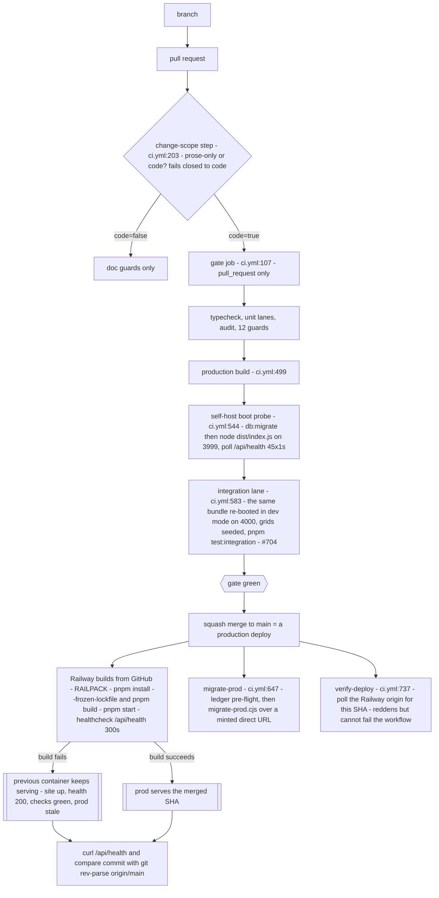

# 10 — Deploy, environments and migrations

> **Freshness:** last verified 2026-08-22 · review every 30 days
> **Verified against** `origin/main` @ 12d7cbec · **Authoritative:** [app-guide 10 — Deploy & Operations](../handbook/app-guide/10-deploy-ops.md) plus the runbooks `../runbooks/CICD.md`, `../runbooks/DB_MIGRATIONS.md`, `../runbooks/ROLLBACK.md` (they win on conflict; the code wins over both — and on the one fact that matters most this month, all four are silent; see *Where this breaks*).

> **Dated status box (re-verify on every refresh — these change):** at 12d7cbec both deploy jobs
> are **live again**. `migrate-prod` runs on push and dispatch (`.github/workflows/ci.yml:681`);
> `verify-deploy` runs on push (`:754`). They had been paused on 2026-08-19/20 on the premise that
> the Railway service "was being taken down" — a premise that silently expired while the pause held,
> and `76c96751` (#669) re-armed both on 2026-08-22 with the finding that "the migration journal ran
> ahead of the production database exactly as the pause note predicted". **Two things did not
> change:** `verify-deploy` is `continue-on-error: true` by design (`:770` — it and Railway's "Wait
> for CI" would otherwise deadlock into a permanent silent deploy freeze, observed live 2026-08-06),
> and `main` still has **no required status checks** (`:30-48`). So the deploy check calls out a
> stale prod, and nothing makes anyone answer. Production answered live during this survey with
> `commit` equal to `origin/main`.

## The mental model

A merge to `main` builds one Railway container, CI applies migrations to Neon before it, and the
only proof anything shipped is the `commit` field of `GET /api/health` — because a failed build
leaves the previous container serving with every check still green.

## Explain it to a new hire

Landing work means branch → PR → the `gate` check (typecheck, the unit suites, a prod-dependency
audit, eleven guards, a real production build, and a boot of the built `dist/index.js` against a
disposable Postgres until `/api/health` answers 200) → squash merge, after which Railway rebuilds
from `main` with `pnpm install --frozen-lockfile && pnpm build` and starts `pnpm start`. A green
check is not a shipped deploy: on 2026-08-06 nine consecutive Railway builds failed on a single
`engines.node` string, a failed build leaves the *previous* container serving, so the site stayed
up, `/api/health` kept answering 200, every check stayed green — and prod sat about eight commits
stale for hours, which is why `/api/health` now reports the deployed commit SHA and why comparing
that field with `git rev-parse origin/main` is the only proof that exists. Migrations are
hand-authored SQL in `migrations/` plus a `migrations/meta/_journal.json` entry, applied to prod by
`scripts/migrate-prod.cjs` over a plain `pg` client against a Neon *direct* URL minted at run time
from `NEON_API_KEY` — and its `--dry-run` only reconciles the journal, it never executes a line of
SQL, so it cannot tell you whether a `SET NOT NULL` will abort on real data. Locally you run on
port 5001 (macOS AirPlay squats on 5000), worktree servers use 5002 and up, and `pnpm preflight`
reproduces the whole gate with 3999 for the boot probe and 4000 for the integration lane. The
database driver is chosen by URL shape: a `localhost` `DATABASE_URL` (or `USE_LOCAL_PG=true`)
gets node-postgres, everything else — including all of production — gets Neon's serverless
WebSocket driver.

## Mechanism



## The facts, with receipts

- **Railway config is in-repo.** `railway.json:4-12`: `RAILPACK`, `pnpm install --frozen-lockfile && pnpm build`,
  `pnpm start`, `healthcheckPath /api/health`, `healthcheckTimeout 300`, `ON_FAILURE` ×10.
- **`pnpm build` is two builds; `pnpm start` is one file.** `package.json:12-13` — Vite for the
  client, esbuild bundling `server/index-prod.ts` to `dist/index.js`; `NODE_ENV=production node dist/index.js`.
- **Node is pinned to an exact major — the 2026-08-06 root cause.** `package.json:7` `"node": "24"`;
  `knowledge-base/runbooks/CICD.md:146-152` records that `"24.x"` is npm range syntax Railpack's
  version resolver cannot parse, so every build failed while CI (which resolves `24.x` fine) stayed
  green.
- **CI has three jobs.** `grep -nE '^  [a-z-]+:$' .github/workflows/ci.yml` → `94: push` (a trigger key the pattern also matches, not a job), `107: gate`,
  `647: migrate-prod`, `737: verify-deploy`. `gate` runs on pull requests only, skips drafts and
  title-only edits (`:142-147`).
- **The change-scope step fails closed.** `.github/workflows/ci.yml:203-204` (`id: scope`), rationale
  `:217-220`: "The cost of a wrong code=false is a COMPLETELY UNGATED PR, so every uncertainty — an
  empty diff, a missing sha, a git failure — resolves to code=true." One markdown file is on the
  code path because a test reads it: `:235` `TEST_BEARING_RE` names
  `knowledge-base/compliance/UNDERWRITING_SCENARIOS.md`, pinned by `tests/ciTriggers.test.ts:251`.
- **The boot probe exists because "build success ≠ boot success".** `:544-582`: after
  `pnpm db:migrate` against the job's Postgres service, boot `dist/index.js` with generated 48-byte
  secrets on `PORT=3999` and poll `/api/health` 45 × 1 s; it "catches the import-time death class
  (e.g. require(esm)) that a green build hides" — the 2026-07-17 postmortem.
- **No prod DB password is stored in GitHub.** `:19-23`, `:716`:
  `DATABASE_URL="$(node scripts/neon-connection-uri.cjs)" node scripts/migrate-prod.cjs $ARGS` —
  minted per run from `NEON_API_KEY`, never echoed, never written to `GITHUB_ENV`.
  `scripts/neon-connection-uri.cjs:23-27`: `pooled=false` is required — "the pooler does not
  migrate reliably."
- **`migrate-prod.cjs` uses a plain `pg` client, not the app's Neon pool.** `scripts/migrate-prod.cjs:3-6`.
  It dedupes by **both** the file's sha256 and the journal `when` (`:65-71`, `:81`) so it
  interoperates with `drizzle-kit migrate`; each migration runs in its own transaction (`:91-108`).
- **A dry run never executes SQL.** `scripts/migrate-prod.cjs:84-87` — `if (DRY_RUN) { console.log(`pending ${entry.tag}`); continue; }`.
  `knowledge-base/runbooks/DB_MIGRATIONS.md:160-164`: it "answers *is the ledger in sync?*, never
  *will this DDL succeed?*" — the 2026-07-13 outage class.
- **The ledger guard runs twice — and the second run is the only one that ever sees `main`.**
  `.github/workflows/ci.yml:287` (gate) and `:695-701` (`migrate-prod`'s first step: "the gate job
  is if: pull_request, so nothing validates the ledger on the push that actually triggers an
  apply"). Seven checks (`scripts/migration-ledger-guard.cjs:18-25` — the seventh, duplicate `when`,
  landed 2026-08-23 in #702, `:105-125`, pinned by `tests/migrationLedgerGuard.test.ts`); born of two branches authoring
  `0038` on the same day (`:12-16`).
- **The schema guard runs schema → migrations only, with a baseline that must not be hand-edited.**
  `scripts/schema-migration-guard.cjs:6-17`, `:34-40` — "Do NOT add to this by hand to silence a
  failure — write the migration instead."
- **58 migrations, 58 journal entries, latest `0057`.** `ls migrations/*.sql | wc -l` → `58`;
  `python3 -c "import json;print(len(json.load(open('migrations/meta/_journal.json'))['entries']))"`
  → `58`; last entry `{"idx": 57, "version": "7", "when": 1786147200003, "tag": "0057_login_lockout_last_failed_at", "breakpoints": true}`.
  `db:push` and `db:generate` are blocked in `package.json:30,34`.
- **A copy-pasted journal `when` makes prod silently skip a migration.** `DB_MIGRATIONS.md:145-150`;
  mechanism `scripts/migrate-prod.cjs:71,81`. Green job, missing DDL — and since #702 the ledger
  guard fails on a duplicate `when` before it can happen (`scripts/migration-ledger-guard.cjs:105-125`;
  both of #650's migrations carried `main`'s `when` on 2026-08-22, which is what the check was built on).
- **Environment variables, in three tiers — every list derived, not typed.** `.env.example` has
  9 uncommented keys (`grep -cE '^[A-Z_]+=' .env.example` → `9`) and documents 65
  (`grep -oE '^#? ?[A-Z][A-Z0-9_]+=' .env.example | sed -E 's/^#? ?//; s/=$//' | sort -u | wc -l`
  → `65`); the code reads 65 names directly
  (`grep -rhoE 'process\.env\.[A-Z][A-Z0-9_]+' server shared client --include='*.ts' --include='*.tsx' | sed 's/process.env.//' | sort -u | wc -l`
  → `65`) — the same number by coincidence, not the same set. `comm -13` of the two sorted lists
  (read but **undocumented**, 10): `FREDDIE_LPA_API_KEY INTAKE_PAUSED RAILWAY_GIT_COMMIT_SHA
  RAILWAY_REPLICA_REGION RATE_LIMIT_RELAXED SEED_LO_ID SENDGRID_API_KEY1 SENTRY_RELEASE
  TRUST_PROXY_HOPS UWM_EASE_CLIENT_ID` — three of them are operator switches a new hire needs
  (`INTAKE_PAUSED` is the kill switch, `RATE_LIMIT_RELAXED` is what the integration lane runs
  under, `TRUST_PROXY_HOPS` decides whether the secure cookie ever reaches a browser) and
  `SENDGRID_API_KEY1` is a fallback name read at `server/services/emailService.ts:5` that nothing
  documents (LEDGER HO-0823-03). `comm -23` (documented but **not read directly**, 10):
  `CREDIT_ENCRYPTION_KEY_V2 GOOGLE_CLIENT_ID GOOGLE_CLIENT_SECRET LINKEDIN_CLIENT_ID
  LINKEDIN_CLIENT_SECRET TWILIO_ACCOUNT_SID TWILIO_API_KEY_SECRET TWILIO_API_KEY_SID
  TWILIO_PHONE_NUMBER VITE_PRELAUNCH_GATED` — four are read dynamically (`CREDIT_ENCRYPTION_KEY_V${v}`
  at `server/services/encryptionService.ts:72`; the social `*_CLIENT_ID`/`*_CLIENT_SECRET` through
  `process.env[config.clientIdEnv]` at `server/socialAuth.ts:211,276-277`), one through
  `import.meta.env` (`VITE_PRELAUNCH_GATED`, `client/src/lib/prelaunch.ts:17-19`), and the four
  Twilio *sender* keys are read by nothing — only `TWILIO_AUTH_TOKEN`, `TWILIO_WEBHOOK_URL` and
  `TWILIO_STATUS_CALLBACK_URL` are (`grep -rhoE 'process\.env\.TWILIO[A-Z_]*' server | sort -u`),
  which is the inbound-only picture LEDGER HO-0822-U3 describes.
  - **Tier 1 — production refuses to boot without them** (four): `DATABASE_URL` (`server/db.ts:11-15`,
    throws in every environment); `SESSION_SECRET` ≥ 32 chars (`server/integrations/auth/session.ts:19-26`,
    production only — in dev the server starts and "every login 500s with `secret option required
    for sessions`", `.env.example:18-21`); `CREDIT_ENCRYPTION_KEY` + `PII_HASH_SALT`
    (`assertEncryptionConfig`, `server/services/encryptionService.ts:197-215`, production only — dev
    falls back to a key derived from `SESSION_SECRET || "default-dev-key"`, `:61-65`).
  - **Tier 2 — what `scripts/dev-up.sh` writes for you** (eight, `scripts/dev-up.sh:139-150`):
    `DATABASE_URL NODE_ENV PORT SESSION_SECRET PII_HASH_SALT CREDIT_ENCRYPTION_KEY DEV_TEST_PASSWORD
    EXTRACTION_SIMULATE` — the Tier-1 four generated with `crypto.randomBytes`, plus the dev login
    password and the switch that keeps document extraction simulated.
  - **Tier 3 — optional, grouped by `.env.example`'s own section headers** (`grep -nE '^# --- '
    .env.example`): Key rotation & Cloud KMS (`:34`: `CREDIT_ENCRYPTION_KEY_V2 ENCRYPTION_ACTIVE_KEY_ID
    PII_KMS_KEY_NAME PII_KMS_WRAPPED_DEKS`) · AI (`:50`, `:149`, `:156`: `ANTHROPIC_API_KEY
    EXTRACTION_SIMULATE AI_INTEGRATIONS_ANTHROPIC_API_KEY`) · Local dev conveniences (`:56`:
    `APP_BASE_URL DEV_TEST_PASSWORD NODE_ENV PORT`) · Credit vendor (`:67`: `CREDIT_VENDOR_API_KEY
    CREDIT_VENDOR_MODE`) · Private beta gate (`:96`: `BETA_ACCESS_CODE`) · CSP (`:104`: `CSP_ENFORCE`)
    · Pre-license launch gate (`:110`: `PRELAUNCH_GATED VITE_PRELAUNCH_GATED`) · Scheduled jobs
    (`:127`: `CRON_SECRET`, uncommented) · Object storage (`:138`: `GCS_SERVICE_ACCOUNT_KEY
    PRIVATE_OBJECT_DIR PUBLIC_OBJECT_SEARCH_PATHS`) · Webhooks (`:160`: `PLAID_WEBHOOK_SECRET`) ·
    Twilio / SMS (`:166`, seven keys) · Vendor integrations (`:220`: `CRS_API_KEY FANNIE_DU_API_KEY
    GOOGLE_MAPS_API_KEY HOUSECANARY_API_KEY ISOFTPULL_API_KEY PLAID_CLIENT_ID PLAID_ENV PLAID_SECRET
    RAPIDAPI_KEY`) · Email (`:231`: `FROM_EMAIL FROM_NAME SENDGRID_API_KEY SMTP_HOST SMTP_PASS
    SMTP_PORT SMTP_USER`) · Social login (`:246`, eight keys) · Error monitoring (`:269`:
    `SENTRY_DSN`) · AI risk brief (`:274`: `RISK_BRIEF_DISABLED`) · Misc tuning (`:279`:
    `AUS_TIMEOUT_MS LOOKUP_MATRIX_STAMP_WINDOW_MS MCP_VENDOR_TIMEOUT_MS PRICING_MARGIN_BASE_BPS
    PUBLIC_BASE_URL`). `TEAM_PRACTICES.md` §5 says a new env var lands in `.env.example` **and**
    `CICD.md`; the ten undocumented names above are the measure of how well that has held.
- **The driver split.** `server/db.ts:23-24` `useLocalPg = USE_LOCAL_PG === "true" || /@(localhost|127\.0\.0\.1)[:/]/.test(url)`
  → node-postgres (`:30-33`) else Neon serverless over WebSocket (`:35-37`); both cast to one type so
  hundreds of `db.select()` call sites never see a union.
- **Ports.** `.env.example:59` `PORT=5001`; `server/app.ts:657` falls back to 5000; worktree
  servers 5002+ (`knowledge-base/runbooks/LOCAL_DEV.md:187`); preflight `BOOT_PORT 3999`,
  `INT_PORT 4000` (`scripts/preflight.sh:40-41`); `scripts/local-db.sh:31` private cluster on 5433
  — it seeds and **wipes the pricing matrices**, so it must never point at a shared DB (`:23-27`).
- **`scripts/dev-up.sh` is the one-command cold start** and never overwrites an existing `.env`
  value (`:17-27`); `scripts/preflight.sh:3-9` runs the whole gate — its header deliberately no
  longer states a count ("it said sixteen while running eighteen") — including the three that
  only ever ran in CI and "catch a broken DEPLOY rather than a broken diff".
- **The 2026-08-06 incident is written down in at least nine places.**
  `grep -rln "nine consecutive" --include='*.md' . --exclude-dir=node_modules` → seven runbooks and
  governance docs; the canonical wording is `knowledge-base/runbooks/CICD.md:221-226`. Its second
  fault: health 200 against the **wrong** database (`CICD.md:205-210` — a stale Neon branch holding
  28 of 53 migrations passed `SELECT 1` while `/api/articles` 500'd).
- **ROLLBACK §0 distinguishes "bad deploy" from "stale prod" in thirty seconds.**
  `knowledge-base/runbooks/ROLLBACK.md:20-39`: commit matches `origin/main` → roll back; commit is
  older or null → prod is stale and rolling back makes it worse.
- **`verify-deploy` must poll the Railway origin, never `www`.** `.github/workflows/ci.yml:794-802`
  — Squarespace DNS, a redirect or a cached edge response "can all make it answer for something
  other than the Railway service"; pinned by `tests/ciTriggers.test.ts:153`. It is
  `continue-on-error: true` (`:770`) to break a deadlock with Railway's "Wait for CI" that otherwise
  marks a deployment SKIPPED, terminally (`:755-769`). Its window was cut from 20 to 6 minutes on
  measured data (125 runs, median 84 s; `:781-793`).
- **The charter records the pause and its accepted exposure.** `knowledge-base/routines/CHARTER.md:746-751`
  — "Prod-commit drift, the rollback window and RELEASABLE are no longer daily checks … Whoever
  un-pauses the deploy pipeline restores this check in the same change."

## Prove it yourself

```bash
cd /Users/ammrebarakat/Developer/Homiquity-handoff && git rev-parse --short HEAD
# → 12d7cbec @ 12d7cbec
curl -s -m 10 https://homiquity-production.up.railway.app/api/health
# → {"status":"ok","timestamp":"…","commit":"12d7cbecd420bbf3361f63b06a3a019398dabc55","email":{"configured":true,"providers":["sendgrid"]}} @ 12d7cbec
git rev-parse origin/main
# → 12d7cbecd420bbf3361f63b06a3a019398dabc55   (equal to the commit above ⇒ prod is CURRENT) @ 12d7cbec
grep -nE '^  [a-z-]+:$' .github/workflows/ci.yml
# → 94: push (a trigger key, not a job) / 107: gate / 647: migrate-prod / 737: verify-deploy @ d9e8f79d
sed -n '681p;754p;770p' .github/workflows/ci.yml
# → if: github.event_name == 'push' || github.event_name == 'workflow_dispatch'
#   if: github.event_name == 'push'
#   continue-on-error: true @ d9e8f79d
git log --format="%h %ad %s" --date=short -1 76c96751
# → 76c96751 2026-08-22 ci: re-arm migrate-prod and verify-deploy — the pause outlived its premise (#669)
# → (no matches — the runbooks do not record the pause) @ 12d7cbec
gh api repos/barakatammre84/Homiquity/branches/main/protection --jq '{contexts: .required_status_checks.contexts, strict: .required_status_checks.strict}'
# → {"contexts":[],"strict":false} @ 2026-08-22
ls migrations/*.sql | wc -l ; python3 -c "import json;print(len(json.load(open('migrations/meta/_journal.json'))['entries']))" ; ls -1 migrations/*.sql | tail -1
# → 58 / 58 / migrations/0057_login_lockout_last_failed_at.sql @ 12d7cbec
sed -n '83,88p' scripts/migrate-prod.cjs
# → if (DRY_RUN) { console.log(`pending  ${entry.tag}`); continue; }   ← a dry run executes nothing @ 12d7cbec
grep -c 'when' scripts/migration-ledger-guard.cjs
# → 10   (was 1, a comment, until #702 added check 7 — duplicate `when` — on 2026-08-23) @ d9e8f79d
grep -cE '^[A-Z_]+=' .env.example ; grep -oE '^#? ?[A-Z][A-Z0-9_]+=' .env.example | sed -E 's/^#? ?//; s/=$//' | sort -u | wc -l ; grep -rhoE 'process\.env\.[A-Z][A-Z0-9_]+' server shared client --include='*.ts' --include='*.tsx' | sed 's/process.env.//' | sort -u | wc -l
# → 9 / 65 / 65 @ 6377727e
comm -13 <(grep -oE '^#? ?[A-Z][A-Z0-9_]+=' .env.example | sed -E 's/^#? ?//; s/=$//' | sort -u) <(grep -rhoE 'process\.env\.[A-Z][A-Z0-9_]+' server shared client --include='*.ts' --include='*.tsx' | sed 's/process.env.//' | sort -u) | tr '\n' ' '
# → FREDDIE_LPA_API_KEY INTAKE_PAUSED RAILWAY_GIT_COMMIT_SHA RAILWAY_REPLICA_REGION RATE_LIMIT_RELAXED SEED_LO_ID SENDGRID_API_KEY1 SENTRY_RELEASE TRUST_PROXY_HOPS UWM_EASE_CLIENT_ID   (read, undocumented — 10) @ 6377727e
comm -23 <(grep -oE '^#? ?[A-Z][A-Z0-9_]+=' .env.example | sed -E 's/^#? ?//; s/=$//' | sort -u) <(grep -rhoE 'process\.env\.[A-Z][A-Z0-9_]+' server shared client --include='*.ts' --include='*.tsx' | sed 's/process.env.//' | sort -u) | tr '\n' ' '
# → CREDIT_ENCRYPTION_KEY_V2 GOOGLE_CLIENT_ID GOOGLE_CLIENT_SECRET LINKEDIN_CLIENT_ID LINKEDIN_CLIENT_SECRET TWILIO_ACCOUNT_SID TWILIO_API_KEY_SECRET TWILIO_API_KEY_SID TWILIO_PHONE_NUMBER VITE_PRELAUNCH_GATED   (documented, not read directly — 10) @ 6377727e
sed -n '23,24p' server/db.ts
# → const useLocalPg = process.env.USE_LOCAL_PG === "true" || /@(localhost|127\.0\.0\.1)[:/]/.test(url); @ 12d7cbec
sed -n '40,41p' scripts/preflight.sh ; grep -nF 'PORT="${PORT:-5001}"' scripts/dev-up.sh   # -F: BSD grep mis-parses the $ inside the pattern
# → BOOT_PORT 3999 / INT_PORT 4000 / 27:PORT="${PORT:-5001}" @ d9e8f79d
git log -S "PAUSED 2026-08-19" --format="%h %ad %s" --date=short -- .github/workflows/ci.yml
# → the pause going in, and 76c96751 taking it back out two days later
# → e762743b 2026-08-20 chore: pause the prod deploy pipeline — local-only development @ 12d7cbec
```

## Where this breaks

| Trap | Where | Caught by |
|---|---|---|
| `verify-deploy` is live again but `continue-on-error: true` (`ci.yml:770`), so its red is advisory. Because it is a post-merge job with `continue-on-error`, a failed deploy check cannot block the merge that triggered it. The four runbooks describe it as live, which is now true but incomplete — none records that it cannot fail a merge. | `.github/workflows/ci.yml:754,770` | `tests/ciTriggers.test.ts:106-118` accepts LIVE **or** PAUSED for both jobs — it could not have told you the pause happened, and cannot tell you it ended. LEDGER HO-0822-14. |
| A pause on `migrate-prod` makes the journal run ahead of prod, and nothing in CI can say so. The 2026-08-19/22 pause did exactly that and cost a 35-minute authentication outage (migration 0057); the job's own account is at `ci.yml:649-658`. `DB_MIGRATIONS.md:19-39` diagrams the automatic apply and is right again — it does not say what the next pause would cost. | `.github/workflows/ci.yml:681` | Nothing — `guard:migrations` validates the ledger, not whether it was applied; `tests/ciTriggers.test.ts:110` accepts LIVE **or** PAUSED. |
| The pause's premise — "the Railway production service is being taken down" (`ci.yml:653-654`, quoted in the resume note) — expired silently while the pause held: prod was up and auto-deploying every merge the whole time. Whether the takedown is still planned is an open question (`:675-680`). | `.github/workflows/ci.yml:649-658` vs the live curl | Nothing — CHARTER §7 retired the prod-commit-drift check with the pause. |
| `main` now requires the named gate under classic branch protection, with strict behaviour proved by rejected merge attempts. Four docs once overstated branch protection while the required-context list was empty; `3d047ce9` corrected those four at the time. `grep -rn "blocked by branch protection" README.md knowledge-base/ --include='*.md'` still finds the phrase in `knowledge-base/runbooks/CICD.md:96` and `knowledge-base/handbook/DEVELOPER_PLAYBOOK.md:303`, both hedged with "while it is live" (and in `ROLLBACK.md:92`, about force-pushes, which `allow_force_pushes: false` really does block — live probe 2026-08-23). The old empty-context condition is closed; the post-merge deploy verifier is still advisory. | `.github/workflows/ci.yml:30-48` | Nothing automated. LEDGER HO-0822-15 (the re-arm half is still open). |
| A copy-pasted journal `when` silently skips a migration in prod. Until 2026-08-23 the ledger guard checked duplicate `idx` and `tag` but **not** duplicate `when`. | `scripts/migrate-prod.cjs:71,81`; `scripts/migration-ledger-guard.cjs:19-25` | **Closed by #702** (`5aab6f9a`): check 7 fails the gate, pre-push and preflight on a shared `when` (`:105-125`; `tests/migrationLedgerGuard.test.ts`). LEDGER HO-0822-24. |
| A dry run is not a pre-flight for a contract migration. | `scripts/migrate-prod.cjs:84-87` | Documented, not enforced — the read-only prod probe in `DB_MIGRATIONS.md:171-205` is manual. |
| `/api/health` 200 proves reachability, not identity; a wrong-branch `DATABASE_URL` passes the Railway healthcheck and 500s every data route. | `server/routes.ts:78`; `CICD.md:205-210` | Nothing — also hit `/api/articles` and `/sitemap.xml` by hand. |
| `engines.node` range syntax kills every Railway build while CI stays green: CI's `setup-node` uses `24.x` (`ci.yml:200`), which resolves fine there. | `package.json:7` | Only `verify-deploy` — live again, but `continue-on-error`, so its red blocks nothing. |
| Turning on Railway "Wait for CI" makes `verify-deploy` decorative and can freeze deploys terminally. | `app-guide/10-deploy-ops.md:58-69`; `ci.yml:755-769` | Nothing — a dashboard setting. |
| `.githooks` are opt-in (`git config core.hooksPath .githooks`); a fresh clone pushes ungated. | `LOCAL_DEV.md:281-283` | Nothing — so the protected PR gate remains the reliable shared enforcement point. |
| `scripts/local-db.sh` seeds and `seedLendingGrids` wipes pricing matrices — destructive against a shared DB. | `scripts/local-db.sh:23-27` | Nothing but the comment and the non-default port 5433. |

## What we do not know

| Question | What resolves it |
|---|---|
| Whether the production database caught up on the first push after the re-arm, and whether anything was pending when it did. | A `workflow_dispatch` of `ci.yml` with `dry_run=true` (the input at `ci.yml:98`, honoured at `:710`), then read the `pending <tag>` list — remembering the dry run reconciles the **journal** and never executes a migration's SQL. Needs repo write access; not run here. |
| Whether the Railway takedown is still planned at all. `ci.yml:675-680` still carries the warning that if it is, re-arming was "the wrong half of the fix" and prod should stop receiving deploys instead. Prod kept auto-deploying throughout the pause, which is how it reached `12d7cbec` with `verify-deploy` off. | The founder, or Railway → service → Deployments and Settings → Source. |
| Whether GitHub Actions billing has fully recovered (the protection was removed 2026-08-19 because of a billing failure, `ci.yml:37-39`). | `gh run list --branch main`; CHARTER §7 warns that zero check-runs can mean an outage rather than a change. |
| Whether `CSP_ENFORCE`, `BETA_ACCESS_CODE`, `VITE_PRELAUNCH_GATED` are set in the live service. | Railway Variables (founder-only). The live health body shows `email.configured: true`, so the email secret at least is set. |

## Analogy

A smoke detector wired to chirp but not to the sprinklers. For two days in August the battery was
out entirely — the building (prod) was fine the whole time, which is exactly why nobody noticed,
and the manual still said "the detector will alert you". The battery is back in as of `76c96751`.
But `continue-on-error: true` is the deliberate choice not to wire it to the sprinklers, because
the sprinklers and the detector were found triggering each other into a lock-up (`ci.yml:755-769`).
So it chirps, and someone has to be listening. That is the 2026-08-06 shape one level up: not a
failed deploy nobody noticed, but a deploy *verifier* whose warning nothing is obliged to act on. And the journal is the ship's logbook:
`migrate-prod` is the navigator who reconciles it with the ship's real position on every merge —
back from a two-day shore leave as of `76c96751` — and a dry run reads the logbook back to you without looking out the
window.

## Teach-back checkpoint

1. Your PR merged, the checks are green, the site loads. Did your code ship? What is the one command that answers?
2. `/api/health` returns 200 but `/api/articles` 500s. First hypothesis?
3. You are adding a `SET NOT NULL`. Is a green `--dry-run` enough, and what is it actually evidence of?
4. You copy a journal entry and change `idx` and `tag` but forget `when`. What happens in prod, and which guard misses it?
5. Why does `migrate-prod` use a plain `pg` client instead of the app's own database module?
6. Why is there no prod database password in GitHub secrets?
7. Which ports do you use where, and why is 5000 unused?
8. Which driver does the app use in production, and what selects it?

## Go deeper

- [app-guide 10](../handbook/app-guide/10-deploy-ops.md) — the operator's summary (its lines 13 and
  33-37 describe the job as live, true again since `76c96751` — but not that its red cannot block a
  merge; LEDGER HO-0822-14).
- Runbooks, all authoritative and all silent on what a pause costs: `knowledge-base/runbooks/CICD.md`
  (§Shipping `:75`, §Railway deploy `:121`, §Post-deploy health binding `:212`, §Checks `:315`),
  `knowledge-base/runbooks/DB_MIGRATIONS.md` (§pipeline `:19`, §adding a migration `:137`, §contract
  migrations + the read-only prod probe `:153`, `:171`, §break-glass `:213`),
  `knowledge-base/runbooks/ROLLBACK.md` (**§0 first, always** `:20`), `knowledge-base/runbooks/LOCAL_DEV.md`
  (quick start `:7`, the whole gate locally `:38`, `:278`, ports `:183`),
  `knowledge-base/runbooks/CHANGE_LEDGER.md:30` (the Railway-cutover ledger row),
  `knowledge-base/logs/2026-07-17-prod-api-outage-uuid-esm-postmortem.md` (the "build success ≠
  boot success" postmortem behind the boot probe).
- Charter: `knowledge-base/routines/CHARTER.md` §7 (`:727-762`) — the only in-repo doc that both
  records the pause and names the accepted exposure.
- Feature-map rows: area 41 (CI, the guard fleet and repository tooling) and area 39 (background
  jobs and scheduled sweeps). Owner: `.claude/agents/hq-ci-guards-owner.md` — its trap list (`:90-95`)
  includes "A green migration dry-run never executes the SQL". `package.json` and the lockfile are
  off limits to every owner (`:21`). **`railway.json`, `server/db.ts`, `scripts/migrate-prod.cjs` and
  `.github/workflows/ci.yml` are named in no owner's file list** — LEDGER HO-0822-13.
