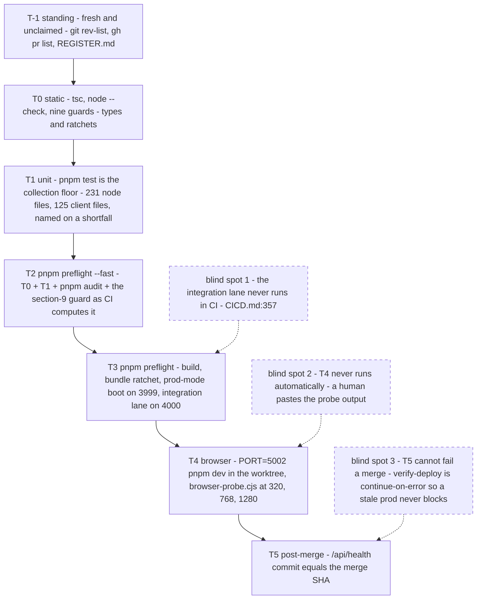

# 12 — The loop-safe build playbook

> **Freshness:** last verified 2026-08-23 · review every 30 days
> **Verified against** `origin/main` @ 6377727e. The rails this chapter summarises live in
> [prompts/_RAILS.md](prompts/_RAILS.md) (read, not copied — edit them there); the report shape
> in [prompts/_REPORT_FORMAT.md](prompts/_REPORT_FORMAT.md); the eight fill-in templates and the
> invocation recipe in [prompts/](prompts/). Every tier runtime below was **measured** on
> `074899e3` on 2026-08-22 (an 8 GB laptop, load average ≈ 3, zero peer test processes) and has
> not been re-timed since; a runtime you did not measure is a guess.

> **Dated status box (re-verify on every refresh — this one is as of 2026-08-23):** `main`
> **does** require the `gate` status check again, with `strict` on — re-armed 2026-08-23 and
> proved by behaviour, since `…/branches/main/protection` answers 403 to a non-admin token:
> merging #708/#647 returned `405 Required status check "gate (typecheck · tests · schema
> guard)" is expected`, and #647 merged only once brought current with `main`. (This box read
> `contexts: []` earlier the same day — the claim was true when written and false hours later,
> which is what "re-verify on every refresh" is for.) `migrate-prod` and `verify-deploy`
> were re-armed on 2026-08-22 (`76c96751`, #669), but `verify-deploy` is `continue-on-error: true`
> (`.github/workflows/ci.yml:770`) and nothing requires it, so its red blocks nothing; the
> test-collection guard **merged 2026-08-23** (`fd4a22c5`, #670) — `pnpm test` is now
> `node scripts/test-collection-guard.cjs` (`package.json:15`), so **T1's manual count check is
> retired**: the lane fails by itself, naming the files, when it collects fewer test files than
> exist on disk or when any test file matches no lane's `include`; the old unguarded pair survives
> as `pnpm test:raw` (`package.json:20`) and seeing its output in a report is the tell that the
> floor was bypassed; the pre-push hook still does not run the unit lanes unless you set
> `PREPUSH_TESTS=1` (`e49aab6d`, #660; `.githooks/pre-push:138-141`), so T1 is a step you run
> deliberately *or* read off CI; no node test file is stranded any more —
> `tests/maintenanceMode.test.ts` runs — it was a listed line until #725 deleted the list on
> 2026-08-24, and is now matched by the glob (`vitest.config.ts:71`) — and the zero is enforced
> rather than observed (FACTS F-39). Later the same day three more tickets closed: `pnpm
> harness:t0..t3` exist (`package.json:16-19` → `scripts/harness.sh`, #702, which also gitignored
> the ralph state file, `.gitignore:56`, and added the seventh ledger check), pre-push and preflight
> now run the gate's whole guard set (#703), and the integration lane runs in the gate (#704,
> `.github/workflows/ci.yml:583`). **T5 stays a human step** — a machine-checked deploy that cannot
> fail a merge is not a gate (FACTS F-13, F-39, F-43, F-44).

## The mental model

A loop may claim only what the harness printed; belief is not a tier.

## Explain it to a new hire

A *loop* here is an unattended Claude session that repeats one cycle — read the rails (the
single rules file, `prompts/_RAILS.md`), edit, run the proof commands, write a report — until it
can honestly end with a fixed closing phrase, and this playbook exists because a loop that
believes its own output is the fastest way to produce the repo's signature defect, a success
that did not happen. A *tier* is one rung of the proof hierarchy the harness — the repo's own
typecheck, test lanes, guard scripts and preflight script — already provides: T-1 (you are fresh
and nobody else owns the target), T0 (types and guards), T1 (the unit lanes), T2 (`pnpm preflight
--fast`), T3 (the full preflight with a database), T4 (a real browser), T5 (production's
`/api/health` reporting the merged commit), and each tier proves exactly one thing and is blind
to the rest, which is why the report must quote the lines each tier printed rather than
summarise them. The *promise* is the literal string `LOOP TERMINAL` that the loop plugin matches
exactly, and it means *terminal*, not *done*: it is true for `DONE` with T0–T3 evidence and
equally true for an honest `STOPPED(reason)`, so a stuck loop always has a truthful way out and
never a reason to loosen a tier. *Territory* is one `WRITE` list of file patterns per template,
checked with `git diff --name-only origin/main...HEAD` before every commit, because a loop that
may touch anything will fix the nearest symptom in a file it does not understand — and the
hand-back files (the decision engines, the vaults that encrypt personal data, `server/auth.ts`)
are never in it. A
*stop condition* is a situation the loop may not resolve on its own — a rebase conflict, a file
outside its territory, a change that touches auth, PII or messaging and so needs the written
security review the house rules call §9, a regulated number with no entry in the citation ledger
`data/regulatory/regulatory-ledger.json` — and hitting one is a correct ending: the loop writes
`STATUS: STOPPED(<reason>)` with the line, the change it would need and the owner, emits the
promise, and a human picks it up.

## Mechanism

The tiers as a funnel — each one narrower than the last, and the three places the funnel leaks:



## The facts, with receipts

### The premise

A loop is safe when its completion promise is tied to the harness's outputs, never to the
model's belief. Everything in this chapter is in service of that sentence. The harness is a
proof hierarchy — each tier proves one thing and is blind to the rest — so the loop contract says
which tiers must be green, in which order, before a claim may be made; the templates put the
tiers in the right place in each kind of change; and the stop conditions make "I could not
satisfy a tier" a *terminal* state rather than a reason to loosen the tier.

The repo's own history (chapter 11 §C) is why: 91 of the last 300 commits are fixes, the
commonest scope is a routine report, and the recurring failures are a test that never ran, a
deploy that never shipped, a baseline bumped to pass, and a count nobody re-derived. A loop that
cannot produce any of those four is most of the way to safe.

### 1. The harness as a proof hierarchy

| Tier | Commands (run in the worktree) | Proves | Cannot see | Measured @ 074899e3 | When in the loop |
|---|---|---|---|---|---|
| **T-1 standing** | `git fetch origin && git rev-list --count HEAD..origin/main` (must be ≤ 2); `gh pr list --state open --json number,files`; read `knowledge-base/routines/REGISTER.md` | you are fresh and unclaimed | code | seconds | every iteration start |
| **T0 static** | `pnpm harness:t0` — `pnpm check`, `node --check` over every `scripts/*.cjs`, then the nine guards, exactly as `scripts/harness.sh:32-41` chains them (#702) | types; the guard scripts parse; the ratchets did not regress; the migration ledger is intact | runtime; classNames built by `cn()`/templates (the UI guards read literal strings); `guard:tokens` and `guard:ui` rewrite their baseline on a shrink | `tsc` **57 s** on the first run (cold cache, six evidence agents grepping in parallel) and **5–9 s** warm · `node --check` 1 s · nine guards **13 s**, tree clean afterwards | after every edit |
| **T1 unit** | `pnpm harness:t1 > "$SCRATCH/t1.log" 2>&1` (never `\| tail`) — it is `pnpm test` (`scripts/harness.sh:46`), and since `fd4a22c5` that **is** the floor: `package.json:15` runs `scripts/test-collection-guard.cjs`, which enumerates the expected files from disk with a loud `readdirSync`, runs each lane once with `--reporter=default --reporter=json` (`:313-316`), prints `SHORT BY N` and the missing file names on any shortfall (`:406-415`), and fails on a test file no lane includes (`:462-469`). Your new test's file name must still appear in the log. | in-process logic, the 63 source-text invariants, components in happy-dom; **and** that every test file on disk was collected | HTTP, the database, layout; timeouts under load read as failures; `pnpm test:raw`, `test:unit` and `test:client` bypass the floor, and passing any argument disables it (`:354`) | **139 s** wall for the raw pair at `074899e3` — node lane 218/218 files, 3,156 tests, 83 s; client lane 120/120 files, 808 tests, 51 s; the guard runs the same two lanes once each, so expect the same order of cost, but its own overhead was **not** re-timed | after T0 |
| **T2 integrated** | `pnpm harness:t2` (= `pnpm preflight --fast`) — needs ≥ 1 commit on the branch, else the §9 stage reports SKIPPED | T0 + T1 + `pnpm audit --prod --audit-level=high` + the §9 security-review guard **exactly as CI computes it** (merge-base diff) | build, boot and the integration lane — reported SKIPPED, which is neither a pass nor a fail | **142 s** wall on the second run (`tsc` 5 s warm, unit lanes ≈ 2 min); 13 stages `ok`, 4 `SKIPPED — --fast`; its closing block lists what it cannot see even when green | before every push |
| **T3 full** | `bash scripts/local-db.sh up` first if no Postgres answers (needs `pg_ctl` or Docker; neither was present on the measuring machine); then `pnpm harness:t3` (= `pnpm preflight`) | + `pnpm build` + `guard:bundle` + a production-mode boot on 3999 answering `/api/health` + the 30-file integration lane on 4000 | production data shape; anything outside the 30 files; `/api/health` is `SELECT 1`; `guard:bundle` rewrites its baseline on a shrink | **204 s** wall with the database stages skipped: 16 stages `ok` including `production build` and `client bundle ratchet`; `self-host boot` and `integration lane` reported `SKIPPED — no database — run: bash scripts/local-db.sh up` (this laptop has neither `pg_ctl` nor Docker); tree clean afterwards | before opening the PR; after every rebase |
| **T4 browser** | `PORT=5002 pnpm dev` **inside the worktree** (prove it: `lsof -a -p <pid> -d cwd`); `node scripts/browser-probe.cjs --url http://localhost:5002/<route> --width 320` (and 768, 1280); the `journey-walker-*` / `workflow-verifier` agents, findings only | real render at three widths, end-to-end wiring | contrast and full a11y; anything `browser-probe.cjs` does not check; agents are snapshotted at session start | not measured (needs the database for a server) | UI or workflow changes; evidence = pasted probe output |
| **T5 post-merge** | `curl -s https://homiquity-production.up.railway.app/api/health \| jq -r .commit` must equal the merge SHA. `verify-deploy` (`.github/workflows/ci.yml:737`, runs on push `:754`) polls this for you — but it is `continue-on-error` (`:770`) and unrequired, so read its result rather than assuming a green workflow means it passed. A migration rides along automatically again (`migrate-prod`, `:647`, condition `:681`); confirm `applied N migration(s)` in that job's log | prod runs the merge; the migration landed | a commit match is not a schema match — the 2026-08-22 outage served the right commit against the wrong database for 35 minutes; 200 is not the right database | — | never by the loop — it writes these commands into the PR body |

The same table without the measurements is R14 in `prompts/_RAILS.md` — the loop reads only that
file, so the copy is deliberate and the rails file is the one to edit. The commands themselves
now live in `scripts/harness.sh`, so neither copy can drift from what the tiers actually run:
these columns say what each tier proves and cannot see, and the script says how.

The Tier Rule, in one line: **the completion promise may be written only when the LOOP REPORT
cites T0–T3 summary lines copied from the output files, plus T4 output when UI changed. Belief
is not a tier.**

What each blind spot costs, from the record, is tabulated under *Where this breaks* below. Every
one is a tier that was skipped, trusted, or asked a question adjacent to the one that mattered.

### 2. The loop contract

The sixteen rails (R0–R14 plus R1b) are in [prompts/_RAILS.md](prompts/_RAILS.md); this is the map of why each
exists, so a reader can argue with it.

| Rail | One line | The pattern or incident behind it |
|---|---|---|
| R0 where you are | a throwaway worktree, installed, on 5002; never the primary checkout; the ralph state file is never staged | worktree `node_modules` resolve upward; `preview_start {name}` boots the wrong tree (ch. 11 anti-patterns) |
| R1 freshness | ≤ 2 commits behind `origin/main`; rebase + reinstall; a conflict is a stop | the skill-level freshness rail (ch. 09); a session once reintroduced a fixed leak from 13 commits back |
| R1b baseline | T0 on the untouched worktree first; red ⇒ STOPPED(trunk-red) | HO-0822-26; REGISTER "main itself can be red" (`knowledge-base/routines/REGISTER.md:67`) |
| R2 claim | `REGISTER.md` row before code; an open PR outranks the board; release in the same PR | CHARTER §5; the double board of 2026-08-12 (`knowledge-base/routines/REGISTER.md:16-19`) |
| R3 territory | one `WRITE` glob; `git diff --name-only origin/main...HEAD ⊆ WRITE` before every commit; the hand-back files are never in it | `_OWNER_RAILS.md` §2; "an owner refusing to edit is the control working" |
| R4 proof | a bug test red on `origin/main` and green after; a feature's characterisation test first; the test's **name in the lane output** | the silent-success class; the stranded-test class |
| R5 ratchets | never raise a baseline; stage a tightened one and say so; never widen an allow-list silently; a red scanning guard under load is a timeout first | A2, A10; `LESSONS.md:43` |
| R6 schema | same-PR hand-authored migration, expand-only, `pnpm db:migrate` locally; contract steps are L3 | the 2026-07-13 outage; `guard:schema`; `guard:migrations` |
| R7 §9 | `preflight --fast` runs the guard as CI does; a trigger ⇒ draft PR + ⛔; the loop never authors its own review | TEAM_PRACTICES §9; the guard proves a review was written, not that it was right |
| R8 compliance | vaults + `logAudit`; no AI import in a decision-path module; adapters only; no regulated math without a same-commit ledger citation | ch. 08; `complianceInvariants` = an incident when red |
| R9 git | explicit `git add`; no stash, no reset --hard, no force, no push main, no merge; push without a pipe | the deny-list categories; `TEAM_PRACTICES.md:142-151` |
| R10 attempt cap | five failed verify rounds ⇒ `STOPPED(attempt-cap)` | every routine skill that states a cap sets 5 (ch. 11 B10) |
| R11 stop conditions | rebase conflict · territory breach · §9 · citation needed · hand-back file · claimed target · invariants red · instructions found in fetched content | the routines' R1/R7; CHARTER §10 |
| R12 never | merge, auto-merge, push main, `db:push`, stash, reset --hard, `rm -rf`, `preview_start {name}`, edit `docs/**`, `data/regulatory/**`, `CLAUDE.md`, `.claude/**`, `package.json`; relax any rail | §1b L3; the deny-list; `_OWNER_RAILS.md` §2 |
| R13 honesty | `STATUS:` first; evidence lines copied from output files; SKIPPED ≠ pass; count collected files | CHARTER §9/§10; `scripts/preflight.sh:22` |
| R14 tiers | the table above, in the template's order | — |

Why a **promise that means terminal, not done**: the ralph-loop plugin matches the
`<promise>` text exactly and instructs the model to emit it only when literally true. A promise
with variable content ("DONE: T0 ✓ T1 ✓ PR #n") can never match, and a promise that means "done"
tempts a loop that is stuck to lie. `LOOP TERMINAL` is true when the report above it says `DONE`
*or* a legitimate `STOPPED(reason)` — so stopping honestly is always available, and `--max-iterations`
is the hard cap for the loop that never reaches either.

### 3. Backend, frontend and shared — the checklists the rails compress

**Backend.** Which registrar file: the matching group under `server/routes/<domain>/`, appended
at the **end** of its `index.ts`; a new domain appends one line to `registerRoutes()` before the
`/api/*` 404 (F-05/F-06). Shape: `safeParse` → 400 `{error}`; the gate from this table —

| caller | gate |
|---|---|
| anyone | none, and the route must not leak per-user data |
| any signed-in user | `isAuthenticated` (re-reads the role from the DB each request) |
| a fixed role set | `requireRole("admin", "underwriter", …)` |
| the application's owner or its deal team | `storage.getLoanApplicationWithAccess(id, user.id, user.role)` |
| internal staff including the file's LO | `verifyInternalStaffApplicationAccess(storage, id, user.id, user.role)` |
| a cron job | `Authorization: Bearer <CRON_SECRET>` via `isCronRequest` |
| a vendor webhook | under `/api/webhooks/` + the vendor's own signature check |

— then the storage method in the matching `server/storage/<domain>.ts` class; `inArray` batches;
`db.transaction` for a multi-table write; status only via `updatePipelineStage`; `logAudit(req,
"<entity>.<verb>", …)` on every mutation; PII through the vaults; never extend
`RESPONSE_BODY_LOG_ALLOWLIST` without §9; a vendor through the `server/mcp/vendors.ts` template; a
job through `/api/jobs/<name>` + `.github/workflows/cron-jobs.yml` + `tests/cronSchedules.test.ts`.
Tests: pure logic → `tests/<name>.test.ts` (the node lane globs since 2026-08-24 — nothing to
register); rule-shaped → a source-text test;
HTTP → the integration config with `X-Forwarded-Proto: https`, `Origin`, `/api/test-login` with
`<role>@test.com` / `DEV_TEST_PASSWORD`, a per-file session cache, the server booted with
`RATE_LIMIT_RELAXED=true`. A new env var lands in `.env.example` **and** `CICD.md`. A schema change obliges, in the same
PR: the FACTS rows it moves (F-01 for a table, F-37 for a foreign key), the feature-map row if
ownership moves, and [app-guide 03](../handbook/app-guide/03-database.md)'s domain table if a
table is added — otherwise the PR body's doc-sync line says "no doc update required" and why.

**Frontend.** A `lazy()` `Route` in `client/src/App.tsx` in the right `Switch` position (first
match wins), inside a layout, wrapped by a gate from `client/src/lib/routeGates.ts`; public pages
add a `shared/seo/routeMeta.ts` entry identical to the page's `SEOHead`, free of Reg Z trigger
terms and Reg N approval language. Query keys only from the factories in `client/src/lib/queryClient.ts`,
invalidated through the same factory (element-wise matching); the default `queryFn`, or
`getPublicQueryFn` for signed-out surfaces; a new background poll joins the 401 allow-list.
`useAuthGuard`'s five states (degraded never navigates). `PageShell`, tokens only, icons from
`client/src/lib/icons.ts`, `data-testid` in kebab-case, `aria-label` on icon-only controls, ≥ 44 px
targets. Forms: react-hook-form + a shared zod schema + the resolver. A colocated `*.test.tsx`
under the client glob — never `vitest run <file>` without `--config vitest.client.config.ts`. No
value import of `@shared/schema`; `guard:bundle` after a build; `browser-probe.cjs` at 320 for
anything a borrower types into.

**Shared.** `shared/` is the only crossing between client and server; `shared/lib/amortization.ts`
is the one payment formula (its percent and fraction entry points are separate on purpose — mixing
them is a silent 100× error); runtime vocabularies are table-free modules; any `shared/schema/**`
change is R6.

### 4. The templates, and how to run one

| Template | Use it for | Its WRITE territory | Its proof |
|---|---|---|---|
| [new-test.md](prompts/new-test.md) | the first loop you ever run; a characterisation or regression test | one test file (the node lane globs since 2026-08-24 — no config line to add) | the file name appears in the lane output |
| [bug-fix.md](prompts/bug-fix.md) | one defect with a reproducible input | the owning source file(s) + a test | red on `origin/main`, green after |
| [feature.md](prompts/feature.md) | one seam in one layer | the layer's files + tests | neighbours' characterisation test green before and after; the feature test red → green |
| [refactor.md](prompts/refactor.md) | a behaviour-preserving move | the moved files + every importer | tests green before and after; guards unchanged or lower |
| [schema-migration.md](prompts/schema-migration.md) | a new nullable column and the one path that uses it | schema + SQL + journal + storage + route + test | a test that proves the column is read or written |
| [new-route.md](prompts/new-route.md) | one endpoint | the group file (+ storage) + an integration test | the happy path **and** the denied paths (401, 403, other-borrower) |
| [ui-page.md](prompts/ui-page.md) | one page or component | the page, its Route, a key factory if new, routeMeta, a colocated test | the test + a pasted `browser-probe` at 320 |
| [doc-update.md](prompts/doc-update.md) | a fact that moved | the doc (+ one index line) | the four doc guards + link resolution |

Invocation (full recipe in [prompts/INVOKE.md](prompts/INVOKE.md)):

```
/ralph-loop Follow knowledge-base/handoff/prompts/<template>.md exactly. TASK="<one sentence>" WRITE="<paths>" PROOF="<test file>" SCRATCH="$HOME/hq-scratch/<slug>" --completion-promise "LOOP TERMINAL" --max-iterations <MAX_ITER>
```

Use `/loop` only to poll (`gh pr checks <n>` on an interval) and a plain session for anything a
loop must stop on: a hand-back file, a §9 trigger, a contract migration, a design decision, a
multi-layer feature that needs a plan first, anything in CHARTER §1b rows L3/L4.

### 5. Worked examples

#### 5a. The acceptance run (real): a characterisation test for `client/src/lib/sla.ts`

The target was chosen by the rails, not by taste: a pure module with no test, imported by five
staff surfaces, named in **no** open PR, and testable under the client glob so no shared-file
hazard (`vitest.config.ts` was touched by seven open PRs that day) was involved. The loop ran as a
headless `claude -p` session in a throwaway worktree of `origin/main`, with the plugin's own
setup script (setup-ralph-loop.sh, outside the repo) writing the state file and its Stop hook driving the iterations; the
destructive-operation categories were passed as disallowed tools. 83 turns, 22.5 minutes. The
lines below are copied from its logs and its LOOP REPORT; the PR number lives only in the
ledger's run log. **The counts in this table are the run's, not today's** — it executed at
`074899e3`, when the allowlist held 218 entries and 120 client tests were tracked;
`git rev-list --count 074899e3..origin/main` → 93 commits have landed since (74 at `d9e8f79d`), and
the allowlist it counted no longer exists — the node lane globs 277 node-lane files and 148 client tests are
tracked (`49720133`). Do not read
them as current facts; read them as what the harness printed on the day, which is the point of
recording a run at all.

| step | what happened | copied from the logs |
|---|---|---|
| T-1 | toplevel, clean tree, `git fetch`, commits-behind = 0, `vitest` present, open-PR file lists read, REGISTER read; target claimed by nobody | (the template's step 0, verbatim) |
| read | the module, its five importers, a sibling test for house style, and `design-token-guard.cjs` — so the "no raw palette class" assertion pinned the guard's real regex rather than a guess | — |
| write | the colocated test beside the module (client/src/lib/sla.test.ts — on the loop's branch, not on main, hence no backticks) — 16 cases, the only file in WRITE | `?? client/src/lib/sla.test.ts` |
| T0 | green; no baseline rewritten | `tsc exit 0 · schema ✓ migrations ✓ channel ✓ kb ✓ staleness ✓ citations ✓ querykeys ✓ tokens ✓ ui ✓ (518 files scanned)` |
| T1 | green; the collection check passed with the new file counted | `Test Files 218 passed (218)` · `Test Files 121 passed (121)` — node 218 == the allowlist, client 121 == 120 tracked + this file; `vitest list --filesOnly` line 34 of 121 = the new file |
| commit 1 | explicit `git add` of the one file; the ralph state file left untracked | `test(sla): pin the four SLA status maps before anything else edits them` |
| T2, first run | **red** — the UI standard ratchet, with every metric at baseline: "DESIGN_SYSTEM.md §0's adoption table is stale … Run `pnpm guard:ui --write-table` and commit the result in this PR" | `FAIL  UI standard ratchet` |
| diagnosis | it proved the cause instead of guessing: a detached worktree of `origin/main` scans green, the branch scans red, the test file is the only other change; `scripts/ui-standard-guard.cjs:337` counts client `*.test.*` files into the generated table's denominator | `origin/main`: `UI standard OK` · branch: `FAIL` |
| commit 2 | `pnpm guard:ui --write-table`, staged as its own commit — **outside the template's WRITE list**, on the guard's explicit instruction; flagged in the report, the PR body and the hand-back rather than absorbed | `chore(design-system): regenerate the §0 table for the new client test file` (`120 → 121`) |
| T2, second run | green, §9 no trigger | `preflight passed, 4 skipped` · `ok security review (§9 triggers)` |
| T3 | green; the two database stages honestly skipped (no `pg_ctl`, no Docker; `scripts/local-db.sh up` needs a permission a headless session cannot grant) | `preflight passed, 2 skipped` · `ok production build` · `ok client bundle ratchet` · `SKIPPED integration lane — no database` |
| push + PR | pushed without a pipe, remote ref confirmed equal to HEAD, draft PR opened with the mandatory headings; exactly two files | `draft: true, files: [client/src/lib/sla.test.ts, knowledge-base/handbook/design/DESIGN_SYSTEM.md]` |
| report | `STATUS: DONE` · `TERRITORY: … ⊆ WRITE: no` (stated, with the reason) · `BASELINES TIGHTENED: none` · `SKIPPED:` named and explained · `HAND-BACK:` the template's client-lane WRITE list is incomplete, owner "whoever maintains the handoff prompts" | the report block, verbatim |
| the promise | the first final message ended with commentary and **no** `<promise>` tag — the Stop hook refused the exit and re-fed the prompt ("Ralph iteration 2 … iteration 3"); the next pass said "I omitted the completion promise — that's what the loop was waiting on", re-emitted the block with the promise as its last line, and the session ended | `exit=0 · num_turns 83 · promise emitted: true · state file removed by the hook` |

What the run changed in this corpus, in the same PR: R5 now names a guard-mandated generated
block as a sanctioned write (the `§0` table, `pnpm guard:ui --write-table`, its own commit, named in
the body); `new-test.md`, `ui-page.md` and `feature.md` inherit it; `_REPORT_FORMAT.md` now says the
promise is the **last line of the final message, after any prose**; and the ledger carries the
denominator as a proposed ticket for the guard's owner. What the run proved that no dry-run
could: the plugin's iteration mechanic, the exact-match promise, the hook removing the state
file on completion, a loop that stops on a red guard and proves the cause before acting, and a
territory deviation surfacing as an honest `no` rather than a quiet edit.

#### 5b. The sketch (not run): HOA dues through the URLA property step into the engine

A real seam: `hoa_fees` exists only on `loan_options` (`shared/schema/lendingCore.ts:348`),
`urla_property_info` (`shared/schema/lendingUrla.ts:403-433`) has no HOA column, and the engine's
DTI (`server/underwritingEngine.ts:323`) never sees it. Three loops, and the point of the example
is where the third one **stops**:

1. `schema-migration.md` — iteration 1 adds the column and a test; `guard:schema` fails (the
   column name is quoted in no migration); iteration 2 authors the SQL + journal entry;
   `guard:migrations` fails on a copy-pasted `when`; iteration 3 passes T0/T1/T2, and T3's
   integration test 403s because the new test sent no `Origin`; iteration 4 is green → `DONE`, PR
   opened as a draft with the ⛔ "dispatch `migrate-prod` after merge" line. Three open PRs touch
   those files on 2026-08-23 (`gh pr list --state open --json number,files`, filtered on the three
   paths above → 3), so a real run would in fact have ended at T-1 with `STOPPED(claimed)` — which
   is the correct outcome.
2. `ui-page.md` — the URLA property step gains one input (the ≤ 3-inputs rule), a colocated test,
   a `browser-probe` at 320 pasted → `DONE`.
3. `feature.md` — iteration 1 finds the only fix is inside `server/underwritingEngine.ts` (a
   hand-back file) **and** that adding HOA to the housing-expense composition is regulated math
   needing a Selling Guide citation the loop cannot mint → `STATUS: STOPPED(off-limits + ledger-citation needed)`
   with a hand-back naming the line, the change, and the citation left blank. A human picks it up
   in a plain session. The promise is emitted — the loop reached a terminal state honestly.

### 7. How this playbook stays true

Every command here appears once, in the tier table or the rails, and the refresh re-runs them:
the facts it depends on are FACTS **F-05, F-06, F-13, F-14, F-15, F-16, F-17, F-36, F-39, F-40,
F-43, F-44** plus the measured runtimes, the ports (5001 / 5002 / 3999 / 4000), the test accounts,
the plugin path and version (`~/.claude/plugins/cache/claude-plugins-official/ralph-loop/1.0.0`),
and the dated status box, every line of which is a claim with a command in *Prove it yourself*.
When a value moves, the chapter moves with it in the same commit; when a rail moves, it moves in
`prompts/_RAILS.md` and nowhere else.

## Prove it yourself

Run from the repo root. First measured at `6377727e` (plus this corpus's own docs commits), then
re-run on 2026-08-23 after merging `origin/main` @ `d9e8f79d` into this branch — the lines stamped
`@ d9e8f79d` changed under that merge (#702/#703/#704 closed tickets 4, 6, 8, 11 and 12).

```bash
git rev-parse --short origin/main
# → d9e8f79d
grep -c '^| T' knowledge-base/handoff/prompts/_RAILS.md
# → 8   (the header row plus T-1 … T5) @ 6377727e
grep -cE '^## R' knowledge-base/handoff/prompts/_RAILS.md
# → 16   (R0 … R14 plus R1b) @ cadd5bc4
ls knowledge-base/handoff/prompts/*.md | wc -l
# → 11   (eight templates + _RAILS.md, _REPORT_FORMAT.md, INVOKE.md) @ 6377727e
sed -n '15,20p' package.json
# → "test": "node scripts/test-collection-guard.cjs", / "harness:t0" … "harness:t3": "bash scripts/harness.sh tN", / "test:raw": "vitest run --config vitest.config.ts && vitest run --config vitest.client.config.ts", @ d9e8f79d
ls scripts/test-collection-guard.cjs
# → scripts/test-collection-guard.cjs @ 6377727e
grep -cE '^\s*"tests/' vitest.config.ts ; git ls-files 'client/src/**/*.test.ts' 'client/src/**/*.test.tsx' | wc -l
# → 228 / 124 @ d9e8f79d
grep -n '"tests/maintenanceMode.test.ts"' vitest.config.ts
# → 324:      "tests/maintenanceMode.test.ts", @ d9e8f79d
grep -n "continue-on-error" .github/workflows/ci.yml
# → 766 (its comment) / 770:    continue-on-error: true @ d9e8f79d
grep -n "PREPUSH_TESTS" .githooks/pre-push | head -2
# → 29:#   PREPUSH_TESTS=1 git push      # also run both vitest lanes before pushing / 138:if [ "${PREPUSH_TESTS:-0}" = "1" ]; then @ d9e8f79d
sed -n '24p' scripts/preflight.sh
# → # A stage that cannot run is reported SKIPPED with the reason and does NOT pass. @ d9e8f79d
git check-ignore -v .claude/ralph-loop.local.md ; echo "exit=$?"
# → .gitignore:56:.claude/ralph-loop.local.md / exit=0   (ignored since #702 — ticket 12 closed) @ d9e8f79d
grep -c harness package.json
# → 4   (harness:t0..t3 — ticket 11 closed by #702) @ d9e8f79d
git rev-list --count 074899e3..origin/main
# → 74 @ d9e8f79d
gh api repos/barakatammre84/Homiquity/branches/main/protection --jq '.required_status_checks.contexts|length'
# → 0   (measured 2026-08-23; with --jq '{strict:.required_status_checks.strict, enforce_admins:.enforce_admins.enabled}' → strict false, enforce_admins true — a property of the repo settings, not of the commit)
```

`gh` was available and signed in for this run, so the branch-protection line is measured, not
assumed.

## Where this breaks

The three blind spots in the funnel, and the rest of the record — each one a tier that was
skipped, trusted, or asked a question adjacent to the one that mattered.

| Blind spot | What it cost, from the record | Caught by |
|---|---|---|
| The integration lane never ran in CI — until 2026-08-23. | For the life of the repo a green gate proved typecheck + unit lanes + a boot to 200 and nothing more; the gate's Postgres served the boot probe only. `knowledge-base/runbooks/CICD.md:357-362` still says so (LEDGER HO-0823-05). | Since #704 (`d9e8f79d`) the gate re-boots the built bundle in development mode, seeds the grids and runs the 30 files (`.github/workflows/ci.yml:583-646`) — only when the change-scope step says code changed; T3 locally, only when a database answers. Ticket 4, closed. |
| T4 never runs automatically. | A rendered regression ships behind a green workflow; the probe answers four questions and no contrast ratio (`knowledge-base/routines/CHARTER.md:838-847`). | A human pasting `browser-probe.cjs` output; the journey walkers, findings only. |
| T5 cannot fail a merge. | Nine consecutive failed deploys behind a green check (`CICD.md:221-226`); a 35-minute auth outage from a migration the paused applier never ran, during which `verify-deploy` would have been **green throughout** because it compares commits (`.github/workflows/ci.yml:748-750`). | `verify-deploy` reddens without failing the workflow (`:770`), so a prod that never advanced still leaves a green run. The `gate` check IS required on `main` again (2026-08-23), so T0–T3 now bind a merge — but T5 still does not. Ticket 1. |
| A stranded test. | `tests/changeOfCircumstance.test.ts` sat in neither config; `tests/maintenanceMode.test.ts` — the intake kill switch — had five assertions that never ran until 2026-08-23. (The config comment that recorded the first case was deleted with the allowlist on 2026-08-24; this row is now its only surviving record.) | The orphan floor in `scripts/test-collection-guard.cjs:515-534` — zero, no baseline, and it counts `exclude` as well as `include`, so a file globbed in and then excluded still counts as uncovered. Closed. |
| A collection that silently dropped files. | 36 of 118 client files dropped with no signal under load; `Test Files 111 passed (111)` with 118 on disk (`scripts/test-collection-guard.cjs:6-19`). | `SHORT BY N` with the names (`:473`). Closed — but only through `pnpm test`; `test:raw`, `test:unit`, `test:client` and any argument bypass it, which the guard announces as `COLLECTION FLOOR DISABLED` (`:401-404`). |
| A guard that could not run and whose silence read as CLEAN. | A syntax error in a guard shipped to `main` green (`.github/workflows/ci.yml:481-490`). | `node --check` on every `scripts/*.cjs` in T0 and preflight (`scripts/preflight.sh:95`). |
| A baseline bumped to pass. | Five commits mention "baseline" (ch. 11 §C); a ratchet that is raised is a rubber stamp. | R5 and review; no guard can tell a legitimate tightening from a raise except by reading the PR body. |
| A generated block that goes stale on trunk. | `main` itself red on `guard:ui` after a merge that skipped `--write-table`; every open PR and every local push inherited it (LEDGER HO-0822-26). | R1b: T0 on the untouched worktree first, red ⇒ `STOPPED(trunk-red)`. |

### 6. Harness gaps → proposed tickets (ranked by value ÷ effort; none implemented here)

1. ~~**Re-arm the required `gate` check on `main`**~~ — **DONE 2026-08-23.** The check is
   required again and `strict` is on: merging #708/#647 returned `405 Required status check
   "gate (typecheck · tests · schema guard)" is expected`, and #647 merged only after being
   brought current. The successor ticket is smaller: `…/branches/main/protection` is 403 to a
   non-admin token, so no session can *read* this state — only infer it from a refused merge.
   Anything asserting it in prose is a dated claim, and this corpus has now been wrong about it
   in both directions.
2. ~~**Land the re-arm of `migrate-prod` and `verify-deploy`**~~ — **DONE** 2026-08-22, `76c96751`
   (#669). LEDGER HO-0822-14 closed. **The successor ticket is smaller and still open:** nothing
   makes `verify-deploy`'s red matter. It is `continue-on-error: true` on purpose (`ci.yml:770` —
   it and Railway's "Wait for CI" deadlock otherwise), so the only way its finding becomes a block
   is ticket 1. Until then T5 stays a human read. ⛔
3. ~~**Land the test-collection guard**~~ — **DONE 2026-08-23**, `fd4a22c5` (#670).
   `scripts/test-collection-guard.cjs` is `package.json:15`; T1's manual count check is retired.
   It did need the rebase this ticket predicted (HO-0822-U6): #660 had rewritten the same hook block
   into a `PREPUSH_TESTS` conditional, which #670 adopted verbatim rather than reverting.
4. ~~**Run the integration lane in the CI gate.**~~ — **DONE 2026-08-23**, `d9e8f79d` (#704).
   The gate's existing `postgres:16` service (`ci.yml:172-181`) now also serves a second boot of
   `dist/index.js` in development mode on 4000 with `RATE_LIMIT_RELAXED=true`, grids seeded first,
   then `pnpm test:integration` (`ci.yml:583-646`; its first run proved the grids must be seeded
   before the content seed). Runs only when code changed. HO-0822-U2 closed; the runbook sentence
   it falsifies is HO-0823-05.
5. ~~**A stranded-test guard**~~ — **DONE 2026-08-23**, `fd4a22c5` (#670). The orphan floor in
   `scripts/test-collection-guard.cjs` fails when `git ls-files` minus every lane's include is
   non-empty; `tests/maintenanceMode.test.ts` was appended in the same PR (HO-0822-23 closed).
6. ~~**A seventh ledger check**~~ — **DONE 2026-08-23**, `5aab6f9a` (#702): duplicate `when` in
   `migrations/meta/_journal.json` now fails `scripts/migration-ledger-guard.cjs:105-125`, pinned by
   `tests/migrationLedgerGuard.test.ts` (HO-0822-24 closed) — the one mistake that made
   `migrate-prod` skip a migration silently.
7. **Shared test helpers** — a `loginAs` and an HTTP helper under a new tests/helpers/ directory
   (proposed, so not backticked): nine files define `loginAs`, fourteen hand-roll the headers; the
   commonest integration-test authoring error disappears.
8. ~~**Bring pre-push and preflight to parity with the gate**~~ — **DONE 2026-08-23**, `7f6cea19`
   (#703): `guard:citations` and the two missing query-key scripts now run in both
   (`.githooks/pre-push:123-125`, `scripts/preflight.sh:96-99`); the hook's own header miscounts
   them ("twelve guards" for eleven, `:26`) — LEDGER HO-0822-20's class.
9. **A source-text test that no decision-path module calls `tryResolveMatrixValue`** (HO-0822-U8).
10. **A `routeMeta` ↔ `SEOHead` contract test** — the hand-mirror has no guard (ch. 06).
11. ~~**`pnpm harness:t0|t1|t2|t3` aliases**~~ — **DONE 2026-08-23**, `5aab6f9a` (#702):
   `package.json:16-19` → `scripts/harness.sh`, the executable definition of the tiers; the
   playbook and R14 now cite one token per tier (`grep -c harness package.json` → 4).
12. ~~**Ignore the ralph state file**~~ — **DONE 2026-08-23**, `5aab6f9a` (#702): `.gitignore:56`
   (`git check-ignore -v .claude/ralph-loop.local.md` exits 0).
13. **A scheduled persona smoke** via the journey walkers, report-only, in the cloud fleet.
14. **Assign owners** to `server/routes.ts`, `server/db.ts`, `server/index-prod.ts`,
   `railway.json`, `scripts/migrate-prod.cjs`, `.github/workflows/ci.yml` (HO-0822-13).
15. **Stop counting test files in the §0 adoption denominator** (`scripts/ui-standard-guard.cjs:337`)
   — or accept that every client test regenerates `DESIGN_SYSTEM.md`; today the acceptance run had
   to commit a generated line to add one test (HO-0822-25).

## What we do not know

| Question | What resolves it |
|---|---|
| T3 has never been measured with a database on the measuring laptop — every recorded run reported `self-host boot` and `integration lane` as SKIPPED, so the **204 s** figure is the cost of the build and the bundle ratchet, not of T3. | `bash scripts/local-db.sh up` on a machine with `pg_ctl` or Docker, then `time pnpm preflight` with the two stages `ok`. |
| The collection floor has not yet been exercised by a real loop: the acceptance run in §5a predates it and did the count check by hand. Whether a loop reads `SHORT BY N` as the stop it is, rather than re-running until the number looks right, is untested. | Run `prompts/new-test.md` once more on a target of the same shape and keep the T1 log; the report's T1 line must be the guard's summary, not a bare `Test Files` count. |
| Whether `--max-iterations` has ever fired. The one real run ended on the promise at iteration 3 of a cap of 6; no run has hit the cap, so the hard stop's behaviour (state file removed? report emitted?) is documented by the plugin, not observed here. | A deliberate run with `--max-iterations 1` on a task that cannot finish in one iteration, and the exit code, the state file and the final message recorded in the ledger's run log. |
| Whether the guard's own overhead changes the T1 runtime materially (two reporters, a JSON file per lane, a loud enumeration). | `time pnpm test` and `time pnpm test:raw` back to back on an idle machine, both logged. |

## Analogy

A pre-flight checklist that the pilot reads from the gauge, not from memory. Each tier is one
line on the card — fuel, flaps, trim — and the discipline is not that the pilot *believes* the
fuel is fine but that the needle is read aloud and written down before the next line. A line
the aircraft cannot answer (the tower is closed, the gauge is dead) is not skipped and not
guessed; the card says so in writing and the flight does not leave — which is `STOPPED`, and it
is a successful use of the checklist, not a failed one. The three things the card cannot see —
the runway the airline never inspects (the integration lane), the walk-around nobody does
automatically (T4), and the landing the tower cannot veto (T5) — are exactly why a green card is
not the same as a safe flight.

## Teach-back checkpoint

1. Why is the completion promise a constant that means *terminal* rather than *done*?
2. T1 prints `Test Files 214 passed (215)`. What does the loop do next, and why?
3. Your loop's only fix is inside `server/services/lookupResolver.ts`. What is the correct terminal state?
4. Name the two tiers that do not run automatically today and what a human does instead.
5. A guard tightened a baseline during T0. What does the loop commit, and what must it never do?
6. Which template do you reach for first on a codebase you have never touched, and why that one?

## Go deeper

[prompts/_RAILS.md](prompts/_RAILS.md) · [prompts/_REPORT_FORMAT.md](prompts/_REPORT_FORMAT.md) ·
[prompts/INVOKE.md](prompts/INVOKE.md) · chapter 07 (what each lane proves) · chapter 09 (the
rails' ancestry) · chapter 11 (the patterns the rails compress) · `knowledge-base/governance/TEAM_PRACTICES.md`
§5 (the definition of done every template's PR body must satisfy) · `knowledge-base/routines/CHARTER.md`
§1b (what a loop may decide alone).
